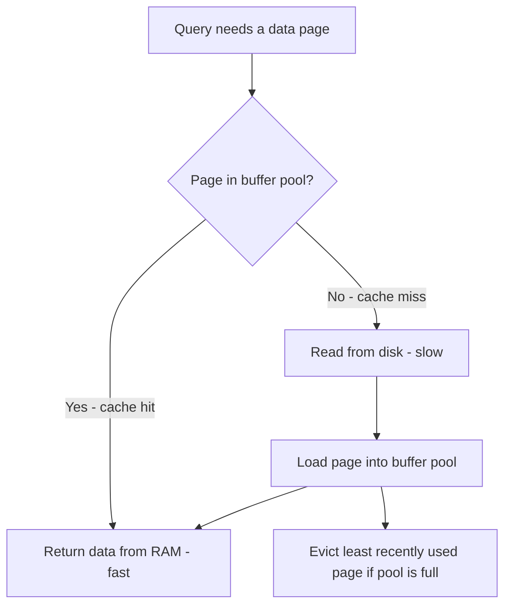

# How to Optimize MySQL Queries with InnoDB Buffer Pool

Author: [nawazdhandala](https://www.github.com/nawazdhandala)

Tags: MySQL, SQL, InnoDB, Buffer Pool, Performance, Database

Description: Learn how the InnoDB buffer pool works and how to configure and optimize it to maximize query performance by keeping hot data in memory.

---

## How the InnoDB Buffer Pool Works

The InnoDB buffer pool is an in-memory cache that stores table data (pages) and index pages read from disk. When MySQL reads a row or index, it loads the containing 16KB page into the buffer pool. Subsequent accesses to the same page are served from memory instead of disk, which is orders of magnitude faster.

The buffer pool is the single most important InnoDB performance setting. A buffer pool hit ratio above 99% means almost all reads are served from memory.



## Key Configuration Variables

| Variable | Default | Description |
|----------|---------|-------------|
| innodb_buffer_pool_size | 128MB | Size of the buffer pool. Most critical setting. |
| innodb_buffer_pool_instances | 8 (MySQL 8.0) | Number of pool partitions for reduced mutex contention. |
| innodb_buffer_pool_chunk_size | 128MB | Chunk size for dynamic resizing. |
| innodb_old_blocks_pct | 37 | Percentage of pool for "old" sublist (LRU eviction zone). |

## Checking Current Buffer Pool Configuration

```sql
SHOW VARIABLES LIKE 'innodb_buffer_pool%';
```

```text
+----------------------------------+-----------+
| Variable_name                    | Value     |
+----------------------------------+-----------+
| innodb_buffer_pool_chunk_size    | 134217728 |
| innodb_buffer_pool_dump_at_shutdown | ON    |
| innodb_buffer_pool_dump_pct      | 25        |
| innodb_buffer_pool_instances     | 1         |
| innodb_buffer_pool_load_at_startup | ON     |
| innodb_buffer_pool_size          | 134217728 |
+----------------------------------+-----------+
```

## Monitoring Buffer Pool Performance

### Check the Buffer Pool Hit Ratio

```sql
SELECT
    (1 - (
        SELECT VARIABLE_VALUE FROM performance_schema.global_status
        WHERE VARIABLE_NAME = 'Innodb_buffer_pool_reads'
    ) /
    (
        SELECT VARIABLE_VALUE FROM performance_schema.global_status
        WHERE VARIABLE_NAME = 'Innodb_buffer_pool_read_requests'
    )) * 100 AS hit_ratio_pct;
```

A hit ratio below 95% suggests the buffer pool is too small.

### Using SHOW ENGINE INNODB STATUS

```sql
SHOW ENGINE INNODB STATUS\G
```

Look for the BUFFER POOL AND MEMORY section:

```text
BUFFER POOL AND MEMORY
----------------------
Total large memory allocated 137363456
Dictionary memory allocated 406899
Buffer pool size   8192
Free buffers       1024
Database pages     7168
Old database pages 2624
Modified db pages  0
Pending reads      0
Pending writes: LRU 0, flush list 0, single page 0
Pages made young 15230, not young 89120
0.00 youngs/s, 0.00 non-youngs/s
Pages read 7890, created 150, written 320
0.00 reads/s, 0.00 creates/s, 0.00 writes/s
Buffer pool hit rate 998 / 1000, young-making rate 0 / 1000 not 0 / 1000
```

Hit rate 998/1000 = 99.8% - excellent.

### Using INFORMATION_SCHEMA for Detailed Stats

```sql
SELECT
    pool_id,
    pool_size AS total_pages,
    free_buffers AS free_pages,
    database_pages AS used_pages,
    hit_rate / 1000.0 AS hit_rate_pct,
    pages_made_young,
    pages_not_made_young
FROM information_schema.INNODB_BUFFER_POOL_STATS;
```

## Configuring the Buffer Pool

### Setting Buffer Pool Size in my.cnf

The general recommendation is to allocate 60-80% of available RAM to the buffer pool on a dedicated MySQL server.

```text
[mysqld]
innodb_buffer_pool_size = 4G
innodb_buffer_pool_instances = 4
innodb_buffer_pool_chunk_size = 128M
```

For a server with 8GB RAM:
- Buffer pool: 5-6GB
- Leave 2-3GB for OS, connections, sort buffers, and other MySQL operations.

### Dynamic Resizing (MySQL 5.7.5+)

```sql
-- Resize without restarting MySQL
SET GLOBAL innodb_buffer_pool_size = 4294967296;  -- 4GB

-- Monitor resize progress
SELECT EVENT_NAME, WORK_COMPLETED, WORK_ESTIMATED
FROM performance_schema.events_stages_current
WHERE EVENT_NAME LIKE '%buffer%';
```

### Warming Up the Buffer Pool

After a restart, the buffer pool starts empty (cold). MySQL can automatically save and restore the buffer pool state to warm it up faster.

```sql
-- Enable automatic save/restore (enabled by default in MySQL 8.0)
SET GLOBAL innodb_buffer_pool_dump_at_shutdown = ON;
SET GLOBAL innodb_buffer_pool_load_at_startup = ON;

-- Manually trigger a dump (save pool contents to disk)
SET GLOBAL innodb_buffer_pool_dump_now = ON;

-- Manually load (warm up after restart)
SET GLOBAL innodb_buffer_pool_load_now = ON;

-- Monitor load progress
SHOW STATUS LIKE 'Innodb_buffer_pool_load_status';
```

## Diagnosing Buffer Pool Pressure

When the buffer pool is too small:
- Hit ratio drops below 99%
- `Innodb_buffer_pool_reads` (physical disk reads) is high
- `Innodb_buffer_pool_wait_free` is non-zero (had to wait for free pages)

```sql
SELECT VARIABLE_NAME, VARIABLE_VALUE
FROM performance_schema.global_status
WHERE VARIABLE_NAME IN (
    'Innodb_buffer_pool_reads',
    'Innodb_buffer_pool_read_requests',
    'Innodb_buffer_pool_wait_free',
    'Innodb_pages_read',
    'Innodb_pages_written'
);
```

## Best Practices

- Set `innodb_buffer_pool_size` to 60-80% of total RAM on a dedicated MySQL server.
- Use multiple `innodb_buffer_pool_instances` (one per GB of pool size, up to 8-16) to reduce mutex contention on multi-core servers.
- Enable `innodb_buffer_pool_dump_at_shutdown` and `innodb_buffer_pool_load_at_startup` to restore warm state after restarts.
- Monitor hit ratio regularly - a sustained ratio below 99% means the pool is too small for the working set.
- Avoid queries that do large sequential full scans on infrequently accessed data - they flush hot pages out of the pool.

## Summary

The InnoDB buffer pool is MySQL's primary memory cache for data and index pages. Sizing it correctly - typically 60-80% of server RAM - is the single most impactful performance tuning step for InnoDB. Monitor the buffer pool hit ratio; a ratio below 99% indicates the working set no longer fits in memory. Use multiple pool instances for high-concurrency workloads, and enable pool dump/restore to avoid cold-start performance degradation after restarts.
