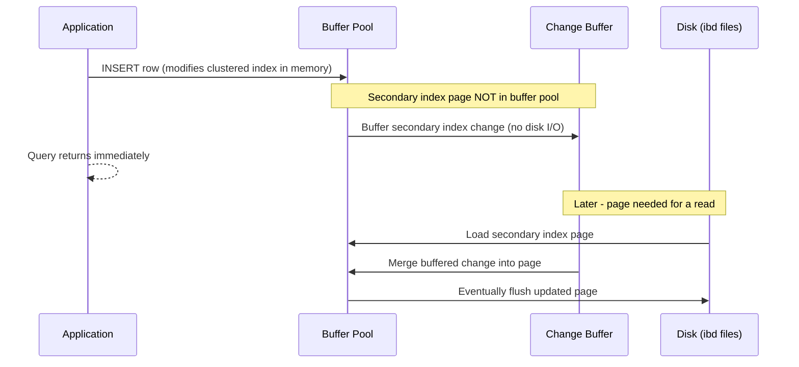

# How to Use InnoDB Change Buffering in MySQL

Author: [nawazdhandala](https://www.github.com/nawazdhandala)

Tags: MySQL, InnoDB, Change Buffer, Performance, Write Optimization

Description: Learn how InnoDB change buffering defers secondary index updates to reduce random I/O, and how to configure and monitor it for write-heavy workloads.

---

## How InnoDB Change Buffering Works

When MySQL modifies a row in an InnoDB table, it must also update all secondary indexes. If the index page needed is not in the buffer pool, reading it from disk just to update it would be expensive (random I/O). InnoDB's change buffer defers these secondary index updates by caching them in a special area of the buffer pool called the change buffer. The deferred changes are merged into the index pages when those pages are eventually read from disk for other reasons.



Benefits:
- Eliminates random I/O for secondary index updates when pages are not in the buffer pool
- Significantly improves write throughput for INSERT-heavy workloads
- Especially beneficial for tables with many secondary indexes

## Types of Operations Buffered

```text
inserts   - Buffer INSERT operations on secondary indexes
deletes   - Buffer DELETE mark operations
purges    - Buffer physical delete operations
changes   - Buffer both inserts and deletes
all       - Buffer all change buffer operations (default)
none      - Disable change buffering
```

## Configuration

Set the `innodb_change_buffering` option:

```ini
[mysqld]
innodb_change_buffering    = all
innodb_change_buffer_max_size = 25
```

`innodb_change_buffer_max_size` is the maximum percentage of the buffer pool that the change buffer can use (default 25%, max 50%).

View the current settings:

```sql
SHOW VARIABLES LIKE 'innodb_change%';
```

Change at runtime (without restart):

```sql
SET GLOBAL innodb_change_buffering = 'all';
SET GLOBAL innodb_change_buffer_max_size = 30;
```

## Monitoring the Change Buffer

Check change buffer size and activity:

```sql
SHOW ENGINE INNODB STATUS\G
```

Look for the `INSERT BUFFER AND ADAPTIVE HASH INDEX` section:

```text
-------------------------------------
INSERT BUFFER AND ADAPTIVE HASH INDEX
-------------------------------------
Ibuf: size 1, free list len 0, seg size 2, 7865 merges
merged operations:
 insert 12873, delete mark 3456, delete 890
discarded operations:
 insert 0, delete mark 0, delete 0
```

From Performance Schema:

```sql
SELECT name, count, sum_timer_wait / 1000000000 AS total_ms
FROM   performance_schema.events_waits_summary_global_by_event_name
WHERE  name LIKE '%ibuf%'
ORDER  BY sum_timer_wait DESC;
```

From InnoDB metrics:

```sql
SELECT name, count
FROM   information_schema.INNODB_METRICS
WHERE  name LIKE 'ibuf%'
ORDER  BY name;
```

Key metrics:

| Metric | Meaning |
|--------|---------|
| `ibuf_merges` | Total change buffer merges |
| `ibuf_merged_inserts` | INSERT operations merged |
| `ibuf_merged_delete_marks` | DELETE marks merged |
| `ibuf_size` | Current change buffer size in pages |
| `ibuf_discarded_inserts` | Inserts discarded (page was removed before merge) |

## When to Adjust Change Buffering

**Increase `innodb_change_buffer_max_size`** when:
- Server is write-heavy with many secondary indexes
- Buffer pool is large (32+ GB)
- `ibuf_merges` rate is high, indicating the change buffer is well-utilized

```sql
SET GLOBAL innodb_change_buffer_max_size = 40;
```

**Reduce or disable change buffering** when:
- Server is primarily read-heavy (fewer writes)
- SSD storage makes random I/O fast enough that buffering adds no benefit
- Memory is constrained and buffer pool space is at a premium

```sql
SET GLOBAL innodb_change_buffering = 'none';
```

**Disable for SSDs:**

On NVMe SSDs, random I/O is nearly as fast as sequential I/O, so change buffering provides less benefit. Many DBA teams disable it on SSD-based servers:

```ini
[mysqld]
innodb_change_buffering = none
```

## Impact on Crash Recovery

The change buffer is persisted in the system tablespace (ibdata1). During crash recovery, MySQL replays the change buffer. A large change buffer means longer crash recovery time. If you prioritize fast restarts, consider limiting change buffer size:

```ini
[mysqld]
innodb_change_buffer_max_size = 10
```

## Viewing Pending Merges

The number of pending change buffer merges indicates how much work is deferred:

```sql
SELECT variable_name, variable_value
FROM   performance_schema.global_status
WHERE  variable_name IN (
    'Innodb_ibuf_discarded_delete_marks',
    'Innodb_ibuf_discarded_deletes',
    'Innodb_ibuf_discarded_inserts',
    'Innodb_ibuf_free_list',
    'Innodb_ibuf_merged_delete_marks',
    'Innodb_ibuf_merged_deletes',
    'Innodb_ibuf_merged_inserts',
    'Innodb_ibuf_merges',
    'Innodb_ibuf_segment_size',
    'Innodb_ibuf_size'
);
```

## Best Practices

- Keep `innodb_change_buffering = all` on spinning disk (HDD) servers.
- Consider setting `innodb_change_buffering = none` on NVMe SSD servers where random I/O is fast.
- Keep `innodb_change_buffer_max_size` at 25% (default) unless you have a specific reason to change it.
- Monitor `ibuf_merges` and `ibuf_size` to understand how actively the change buffer is used.
- Be aware that a large change buffer increases crash recovery time.
- Test performance with and without change buffering if you are on SSDs, as the benefit varies.

## Summary

InnoDB change buffering improves write performance on secondary indexes by deferring updates to index pages that are not in the buffer pool. Changes are merged when the pages are eventually loaded from disk. On spinning disks with many secondary indexes, change buffering can significantly reduce I/O. On SSDs, the benefit is smaller. Configure `innodb_change_buffering` and `innodb_change_buffer_max_size` based on your storage type and workload characteristics.
