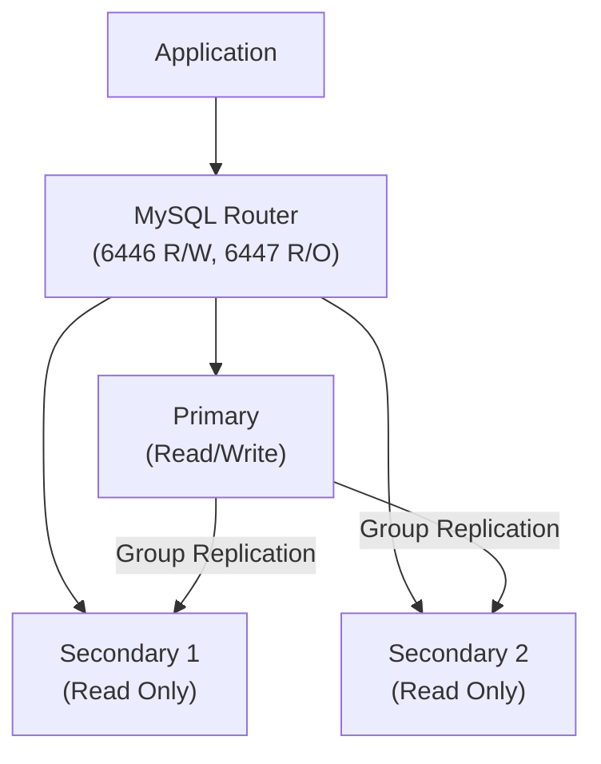

# How to Use MySQL InnoDB Cluster

Author: [nawazdhandala](https://www.github.com/nawazdhandala)

Tags: MySQL, InnoDB, Cluster, High Availability, Group Replication

Description: Learn how to set up and manage MySQL InnoDB Cluster using MySQL Shell, with automatic failover, multi-primary support, and MySQL Router integration.

---

## How MySQL InnoDB Cluster Works

MySQL InnoDB Cluster is a complete high-availability solution built on three components:

- **MySQL Group Replication** - synchronous replication with automatic membership management
- **MySQL Shell** - administrative interface for cluster management
- **MySQL Router** - transparent client routing between cluster members



The cluster requires a minimum of three members for automatic failover (to maintain quorum). When the primary fails, the remaining members elect a new primary automatically.

## Prerequisites

Install MySQL Server 8.0+ and MySQL Shell on all three nodes:

```bash
# On each node (Ubuntu/Debian)
sudo apt-get install -y mysql-server mysql-shell

# On each node (RHEL/CentOS)
sudo yum install -y mysql-server mysql-shell
```

## Configuration

### Step 1 - Prepare Each Node's MySQL Configuration

Each node needs a unique `server-id` and must use `binlog_format = ROW`. Edit `/etc/mysql/mysql.conf.d/mysqld.cnf` on each node:

```ini
# Node 1
[mysqld]
server-id            = 1
binlog_format        = ROW
gtid_mode            = ON
enforce_gtid_consistency = ON
log_replica_updates  = ON
```

Use `server-id = 2` and `server-id = 3` on the other nodes. Restart MySQL on all nodes:

```bash
sudo systemctl restart mysql
```

### Step 2 - Check Instance Configuration with MySQL Shell

Run MySQL Shell on the first node and check if the instance is ready for InnoDB Cluster:

```bash
mysqlsh
```

```javascript
// Inside MySQL Shell
dba.checkInstanceConfiguration('root@node1:3306')
```

MySQL Shell will report any issues that need to be fixed. To apply automatic fixes:

```javascript
dba.configureInstance('root@node1:3306')
```

Run this on all three nodes.

### Step 3 - Create the Cluster

From MySQL Shell connected to the first node:

```javascript
// Connect to the first node
\connect root@node1:3306

// Create the cluster
var cluster = dba.createCluster('myCluster')
```

### Step 4 - Add Members to the Cluster

Add the remaining nodes:

```javascript
cluster.addInstance('root@node2:3306')
cluster.addInstance('root@node3:3306')
```

MySQL Shell will prompt for recovery options. Choose `Clone` for a clean data transfer.

### Step 5 - Verify Cluster Status

Check the cluster topology:

```javascript
cluster.status()
```

Expected output:

```text
{
    "clusterName": "myCluster",
    "defaultReplicaSet": {
        "name": "default",
        "primary": "node1:3306",
        "ssl": "REQUIRED",
        "status": "OK",
        "topology": {
            "node1:3306": { "mode": "R/W", "status": "ONLINE" },
            "node2:3306": { "mode": "R/O", "status": "ONLINE" },
            "node3:3306": { "mode": "R/O", "status": "ONLINE" }
        }
    }
}
```

### Step 6 - Configure MySQL Router

Bootstrap MySQL Router against the cluster:

```bash
sudo mysqlrouter --bootstrap root@node1:3306 --directory /etc/mysqlrouter --conf-use-sockets --user=mysqlrouter
sudo systemctl start mysqlrouter
```

Connect through the router:

```bash
# Read/Write port
mysql -u appuser -p -h 127.0.0.1 -P 6446

# Read-Only port
mysql -u appuser -p -h 127.0.0.1 -P 6447
```

## Cluster Management

### Switch to Multi-Primary Mode

```javascript
cluster.switchToMultiPrimaryMode()
```

### Switch Back to Single-Primary Mode

```javascript
cluster.switchToSinglePrimaryMode()
```

### Set a Specific Primary

```javascript
cluster.setPrimaryInstance('node2:3306')
```

### Rejoin a Node After Restart

```javascript
cluster.rejoinInstance('node3:3306')
```

### Remove a Node

```javascript
cluster.removeInstance('node3:3306')
```

### Dissolve the Cluster

```javascript
cluster.dissolve({force: true})
```

## Monitoring

Check the cluster in a SQL session:

```sql
-- View group members
SELECT * FROM performance_schema.replication_group_members;

-- View replication stats
SELECT * FROM performance_schema.replication_group_member_stats\G
```

## Best Practices

- Always use at least three members for automatic failover with a quorum.
- Enable SSL on all cluster connections by setting `memberSslMode: 'REQUIRED'` during cluster creation.
- Run MySQL Router on the application servers, not on the database nodes.
- Use `cluster.rescan()` after changes to ensure the cluster metadata is current.
- Store the cluster admin credentials securely; never use the root account for application access.
- Monitor `Seconds_Behind_Source` equivalent metrics via `performance_schema.replication_group_member_stats`.

## Summary

MySQL InnoDB Cluster combines Group Replication, MySQL Shell, and MySQL Router into a complete high-availability solution. You use MySQL Shell to create and manage the cluster, and MySQL Router to route application connections automatically to the current primary or a read replica. With three or more members, the cluster handles primary failures without manual intervention.
