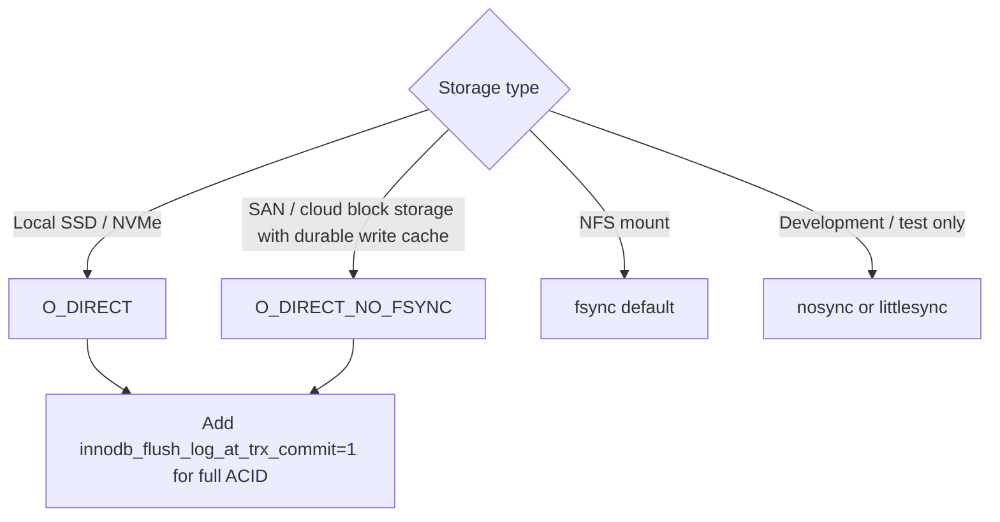

# How to Configure InnoDB Flush Method in MySQL

Author: [OneUptime](https://oneuptime.com)

Tags: MySQL, InnoDB, Configuration, Performance, Disk I/O

Description: Learn how to configure the InnoDB flush method (fsync, O_DIRECT, O_DSYNC) to optimize disk I/O, avoid double buffering, and maximize write throughput on Linux.

---

## Introduction

The `innodb_flush_method` variable controls how InnoDB flushes data to the operating system and ultimately to disk. The choice directly impacts:

- Write throughput and latency
- Whether the OS page cache is used or bypassed
- How crash safety is maintained
- Effective memory usage (avoiding double buffering)

On Linux the most important options are `fsync` (default), `O_DIRECT`, and `O_DIRECT_NO_FSYNC`. On Windows the relevant values differ.

## Available flush methods

| Value | OS call for data writes | OS call for log writes | OS page cache used? |
|---|---|---|---|
| `fsync` | `write()` + `fsync()` | `write()` + `fsync()` | Yes (double buffered) |
| `O_DSYNC` | `write()` + `fsync()` | `O_SYNC flag` | Yes for data, No for log |
| `O_DIRECT` | `O_DIRECT + fsync()` | `write()` + `fsync()` | No for data |
| `O_DIRECT_NO_FSYNC` | `O_DIRECT` (no fsync) | `write()` + `fsync()` | No for data |
| `littlesync` | `write()` | `write()` + `fsync()` | Yes (unsafe) |
| `nosync` | `write()` | `write()` | Yes (unsafe, dev only) |

## Recommended setting for production: O_DIRECT

```ini
# /etc/mysql/mysql.conf.d/mysqld.cnf

[mysqld]
innodb_flush_method = O_DIRECT
```

`O_DIRECT` bypasses the OS page cache for InnoDB data files. This:
- Eliminates double buffering (data is already in InnoDB buffer pool)
- Reduces memory pressure on the OS
- Makes buffer pool size estimates accurate
- Slightly increases write latency per operation (no write-back coalescing by OS)

## O_DIRECT_NO_FSYNC for specific storage systems

On some storage systems (hardware RAID with battery-backed write cache, cloud block storage with durable volumes) the `fsync()` call is unnecessary because the storage controller guarantees durability. In this case `O_DIRECT_NO_FSYNC` avoids the extra syscall:

```ini
# Use only if storage controller / cloud volume provides durability guarantees
[mysqld]
innodb_flush_method = O_DIRECT_NO_FSYNC
```

**Do not use `O_DIRECT_NO_FSYNC` on local disks without hardware write cache.**

## Default fsync behavior and its drawback

The default `fsync` method writes data through the OS page cache:

```
InnoDB buffer pool --> OS page cache --> disk
```

This means data exists in two places in memory simultaneously (buffer pool + page cache), wasting RAM. With a 32 GB buffer pool you may be consuming 64 GB of server memory effectively.

```mermaid
flowchart LR
    subgraph fsync default
        A1[InnoDB buffer pool] --> B1[OS page cache]
        B1 --> C1[Disk]
        style B1 fill:#f96
    end

    subgraph O_DIRECT recommended
        A2[InnoDB buffer pool] --> C2[Disk]
        note2[OS page cache bypassed]
    end
```

## Checking the current setting

```sql
SHOW VARIABLES LIKE 'innodb_flush_method';
/*
+---------------------+----------+
| Variable_name       | Value    |
+---------------------+----------+
| innodb_flush_method | O_DIRECT |
+---------------------+----------+
*/
```

## Applying the change

`innodb_flush_method` is not dynamic -- a MySQL restart is required after changing it:

```bash
# 1. Edit my.cnf
sudo nano /etc/mysql/mysql.conf.d/mysqld.cnf

# 2. Restart MySQL
sudo systemctl restart mysql

# 3. Verify
mysql -u root -p -e "SHOW VARIABLES LIKE 'innodb_flush_method';"
```

## Interaction with innodb_flush_log_at_trx_commit

The flush method interacts with `innodb_flush_log_at_trx_commit`, which controls when the redo log is flushed:

| `innodb_flush_log_at_trx_commit` | Behaviour |
|---|---|
| `1` (default) | Flush and fsync log on every commit - fully ACID |
| `2` | Write to OS buffer on every commit, fsync once per second |
| `0` | Write and fsync once per second - fastest but least safe |

```ini
[mysqld]
innodb_flush_method             = O_DIRECT
innodb_flush_log_at_trx_commit  = 1   # ACID compliant
```

For maximum write throughput (accepting up to 1 second of data loss on crash):

```ini
[mysqld]
innodb_flush_method             = O_DIRECT
innodb_flush_log_at_trx_commit  = 2
```

## Monitoring I/O behaviour

```sql
-- Check I/O activity
SHOW STATUS LIKE 'Innodb_data_fsyncs';
SHOW STATUS LIKE 'Innodb_os_log_fsyncs';
SHOW STATUS LIKE 'Innodb_data_written';
SHOW STATUS LIKE 'Innodb_log_writes';

-- Check pending I/O
SHOW ENGINE INNODB STATUS\G
-- Look for: FILE I/O section
```

```bash
# OS-level I/O monitoring
iostat -x 1 5
# Watch %util, await, and w/s for the MySQL data disk

# Check if O_DIRECT is active (Linux)
strace -p $(pidof mysqld) -e trace=open,write 2>&1 | grep O_DIRECT
```

## Flush method decision guide



## Summary

`innodb_flush_method` controls whether InnoDB bypasses the OS page cache when writing data files. `O_DIRECT` is the recommended setting for production Linux servers because it eliminates double buffering between the InnoDB buffer pool and the OS page cache, reducing memory waste and providing more predictable I/O performance. `O_DIRECT_NO_FSYNC` offers a further optimization for cloud block volumes or RAID controllers with battery-backed write caches. The default `fsync` should generally be avoided on dedicated database servers where the buffer pool is large. The setting requires a MySQL restart to take effect.
