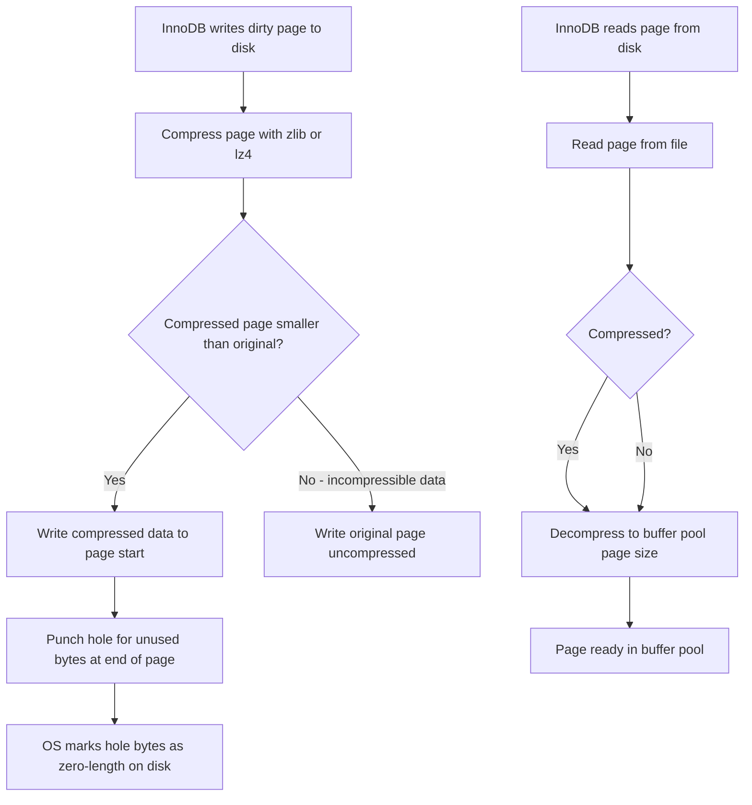

# How to Use InnoDB Transparent Page Compression in MySQL

Author: [OneUptime](https://oneuptime.com)

Tags: MySQL, InnoDB, Compression, Storage, Performance

Description: Learn how to enable InnoDB transparent page compression to reduce storage footprint using filesystem hole-punching without changing SQL queries or application code.

---

## Introduction

InnoDB Transparent Page Compression (TPC) compresses data pages on disk using the operating system's hole-punching mechanism. Unlike InnoDB row-format compression (`ROW_FORMAT=COMPRESSED`), transparent page compression:

- Works at the page level, not the row level
- Does not require a reduced `KEY_BLOCK_SIZE`
- Relies on filesystem sparse file support (hole punching)
- Has lower CPU overhead than row-format compression
- Does not affect in-memory buffer pool pages (pages are decompressed when loaded)

Supported compression algorithms: `zlib`, `lz4` (MySQL 8.0+)

## Requirements

- Linux with a filesystem that supports hole punching: ext4, xfs, btrfs, ZFS, or NVMe drives with block zeroing
- `innodb_file_per_table = ON` (default in MySQL 8.0)
- For LZ4: MySQL 8.0 compiled with LZ4 support

## Checking filesystem support

```bash
# Verify your filesystem supports sparse files
stat /var/lib/mysql/ibdata1
# Look for: Size vs Blocks - if Blocks * 512 < Size, sparse files work

# Check filesystem type
df -T /var/lib/mysql
# ext4 and xfs both support hole punching

# Test hole punching capability
fallocate -d /var/lib/mysql/test_sparse_file
```

## Enabling compression on a table

```sql
-- Create a new table with page compression
CREATE TABLE product_catalog (
  id          INT UNSIGNED AUTO_INCREMENT PRIMARY KEY,
  sku         VARCHAR(50)  NOT NULL,
  name        VARCHAR(200) NOT NULL,
  description TEXT,
  price       DECIMAL(10,2) NOT NULL,
  created_at  TIMESTAMP DEFAULT CURRENT_TIMESTAMP
) COMPRESSION = 'zlib';

-- Use LZ4 for lower CPU overhead (MySQL 8.0)
CREATE TABLE order_history (
  id          BIGINT UNSIGNED AUTO_INCREMENT PRIMARY KEY,
  order_json  JSON NOT NULL,
  created_at  TIMESTAMP DEFAULT CURRENT_TIMESTAMP
) COMPRESSION = 'lz4';
```

## Enabling compression on an existing table

```sql
-- Add compression to an existing table (triggers a full rebuild)
ALTER TABLE product_catalog COMPRESSION = 'zlib';

-- The ALTER alone does not physically compress existing pages.
-- Run OPTIMIZE TABLE to rebuild and compress all pages:
OPTIMIZE TABLE product_catalog;
```

## Disabling compression

```sql
ALTER TABLE product_catalog COMPRESSION = 'none';
OPTIMIZE TABLE product_catalog;
```

## Checking compression status

```sql
-- Check compression attribute from information_schema
SELECT
  TABLE_SCHEMA,
  TABLE_NAME,
  CREATE_OPTIONS
FROM information_schema.TABLES
WHERE TABLE_SCHEMA = 'myapp'
  AND CREATE_OPTIONS LIKE '%COMPRESSION%';

-- Or directly from SHOW CREATE TABLE
SHOW CREATE TABLE product_catalog\G
```

## Measuring compression savings

```sql
-- Compare compressed vs uncompressed table sizes
SELECT
  TABLE_NAME,
  ROUND(DATA_LENGTH / 1024 / 1024, 2)        AS data_mb,
  ROUND(INDEX_LENGTH / 1024 / 1024, 2)       AS index_mb,
  ROUND((DATA_LENGTH + INDEX_LENGTH) / 1024 / 1024, 2) AS total_mb
FROM information_schema.TABLES
WHERE TABLE_SCHEMA = 'myapp'
  AND TABLE_NAME IN ('product_catalog', 'product_catalog_uncompressed')
ORDER BY TABLE_NAME;
```

```bash
# Physical file size comparison
ls -lsh /var/lib/mysql/myapp/product_catalog.ibd
# Sparse file actual disk usage (du shows real blocks used):
du -sh /var/lib/mysql/myapp/product_catalog.ibd
```

## How transparent page compression works



## zlib vs LZ4 comparison

| Attribute | zlib | LZ4 |
|---|---|---|
| Compression ratio | Higher (good for text/JSON) | Lower |
| CPU overhead | Higher | Very low |
| Speed | Slower | Very fast |
| Best for | Cold/archival tables, large blobs | Hot OLTP tables, large datasets |

## Tables that benefit most from compression

```sql
-- Tables with high text/JSON/blob content are best candidates
SELECT
  TABLE_NAME,
  ROUND(DATA_LENGTH / 1024 / 1024, 1) AS data_mb,
  AVG_ROW_LENGTH                       AS avg_row_bytes
FROM information_schema.TABLES
WHERE TABLE_SCHEMA = 'myapp'
ORDER BY DATA_LENGTH DESC
LIMIT 20;
```

Good candidates:
- Tables with `TEXT`, `BLOB`, `JSON`, `VARCHAR` columns with long values
- Historical / audit log tables
- Tables with repetitive string patterns

Poor candidates:
- Tables with mostly small integer or boolean columns
- Tables that are already compressed externally
- Very hot OLTP tables where CPU headroom is limited

## Global compression configuration

```ini
# /etc/mysql/mysql.conf.d/mysqld.cnf

[mysqld]
innodb_file_per_table          = ON
innodb_page_size               = 16384   # default; TPC works best at 16K

# Ensure punch hole support is detected
# (automatically detected from OS and filesystem)
```

## Summary

InnoDB Transparent Page Compression is enabled per table with `COMPRESSION = 'zlib'` or `COMPRESSION = 'lz4'`. It compresses pages at write time and uses filesystem hole-punching to reclaim the unused space, reducing physical disk usage without any SQL changes. After setting the compression attribute on an existing table, run `OPTIMIZE TABLE` to rebuild all pages in compressed form. Use `zlib` for archival/read-mostly tables where compression ratio matters and `lz4` for hot OLTP tables where CPU overhead must be minimized. The approach requires a filesystem supporting sparse files (ext4, xfs, ZFS) and `innodb_file_per_table = ON`.
