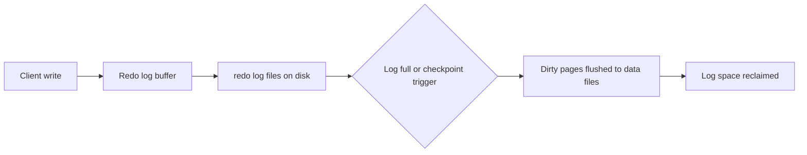
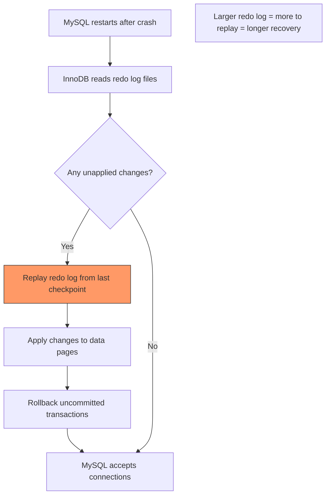

# How to Configure InnoDB Redo Log Size in MySQL

Author: [nawazdhandala](https://www.github.com/nawazdhandala)

Tags: MySQL, InnoDB, Redo Log, Performance, Configuration

Description: Learn how to configure InnoDB redo log size in MySQL 8.0 to improve write performance and crash recovery, including the new dynamic resize feature in MySQL 8.0.30+.

---

## Introduction

The InnoDB redo log is a disk-based data structure used for crash recovery. Every change made to InnoDB data pages is first recorded in the redo log before being written to the actual data files. If MySQL crashes, the redo log is replayed during restart to bring data pages back to a consistent state.

The size of the redo log directly affects:
- **Write throughput:** larger redo logs absorb more write bursts before checkpointing
- **Crash recovery time:** larger logs take longer to replay after a crash
- **Checkpoint pressure:** undersized logs cause frequent checkpoints, stalling writes

## How InnoDB redo logging works



## MySQL 8.0.30+ - Dynamic redo log resize

From MySQL 8.0.30, InnoDB uses a single `#ib_redo_N` file format and allows online resize:

```sql
-- Check current redo log size
SELECT * FROM performance_schema.innodb_redo_log_files;

-- Check available space
SHOW STATUS LIKE 'Innodb_redo_log%';
/*
+----------------------------------+----------+
| Variable_name                    | Value    |
+----------------------------------+----------+
| Innodb_redo_log_capacity_resized | 104857600|
| Innodb_redo_log_current_lsn      | 845123456|
| Innodb_redo_log_flushed_to_disk_lsn | 845123456 |
| Innodb_redo_log_logical_size     | 8192     |
| Innodb_redo_log_physical_size    | 16777216 |
| Innodb_redo_log_resize_status    | OK       |
+----------------------------------+----------+
*/

-- Dynamically resize (no restart required in MySQL 8.0.30+)
SET GLOBAL innodb_redo_log_capacity = 4294967296; -- 4 GB

-- Verify resize completed
SHOW STATUS LIKE 'Innodb_redo_log_resize_status';
-- Should show: OK
```

## MySQL 8.0 before 8.0.30 - Static configuration

```ini
# /etc/mysql/mysql.conf.d/mysqld.cnf

[mysqld]
# Two redo log files of 512 MB each = 1 GB total (pre-8.0.30 style)
innodb_log_file_size    = 536870912   # 512 MB per file
innodb_log_files_in_group = 2         # total redo log = 2 x 512 MB = 1 GB
```

Changing this before MySQL 8.0.30 requires a clean shutdown:

```bash
# 1. Clean shutdown
sudo mysqladmin -u root -p shutdown

# 2. Remove old redo log files
sudo rm /var/lib/mysql/ib_logfile0
sudo rm /var/lib/mysql/ib_logfile1

# 3. Update my.cnf with new size

# 4. Start MySQL - it will create new redo log files
sudo systemctl start mysql
```

## MySQL 8.0.30+ configuration

```ini
# /etc/mysql/mysql.conf.d/mysqld.cnf

[mysqld]
# Single variable for total redo log capacity (MySQL 8.0.30+)
innodb_redo_log_capacity = 4294967296   # 4 GB
```

## Sizing guidelines

| Workload | Recommended total redo log size |
|---|---|
| Light OLTP (< 100 writes/sec) | 512 MB - 1 GB |
| Medium OLTP (100-1000 writes/sec) | 1 GB - 4 GB |
| Heavy OLTP / batch processing | 4 GB - 16 GB |
| Bulk loads / ETL | 16 GB+ (with careful recovery time planning) |

A common rule of thumb: set the redo log large enough that checkpoints triggered by log fullness (`SHOW ENGINE INNODB STATUS` shows "Log sequence number" vs "Log flushed up to") do not occur more than once every few minutes under peak load.

## Checking redo log pressure

```sql
SHOW ENGINE INNODB STATUS\G

-- Look for the LOG section:
/*
---
LOG
---
Log sequence number          1234567890
Log buffer assigned up to    1234567890
Log buffer completed up to   1234567890
Log written up to            1234567890
Log flushed up to            1234567890
Added dirty pages up to      1234567890
Pages flushed up to          1190000000
Last checkpoint at           1188000000
*/
```

If `Log sequence number` - `Last checkpoint at` is close to the total redo log size, the log is under pressure. Increase `innodb_redo_log_capacity`.

## Monitoring redo log fullness

```sql
-- Percentage of redo log used
SELECT
  (1 - (variable_value / @@innodb_redo_log_capacity)) * 100
    AS pct_redo_used
FROM performance_schema.global_status
WHERE variable_name = 'Innodb_redo_log_logical_size';

-- Alert if > 75% full
```

## Impact on crash recovery time



Recovery time scales roughly linearly with the amount of unapplied redo data. For very large logs, consider `innodb_fast_shutdown = 1` (default) to ensure clean shutdowns.

## Relationship with innodb_buffer_pool_size

The redo log capacity should be proportional to the buffer pool size. A general guideline:

```text
recommended redo log = 25% of innodb_buffer_pool_size
minimum redo log = 10% of innodb_buffer_pool_size
```

```sql
-- Check current buffer pool size
SELECT @@innodb_buffer_pool_size / 1024 / 1024 / 1024 AS buffer_pool_gb;

-- Check current redo log capacity
SELECT @@innodb_redo_log_capacity / 1024 / 1024 / 1024 AS redo_log_gb;
```

## Summary

The InnoDB redo log records all changes before they are written to data files, enabling crash recovery. In MySQL 8.0.30+ configure `innodb_redo_log_capacity` for the total size; in earlier versions use `innodb_log_file_size` multiplied by `innodb_log_files_in_group`. A larger redo log improves write throughput by reducing checkpoint pressure but increases crash recovery time. Monitor redo log utilization through `SHOW ENGINE INNODB STATUS` and aim for the log to be no more than 75% full under peak load.
