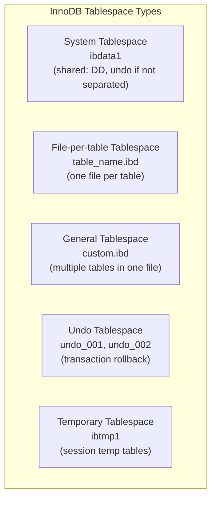

# How to Manage MySQL InnoDB Tablespaces

Author: [nawazdhandala](https://www.github.com/nawazdhandala)

Tags: MySQL, InnoDB, Tablespace, Storage, Database Administration

Description: Learn how to manage MySQL InnoDB tablespaces, including the system tablespace, file-per-table tablespaces, general tablespaces, and undo tablespaces.

---

## How InnoDB Tablespaces Work

InnoDB organizes all its data into tablespaces - logical storage units that map to one or more physical files on disk. Understanding tablespace types helps you control storage layout, performance, and manageability.



## Tablespace Types

| Type | File | Contains |
|------|------|----------|
| System tablespace | `ibdata1` | Data dictionary (MySQL 5.x), undo log (if not separated) |
| File-per-table | `<table>.ibd` | Individual table data and index |
| General tablespace | `<name>.ibd` | Multiple tables, user-defined |
| Undo tablespace | `undo_001`, `undo_002` | Undo log segments |
| Temporary tablespace | `ibtmp1` | Temporary tables |

## Configuring File-Per-Table

The `innodb_file_per_table` option (enabled by default in MySQL 5.6.6+) places each InnoDB table in its own `.ibd` file:

```ini
[mysqld]
innodb_file_per_table = ON
```

Verify the setting:

```sql
SHOW VARIABLES LIKE 'innodb_file_per_table';
```

Benefits of file-per-table:
- Reclaim disk space with `OPTIMIZE TABLE` or `ALTER TABLE ... ENGINE=InnoDB`
- Move individual tables to different storage volumes
- Easier to manage and monitor per-table sizes

## Viewing Tablespace Information

```sql
-- View all InnoDB tablespaces
SELECT space, name, space_type, row_format, page_size
FROM   information_schema.INNODB_TABLESPACES
ORDER  BY space_type, name;

-- View tablespace file locations
SELECT tablespace_name, file_name, file_type, total_extents, free_extents
FROM   information_schema.FILES
WHERE  engine = 'InnoDB';
```

## General Tablespaces

General tablespaces allow multiple tables to share a single tablespace file, and support placement on specific storage:

```sql
-- Create a general tablespace on a fast SSD
CREATE TABLESPACE ts_fast
    ADD DATAFILE '/mnt/fast-ssd/ts_fast.ibd'
    ENGINE=InnoDB;

-- Create tables in the general tablespace
CREATE TABLE hot_data (
    id   INT NOT NULL AUTO_INCREMENT,
    data VARCHAR(200),
    PRIMARY KEY (id)
) ENGINE=InnoDB TABLESPACE=ts_fast;
```

Move an existing table to the general tablespace:

```sql
ALTER TABLE orders TABLESPACE=ts_fast;
```

Move a table back to the system tablespace:

```sql
ALTER TABLE orders TABLESPACE=innodb_system;
```

## Resizing the System Tablespace

The system tablespace (`ibdata1`) can be configured to auto-extend:

```ini
[mysqld]
innodb_data_file_path = ibdata1:12M:autoextend
```

Add a second file to the system tablespace:

```ini
[mysqld]
innodb_data_file_path = ibdata1:12M;ibdata2:10M:autoextend
```

Note: you cannot shrink the system tablespace files once they have grown.

## Undo Tablespaces

Starting with MySQL 8.0, undo logs are stored in separate undo tablespace files. View them:

```sql
SELECT space_name, file_name, space_type, state
FROM   information_schema.INNODB_TABLESPACES
WHERE  space_type = 'Undo';
```

Add a new undo tablespace:

```sql
CREATE UNDO TABLESPACE extra_undo ADD DATAFILE 'extra_undo.ibu';
```

Set an undo tablespace inactive (allows it to be truncated):

```sql
ALTER UNDO TABLESPACE extra_undo SET INACTIVE;
```

Drop an inactive undo tablespace:

```sql
DROP UNDO TABLESPACE extra_undo;
```

## Importing and Exporting Tablespaces

Export a table's tablespace for transport to another server:

```sql
-- Flush and lock the table, generate .cfg file
FLUSH TABLE orders FOR EXPORT;
-- Copy orders.ibd and orders.cfg to the destination
UNLOCK TABLES;
```

On the destination server:

```sql
-- Create the same table structure
CREATE TABLE orders (...) ENGINE=InnoDB;

-- Discard the empty tablespace
ALTER TABLE orders DISCARD TABLESPACE;

-- Copy the .ibd and .cfg files to the MySQL data directory
-- Then import
ALTER TABLE orders IMPORT TABLESPACE;
```

## Reclaiming Space After Large Deletes

After deleting a large number of rows, reclaim space by rebuilding the table:

```sql
-- Rebuilds the table and reclaims free space
OPTIMIZE TABLE orders;

-- Alternative: same effect
ALTER TABLE orders ENGINE=InnoDB;
```

## Checking Per-Table Size

```sql
SELECT table_name,
       ROUND(data_length / 1024 / 1024, 2) AS data_mb,
       ROUND(index_length / 1024 / 1024, 2) AS index_mb,
       ROUND((data_length + index_length) / 1024 / 1024, 2) AS total_mb
FROM   information_schema.TABLES
WHERE  table_schema = 'myapp_db'
ORDER  BY total_mb DESC;
```

## Best Practices

- Keep `innodb_file_per_table = ON` (the default) for most workloads.
- Use general tablespaces to place hot tables on faster SSD storage.
- Do not let `ibdata1` grow unbounded; consider separating undo logs with dedicated undo tablespaces.
- Use `OPTIMIZE TABLE` after large bulk deletes to reclaim disk space.
- Monitor tablespace sizes with `information_schema.INNODB_TABLESPACES` and alert on growth.
- Use tablespace import/export for fast, logical table migrations between servers.

## Summary

InnoDB tablespaces organize data into physical `.ibd` files. File-per-table mode (the default) keeps each table in its own file, simplifying management and space reclamation. General tablespaces allow multiple tables in one file and can be placed on specific storage devices. Undo tablespaces (MySQL 8.0+) keep undo log separate from the system tablespace for better manageability.
