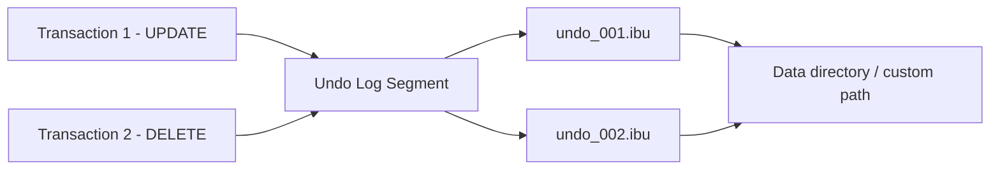
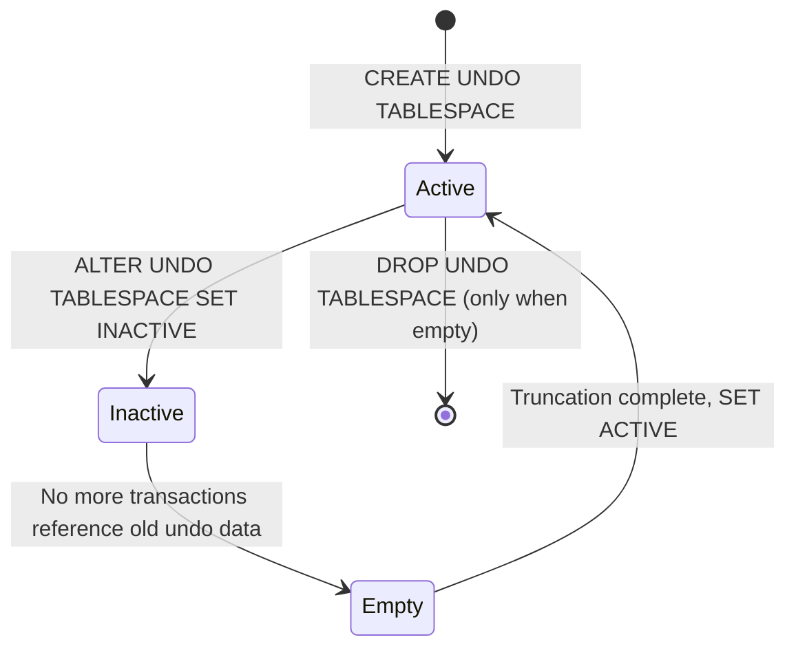

# How to Configure InnoDB Undo Tablespace in MySQL

Author: [nawazdhandala](https://www.github.com/nawazdhandala)

Tags: MySQL, InnoDB, Undo Tablespace, Configuration, Storage

Description: Learn how InnoDB undo tablespaces work, how to configure their size and location, and how to manage undo log truncation in MySQL 8.0 to reclaim disk space.

---

## Introduction

The InnoDB undo log stores the "before images" of rows modified by uncommitted transactions. It serves two purposes:

1. **Transaction rollback:** if a transaction is rolled back, the undo log is used to restore rows to their previous state.
2. **MVCC (Multi-Version Concurrency Control):** long-running read transactions see a consistent snapshot using undo log data.

In MySQL 8.0 the undo log lives in dedicated undo tablespace files (`.ibu` extension) separate from the system tablespace. This makes it possible to truncate and reclaim space without restarting the server.

## Undo tablespace architecture



## Default configuration

MySQL 8.0 creates two undo tablespace files by default:

```bash
ls -lh /var/lib/mysql/undo_001 /var/lib/mysql/undo_002
# -rw-r----- 1 mysql mysql 16M undo_001
# -rw-r----- 1 mysql mysql 16M undo_002
```

```sql
-- View current undo tablespaces
SELECT TABLESPACE_NAME, FILE_NAME, FILE_TYPE, ENGINE, AUTOEXTEND_SIZE
FROM information_schema.FILES
WHERE FILE_TYPE = 'UNDO LOG';
```

## Configuring undo tablespace location and initial size

```ini
# /etc/mysql/mysql.conf.d/mysqld.cnf

[mysqld]
# Place undo tablespaces on a fast SSD separate from data
innodb_undo_directory   = /mnt/fast-ssd/mysql-undo

# Initial size of each undo tablespace (default: 16 MB)
# Can also be set per-tablespace at creation time
```

## Creating additional undo tablespaces

MySQL 8.0 allows up to 127 undo tablespaces:

```sql
-- Create a third undo tablespace
CREATE UNDO TABLESPACE innodb_undo_003
  ADD DATAFILE '/mnt/fast-ssd/mysql-undo/undo_003.ibu';

-- Verify
SELECT TABLESPACE_NAME, FILE_NAME, STATE
FROM information_schema.INNODB_TABLESPACES
WHERE ROW_FORMAT = 'Undo';
```

## Setting undo tablespace autoextend size

```sql
-- Set autoextend increment for all undo tablespaces (MySQL 8.0.23+)
ALTER UNDO TABLESPACE innodb_undo_001 SET AUTOEXTEND_SIZE = 67108864; -- 64 MB

SHOW VARIABLES LIKE 'innodb_undo_tablespaces';
SHOW VARIABLES LIKE 'innodb_max_undo_log_size';
```

## Undo log truncation

Long-running transactions and large write batches can cause undo tablespaces to grow significantly. MySQL 8.0 can automatically truncate undo tablespaces online:

```ini
# /etc/mysql/mysql.conf.d/mysqld.cnf

[mysqld]
innodb_undo_log_truncate   = ON     # Enable automatic truncation (default ON in 8.0)
innodb_max_undo_log_size   = 1073741824  # 1 GB: trigger truncation above this size
```

```sql
-- Check current setting
SHOW VARIABLES LIKE 'innodb_undo_log_truncate';
SHOW VARIABLES LIKE 'innodb_max_undo_log_size';

-- Monitor undo tablespace sizes
SELECT
  TABLESPACE_NAME,
  FILE_NAME,
  ROUND(TOTAL_EXTENTS * EXTENT_SIZE / 1024 / 1024, 1) AS size_mb
FROM information_schema.FILES
WHERE FILE_TYPE = 'UNDO LOG';
```

## Manual truncation (deactivate, then activate)

You can manually trigger truncation by deactivating an undo tablespace, which marks it for truncation when no active transactions reference it:

```sql
-- Deactivate (marks for truncation)
ALTER UNDO TABLESPACE innodb_undo_002 SET INACTIVE;

-- Wait for truncation to complete
SELECT TABLESPACE_NAME, STATE
FROM information_schema.INNODB_TABLESPACES
WHERE ROW_FORMAT = 'Undo';
-- STATE will show: empty -> inactive -> active (once truncated)

-- Re-activate after truncation
ALTER UNDO TABLESPACE innodb_undo_002 SET ACTIVE;
```

## Monitoring undo log growth

```sql
-- Check history list length (length of undo log chain)
-- A growing HLL means long-running transactions are preventing purge
SHOW ENGINE INNODB STATUS\G
/*
...
TRANSACTIONS
...
History list length 1234
...
*/

-- Also available from Performance Schema
SELECT NAME, COUNT FROM information_schema.INNODB_METRICS
WHERE NAME = 'trx_rseg_history_len';
```

A large history list length (> 10,000) indicates that the purge thread is falling behind, usually due to long-running read transactions keeping old undo records alive.

## Diagnosing long-running transactions that hold undo

```sql
-- Find transactions that have been open the longest
SELECT
  trx_id,
  trx_started,
  TIMESTAMPDIFF(SECOND, trx_started, NOW()) AS duration_sec,
  trx_mysql_thread_id AS connection_id,
  trx_query
FROM information_schema.INNODB_TRX
ORDER BY trx_started ASC
LIMIT 10;
```

## Undo tablespace lifecycle



## Key variables reference

| Variable | Default | Description |
|---|---|---|
| `innodb_undo_directory` | Data directory | Location of undo tablespace files |
| `innodb_undo_log_truncate` | ON | Enable automatic online truncation |
| `innodb_max_undo_log_size` | 1 GB | Size threshold to trigger truncation |
| `innodb_purge_threads` | 4 | Number of purge threads |
| `innodb_purge_batch_size` | 300 | Rows purged per batch |

## Summary

InnoDB undo tablespaces store row before-images for transaction rollback and MVCC reads. In MySQL 8.0 they live in dedicated `.ibu` files and can be created, relocated, and truncated online without downtime. Enable `innodb_undo_log_truncate = ON` and set `innodb_max_undo_log_size` to a reasonable limit (512 MB - 2 GB depending on workload) to prevent unbounded disk growth. Monitor the history list length in `SHOW ENGINE INNODB STATUS` to detect long-running transactions that prevent purge and cause undo log accumulation.
