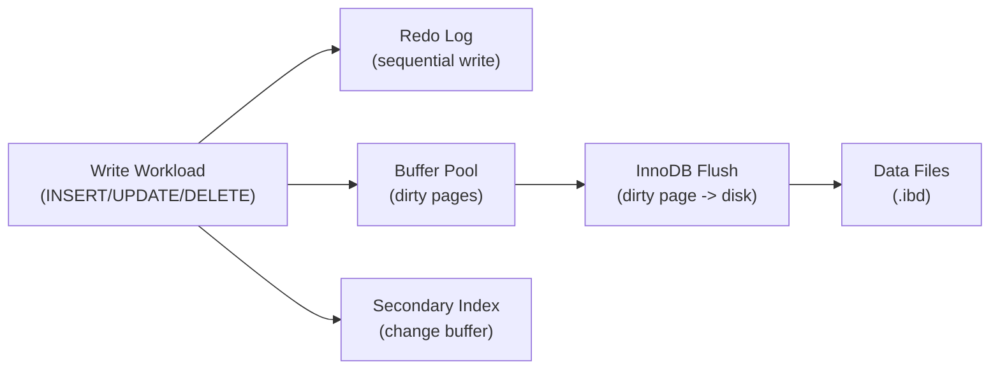

# How to Tune MySQL InnoDB for Write-Heavy Workloads

Author: [nawazdhandala](https://www.github.com/nawazdhandala)

Tags: MySQL, InnoDB, Performance, Write Optimization, Tuning

Description: Learn how to tune InnoDB configuration for write-heavy MySQL workloads, covering redo log sizing, flush settings, change buffering, and I/O thread tuning.

---

## Write-Heavy Workload Bottlenecks

In write-heavy workloads, performance is limited by how fast InnoDB can:

1. Write transactions to the redo log
2. Flush dirty pages from the buffer pool to disk
3. Update secondary indexes
4. Maintain binary logs (if enabled)



## Redo Log Tuning

The redo log is the most critical component for write performance. A larger redo log reduces checkpoint frequency and I/O.

### MySQL 8.0.30+ (Dynamic Redo Log)

```ini
[mysqld]
# 4 GB redo log capacity (dynamic, auto-managed)
innodb_redo_log_capacity = 4294967296
```

### MySQL 8.0.29 and Earlier

```ini
[mysqld]
innodb_log_file_size     = 2G   -- each file
innodb_log_files_in_group = 2   -- total = 4 GB
```

Verify the setting after restart:

```sql
SHOW VARIABLES LIKE 'innodb_log_file_size';
```

### Log Buffer Size

The log buffer holds redo log data in memory before flushing to disk. Increase it for high write rates:

```ini
[mysqld]
innodb_log_buffer_size = 64M
```

At high write rates, flush the log more frequently than once per second:

```ini
innodb_flush_log_at_timeout = 1  -- flush every 1 second (default)
```

## Durability vs. Performance Trade-off

`innodb_flush_log_at_trx_commit` controls when the redo log is flushed to disk:

```ini
# Option 1: Full durability (ACID compliant, slowest)
innodb_flush_log_at_trx_commit = 1

# Option 2: Flush every second (lose at most ~1 second of data on OS crash)
innodb_flush_log_at_trx_commit = 2

# Option 3: No flush per transaction (fastest; risk data loss on MySQL crash)
innodb_flush_log_at_trx_commit = 0
```

For write-heavy workloads where some data loss is acceptable (e.g., analytics ingestion):

```ini
innodb_flush_log_at_trx_commit = 2
sync_binlog                    = 0
```

For financial data requiring full ACID compliance:

```ini
innodb_flush_log_at_trx_commit = 1
sync_binlog                    = 1
```

## Buffer Pool Tuning

### Buffer Pool Size and Instances

```ini
[mysqld]
innodb_buffer_pool_size      = 24G
innodb_buffer_pool_instances = 16   -- one per GB
```

### Dirty Page Flush Rate

Configure how aggressively InnoDB flushes dirty pages:

```ini
[mysqld]
innodb_max_dirty_pages_pct        = 75   -- default 90; reduce for more frequent flushing
innodb_max_dirty_pages_pct_lwm    = 10   -- start flushing when dirty pages exceed 10%
innodb_io_capacity                = 2000  -- I/O operations per second (for SSD)
innodb_io_capacity_max            = 4000  -- max burst I/O
```

Adaptive flushing algorithm:

```ini
innodb_adaptive_flushing     = ON
innodb_adaptive_flushing_lwm = 10
```

This makes InnoDB flush more aggressively as the redo log fills, preventing redo log exhaustion.

## I/O Thread Tuning

Increase the number of I/O threads for parallel flush operations:

```ini
[mysqld]
innodb_read_io_threads  = 8
innodb_write_io_threads = 8
```

For NVMe SSDs, increase further:

```ini
innodb_read_io_threads  = 16
innodb_write_io_threads = 16
```

## Flush Method

Avoid double-buffering by bypassing the OS page cache:

```ini
[mysqld]
innodb_flush_method = O_DIRECT
```

On Linux with EXT4 or XFS and SSD, `O_DIRECT` consistently improves write throughput.

For very fast NVMe storage:

```ini
innodb_flush_method = O_DIRECT_NO_FSYNC  -- skip fsync, OS guarantees order
```

## Change Buffering

Enable the change buffer to defer secondary index updates:

```ini
[mysqld]
innodb_change_buffering       = all
innodb_change_buffer_max_size = 25  -- up to 25% of buffer pool
```

For SSD storage where random I/O is fast, disable the change buffer:

```ini
innodb_change_buffering = none
```

## Batching Writes

### Group Commit

InnoDB group commit batches multiple transaction commits into a single redo log write. It is enabled automatically. Ensure you are not artificially limiting it.

### Bulk Insert Optimization

For large batch inserts, temporarily disable checks:

```sql
SET FOREIGN_KEY_CHECKS = 0;
SET UNIQUE_CHECKS = 0;
SET SQL_LOG_BIN = 0;  -- if replication is not needed for this session

-- Perform bulk INSERT
LOAD DATA INFILE '/tmp/data.csv'
INTO TABLE orders
FIELDS TERMINATED BY ','
LINES TERMINATED BY '\n';

SET FOREIGN_KEY_CHECKS = 1;
SET UNIQUE_CHECKS = 1;
SET SQL_LOG_BIN = 1;
```

Or use multi-row INSERT for better performance:

```sql
INSERT INTO orders (customer_id, amount, status) VALUES
    (1, 99.99, 'pending'),
    (2, 149.50, 'pending'),
    (3, 49.00, 'pending');
```

### Auto-increment Lock Mode

For high-throughput INSERT workloads, use `innodb_autoinc_lock_mode = 2`:

```ini
[mysqld]
innodb_autoinc_lock_mode = 2  -- interleaved mode (fastest); requires binlog_format=ROW
binlog_format            = ROW
```

This eliminates the AUTO-INC table-level lock for INSERT statements.

## Doublewrite Buffer

The doublewrite buffer prevents partial page writes. It adds overhead but ensures data integrity:

```ini
[mysqld]
innodb_doublewrite = ON  -- default; disable only on ZFS or other journaling FS
```

On ZFS or Btrfs (atomic writes):

```ini
innodb_doublewrite = OFF  -- ZFS handles atomicity
```

## Monitoring Write Performance

```sql
-- Redo log usage
SHOW ENGINE INNODB STATUS\G
-- Look for: "Log sequence number", "Log flushed up to", "Pages flushed up to"

-- Dirty page percentage
SELECT variable_value AS dirty_pages
FROM   performance_schema.global_status
WHERE  variable_name = 'Innodb_buffer_pool_pages_dirty';

-- I/O rates
SHOW GLOBAL STATUS LIKE 'Innodb_data_written';
SHOW GLOBAL STATUS LIKE 'Innodb_data_reads';
SHOW GLOBAL STATUS LIKE 'Innodb_data_fsyncs';

-- Checkpoint stalls (should be 0)
SELECT name, count
FROM   information_schema.INNODB_METRICS
WHERE  name IN ('log_waits', 'log_write_requests', 'log_writes');
```

## Complete Write-Heavy Configuration Example

```ini
[mysqld]
# Buffer Pool
innodb_buffer_pool_size          = 24G
innodb_buffer_pool_instances     = 16

# Redo Log (MySQL 8.0.30+)
innodb_redo_log_capacity         = 4294967296  -- 4 GB
innodb_log_buffer_size           = 64M

# Durability (sacrifice 1 second of data for throughput)
innodb_flush_log_at_trx_commit   = 2
sync_binlog                      = 0

# Flush method
innodb_flush_method              = O_DIRECT

# I/O Threads (for SSD)
innodb_read_io_threads           = 8
innodb_write_io_threads          = 8
innodb_io_capacity               = 2000
innodb_io_capacity_max           = 4000

# Dirty Page Management
innodb_max_dirty_pages_pct       = 75
innodb_adaptive_flushing         = ON

# Auto-increment (for bulk inserts)
innodb_autoinc_lock_mode         = 2
binlog_format                    = ROW

# Change Buffering (HDD only)
innodb_change_buffering          = all
innodb_change_buffer_max_size    = 25
```

## Best Practices

- Set `innodb_redo_log_capacity` (or `innodb_log_file_size`) large enough that checkpoints happen infrequently (every 5-10 minutes, not every second).
- Use `innodb_flush_log_at_trx_commit = 2` if you can tolerate 1 second of data loss.
- Set `innodb_autoinc_lock_mode = 2` with `binlog_format = ROW` for parallel INSERT workloads.
- Monitor for checkpoint stalls (`log_waits`) - they indicate the redo log is too small.
- Use `O_DIRECT` on Linux to eliminate OS page cache overhead.
- Batch writes in application code using multi-row INSERT and transactions.

## Summary

Tuning InnoDB for write-heavy workloads centers on the redo log, buffer pool, and flush settings. Increase redo log capacity to reduce checkpoint frequency, set `innodb_flush_log_at_trx_commit = 2` for a throughput boost at the cost of 1 second of potential data loss, use `O_DIRECT` flush method, and configure I/O capacity to match your storage hardware. For bulk inserts, use `innodb_autoinc_lock_mode = 2` and batch inserts in multi-row statements.
