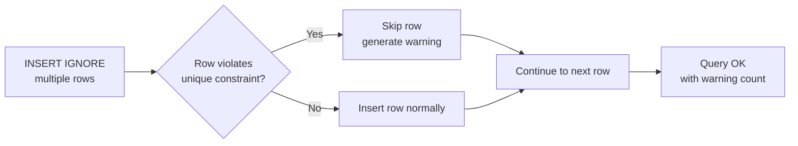

# How to Use INSERT IGNORE in MySQL to Skip Duplicate Errors

Author: [nawazdhandala](https://www.github.com/nawazdhandala)

Tags: MySQL, SQL, DML, INSERT, Duplicate, Error Handling

Description: Use INSERT IGNORE to silently skip rows that would violate unique or primary key constraints, and understand when to use it versus ON DUPLICATE KEY UPDATE.

---

## How It Works

`INSERT IGNORE` tells MySQL to silently skip any row that would cause a constraint violation error (duplicate primary key, unique key violation, or data conversion error). Instead of raising an error, MySQL generates a warning and continues inserting the remaining rows.



## Syntax

```sql
INSERT IGNORE INTO table_name (col1, col2, ...)
VALUES (val1, val2, ...),
       (val3, val4, ...);
```

## Setting Up the Example

```sql
CREATE TABLE tags (
    id   INT UNSIGNED AUTO_INCREMENT PRIMARY KEY,
    name VARCHAR(50)  NOT NULL UNIQUE
);

INSERT INTO tags (name) VALUES
    ('mysql'), ('database'), ('sql');

SELECT * FROM tags;
```

```text
+----+----------+
| id | name     |
+----+----------+
|  1 | mysql    |
|  2 | database |
|  3 | sql      |
+----+----------+
```

## Basic INSERT IGNORE Example

Without `IGNORE`, inserting a duplicate raises an error.

```sql
INSERT INTO tags (name) VALUES ('mysql');
```

```text
ERROR 1062 (23000): Duplicate entry 'mysql' for key 'tags.name'
```

With `INSERT IGNORE`, the duplicate is silently skipped.

```sql
INSERT IGNORE INTO tags (name) VALUES ('mysql');
```

```text
Query OK, 0 rows affected, 1 warning (0.00 sec)
```

No error, no new row inserted. Check the warning.

```sql
SHOW WARNINGS;
```

```text
+---------+------+---------------------------------------------+
| Level   | Code | Message                                     |
+---------+------+---------------------------------------------+
| Warning | 1062 | Duplicate entry 'mysql' for key 'tags.name' |
+---------+------+---------------------------------------------+
```

## Inserting Multiple Rows with Some Duplicates

`INSERT IGNORE` continues processing all rows even after encountering duplicates.

```sql
INSERT IGNORE INTO tags (name) VALUES
    ('mysql'),       -- duplicate, skipped
    ('performance'), -- new, inserted
    ('database'),    -- duplicate, skipped
    ('indexing');    -- new, inserted

SELECT * FROM tags;
```

```text
+----+-------------+
| id | name        |
+----+-------------+
|  1 | mysql       |
|  2 | database    |
|  3 | sql         |
|  4 | performance |
|  5 | indexing    |
+----+-------------+
```

```text
Query OK, 2 rows affected, 2 warnings (0.01 sec)
Records: 4  Duplicates: 2  Warnings: 2
```

## Bulk Import with INSERT IGNORE

`INSERT IGNORE` is useful when importing data from an external source that may contain duplicates.

```sql
CREATE TABLE products (
    id   INT UNSIGNED AUTO_INCREMENT PRIMARY KEY,
    sku  VARCHAR(50)    NOT NULL UNIQUE,
    name VARCHAR(255)   NOT NULL,
    price DECIMAL(10,2) NOT NULL
);

-- Simulate an idempotent bulk import
INSERT IGNORE INTO products (sku, name, price) VALUES
    ('SKU-001', 'Widget',     9.99),
    ('SKU-002', 'Gadget',    29.99),
    ('SKU-001', 'Widget v2', 12.99),  -- duplicate SKU, skipped
    ('SKU-003', 'Doohickey',  4.99);

SELECT * FROM products;
```

```text
+----+---------+-----------+-------+
| id | sku     | name      | price |
+----+---------+-----------+-------+
|  1 | SKU-001 | Widget    |  9.99 |
|  2 | SKU-002 | Gadget    | 29.99 |
|  3 | SKU-003 | Doohickey |  4.99 |
+----+---------+-----------+-------+
```

Note that the first `SKU-001` row was kept and the second was silently ignored.

## INSERT IGNORE vs ON DUPLICATE KEY UPDATE

| Behaviour | INSERT IGNORE | ON DUPLICATE KEY UPDATE |
|---|---|---|
| Duplicate primary/unique key | Skip, warn | Update existing row |
| Outcome | Old row unchanged | Old row updated |
| Use case | Idempotent insert-if-not-exists | Upsert (insert or update) |
| Performance | Slightly faster (no update) | Slightly slower |

Use `INSERT IGNORE` when you want to keep the existing row as-is. Use `ON DUPLICATE KEY UPDATE` when you want to update it.

## INSERT IGNORE with Data Conversion Errors

`INSERT IGNORE` also suppresses data truncation and out-of-range errors (converting them to warnings and inserting the closest valid value). This can lead to silent data corruption.

```sql
CREATE TABLE readings (
    id    INT UNSIGNED AUTO_INCREMENT PRIMARY KEY,
    value TINYINT UNSIGNED NOT NULL  -- range 0-255
);

INSERT IGNORE INTO readings (value) VALUES (300);
-- 300 is out of range for TINYINT UNSIGNED, stored as 255
```

```sql
SELECT * FROM readings;
```

```text
+----+-------+
| id | value |
+----+-------+
|  1 |   255 |
+----+-------+
```

Avoid `INSERT IGNORE` for type-conversion scenarios where silent truncation is unacceptable.

## Checking How Many Rows Were Inserted vs Skipped

```sql
INSERT IGNORE INTO tags (name) VALUES
    ('query'), ('mysql'), ('optimizer'), ('sql');

-- ROW_COUNT() returns only rows actually changed
SELECT ROW_COUNT() AS inserted_count;
```

```text
+----------------+
| inserted_count |
+----------------+
|              2 |
+----------------+
```

## Best Practices

- Use `INSERT IGNORE` only for duplicate key scenarios where keeping the original row is correct.
- Do not use `INSERT IGNORE` to suppress data type conversion errors - this leads to silent data corruption.
- Log or monitor the warning count when using `INSERT IGNORE` in production imports.
- Prefer `INSERT ... ON DUPLICATE KEY UPDATE` when you need to update the existing row on conflict.
- Check `ROW_COUNT()` after `INSERT IGNORE` to verify how many rows were actually inserted.

## Summary

`INSERT IGNORE` skips rows that would cause constraint violations (mainly duplicate key errors) and continues inserting the remaining rows. It is ideal for idempotent imports where the first-written value should be preserved. Duplicates are converted to warnings rather than errors. Avoid using it to suppress data conversion errors because it will silently truncate or clamp values instead of rejecting them.
