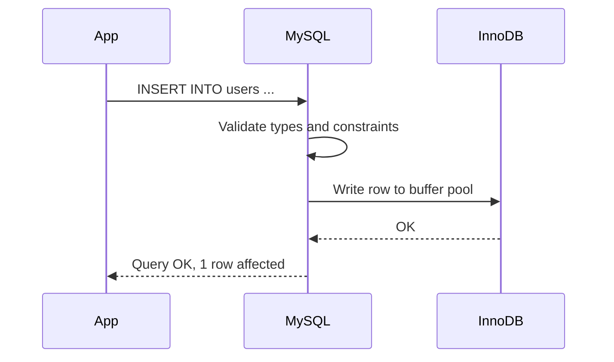

# How to Insert Data into MySQL with INSERT INTO

Author: [nawazdhandala](https://www.github.com/nawazdhandala)

Tags: MySQL, SQL, DML, Insert, Database

Description: Insert single rows, multiple rows, and use various INSERT forms in MySQL including column lists, default values, and SET syntax.

---

## How It Works

`INSERT INTO` adds one or more rows to a table. MySQL validates the data against column types, NOT NULL constraints, unique indexes, and foreign key constraints before committing the row. If validation fails, the entire statement is rolled back.



## Syntax

### Column-list form (recommended)

```sql
INSERT INTO table_name (col1, col2, col3)
VALUES (val1, val2, val3);
```

### All-columns form (not recommended for production)

```sql
INSERT INTO table_name
VALUES (val1, val2, val3, ...);
```

### SET form

```sql
INSERT INTO table_name
SET col1 = val1,
    col2 = val2;
```

## Creating the Sample Table

```sql
CREATE TABLE users (
    id         INT UNSIGNED AUTO_INCREMENT PRIMARY KEY,
    username   VARCHAR(50)  NOT NULL UNIQUE,
    email      VARCHAR(255) NOT NULL UNIQUE,
    age        TINYINT UNSIGNED,
    is_active  BOOLEAN      NOT NULL DEFAULT TRUE,
    created_at DATETIME     NOT NULL DEFAULT CURRENT_TIMESTAMP
);
```

## Single Row Insert

```sql
INSERT INTO users (username, email, age)
VALUES ('alice', 'alice@example.com', 30);
```

```text
Query OK, 1 row affected (0.01 sec)
```

Columns with defaults (`is_active`, `created_at`) and the auto-increment `id` are filled automatically.

## Multiple Row Insert

Insert several rows in a single statement for better performance.

```sql
INSERT INTO users (username, email, age) VALUES
    ('bob',   'bob@example.com',   25),
    ('carol', 'carol@example.com', 35),
    ('dave',  'dave@example.com',  28);
```

```text
Query OK, 3 rows affected (0.01 sec)
Records: 3  Duplicates: 0  Warnings: 0
```

Verify the inserts.

```sql
SELECT id, username, email, age, is_active, created_at FROM users;
```

```text
+----+----------+-------------------+------+-----------+---------------------+
| id | username | email             | age  | is_active | created_at          |
+----+----------+-------------------+------+-----------+---------------------+
|  1 | alice    | alice@example.com |   30 |         1 | 2024-06-01 10:00:00 |
|  2 | bob      | bob@example.com   |   25 |         1 | 2024-06-01 10:00:00 |
|  3 | carol    | carol@example.com |   35 |         1 | 2024-06-01 10:00:00 |
|  4 | dave     | dave@example.com  |   28 |         1 | 2024-06-01 10:00:00 |
+----+----------+-------------------+------+-----------+---------------------+
```

## SET Syntax

The `SET` form can be more readable for single-row inserts with many columns.

```sql
INSERT INTO users
SET username  = 'eve',
    email     = 'eve@example.com',
    age       = 22,
    is_active = FALSE;
```

## Inserting NULL Values

Use `NULL` explicitly for nullable columns, or simply omit the column.

```sql
INSERT INTO users (username, email, age)
VALUES ('frank', 'frank@example.com', NULL);
-- age is NULL
```

## Getting the Generated AUTO_INCREMENT ID

Use `LAST_INSERT_ID()` immediately after the insert to retrieve the auto-generated primary key.

```sql
INSERT INTO users (username, email) VALUES ('grace', 'grace@example.com');
SELECT LAST_INSERT_ID() AS new_id;
```

```text
+--------+
| new_id |
+--------+
|      6 |
+--------+
```

For multi-row inserts, `LAST_INSERT_ID()` returns the first generated ID of the batch.

```sql
INSERT INTO users (username, email) VALUES
    ('henry', 'henry@example.com'),
    ('iris',  'iris@example.com');

SELECT LAST_INSERT_ID() AS first_id_of_batch;
```

```text
+-------------------+
| first_id_of_batch |
+-------------------+
|                 7 |
+-------------------+
```

## Inserting with Explicit ID

You can supply an explicit value for an AUTO_INCREMENT column. MySQL accepts it and adjusts the counter.

```sql
INSERT INTO users (id, username, email) VALUES (100, 'jack', 'jack@example.com');
-- Next auto-increment will be 101
```

## Inserting Default Values

Use `DEFAULT` keyword to explicitly request the column default.

```sql
INSERT INTO users (username, email, is_active)
VALUES ('karen', 'karen@example.com', DEFAULT);
-- is_active gets its DEFAULT value of TRUE
```

## Inserting from an Expression

Column values can be expressions.

```sql
INSERT INTO users (username, email)
VALUES (LOWER('LAURA'), CONCAT('laura', '@example.com'));
```

## Error Handling

### Duplicate Key Error

```sql
INSERT INTO users (username, email) VALUES ('alice', 'different@example.com');
```

```text
ERROR 1062 (23000): Duplicate entry 'alice' for key 'users.uq_username'
```

### NOT NULL Violation

```sql
INSERT INTO users (username) VALUES ('mark');
```

```text
ERROR 1364 (HY000): Field 'email' doesn't have a default value
```

## Transactions

Wrap multiple inserts in a transaction to ensure atomicity.

```sql
START TRANSACTION;

INSERT INTO orders (user_id, total_amount) VALUES (1, 59.99);
SET @order_id = LAST_INSERT_ID();

INSERT INTO order_items (order_id, product_id, quantity, unit_price)
VALUES (@order_id, 5, 2, 29.99);

COMMIT;
```

If any insert fails, `ROLLBACK` reverts all changes.

## Best Practices

- Always specify the column list in `INSERT INTO`; avoid the all-columns positional form.
- Batch multiple rows in a single `INSERT` statement for much better performance than repeated single-row inserts.
- Wrap multi-statement inserts in a transaction so partial failures can be rolled back.
- Use `LAST_INSERT_ID()` immediately after the insert, before any other queries, to get the generated ID.
- Validate data in the application layer before inserting to provide better error messages than MySQL constraint errors.

## Summary

`INSERT INTO` adds rows to a MySQL table using the column-list form, the SET form, or the positional all-columns form. Always use the column-list form for clarity and safety. Insert multiple rows in a single statement for efficiency. Use `LAST_INSERT_ID()` to retrieve auto-generated keys, wrap multi-step inserts in transactions for atomicity, and handle duplicate key and NOT NULL errors gracefully in the application.
