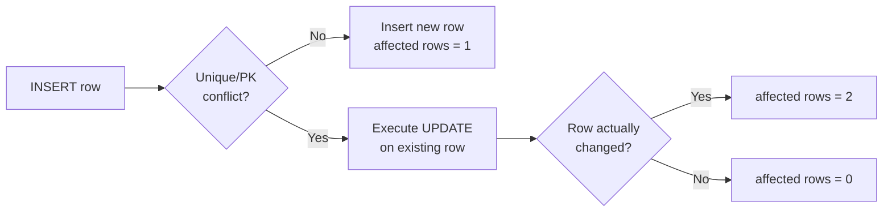

# How to Use INSERT ON DUPLICATE KEY UPDATE in MySQL

Author: [nawazdhandala](https://www.github.com/nawazdhandala)

Tags: MySQL, SQL, DML, INSERT, Upsert, Duplicate Key, Update

Description: Perform MySQL upserts with INSERT ON DUPLICATE KEY UPDATE to insert a new row or update an existing one when a unique or primary key conflict occurs.

---

## How It Works

`INSERT ... ON DUPLICATE KEY UPDATE` is MySQL's upsert mechanism. When an INSERT would cause a duplicate primary key or unique key violation, MySQL executes the `UPDATE` clause on the existing row instead. It is a single atomic operation.



Note: MySQL reports `2 rows affected` when a row is updated and `1 row affected` when a new row is inserted. `0 rows affected` means a duplicate was found but the UPDATE made no change.

## Syntax

```sql
INSERT INTO table_name (col1, col2, ...)
VALUES (val1, val2, ...)
ON DUPLICATE KEY UPDATE
    col1 = new_val1,
    col2 = new_val2;
```

## Basic Example - Upsert a Single Row

```sql
CREATE TABLE page_views (
    page_slug  VARCHAR(200)    NOT NULL,
    view_count INT UNSIGNED    NOT NULL DEFAULT 0,
    updated_at DATETIME        NOT NULL DEFAULT CURRENT_TIMESTAMP ON UPDATE CURRENT_TIMESTAMP,
    PRIMARY KEY (page_slug)
);

-- First visit: inserts a new row
INSERT INTO page_views (page_slug, view_count)
VALUES ('home', 1)
ON DUPLICATE KEY UPDATE
    view_count = view_count + 1;

-- Second visit: updates the existing row
INSERT INTO page_views (page_slug, view_count)
VALUES ('home', 1)
ON DUPLICATE KEY UPDATE
    view_count = view_count + 1;

SELECT * FROM page_views;
```

```text
+-----------+------------+---------------------+
| page_slug | view_count | updated_at          |
+-----------+------------+---------------------+
| home      |          2 | 2024-06-01 10:00:05 |
+-----------+------------+---------------------+
```

## Using VALUES() to Reference the Inserted Value

The `VALUES(col)` function returns the value that would have been inserted for that column.

```sql
CREATE TABLE products (
    id         INT UNSIGNED AUTO_INCREMENT PRIMARY KEY,
    sku        VARCHAR(50)    NOT NULL UNIQUE,
    name       VARCHAR(255)   NOT NULL,
    price      DECIMAL(10, 2) NOT NULL,
    updated_at DATETIME       NOT NULL DEFAULT CURRENT_TIMESTAMP ON UPDATE CURRENT_TIMESTAMP
);

-- First run: inserts
INSERT INTO products (sku, name, price) VALUES
    ('SKU-001', 'Widget',  9.99),
    ('SKU-002', 'Gadget', 29.99)
ON DUPLICATE KEY UPDATE
    name       = VALUES(name),
    price      = VALUES(price);

-- Second run: updates SKU-001's price
INSERT INTO products (sku, name, price) VALUES
    ('SKU-001', 'Widget', 12.99)
ON DUPLICATE KEY UPDATE
    name  = VALUES(name),
    price = VALUES(price);

SELECT * FROM products;
```

```text
+----+---------+--------+-------+---------------------+
| id | sku     | name   | price | updated_at          |
+----+---------+--------+-------+---------------------+
|  1 | SKU-001 | Widget | 12.99 | 2024-06-01 10:00:10 |
|  2 | SKU-002 | Gadget | 29.99 | 2024-06-01 10:00:00 |
+----+---------+--------+-------+---------------------+
```

Note: `VALUES(col)` is deprecated in MySQL 8.0.20. Use the new alias syntax instead.

## Using Alias Syntax (MySQL 8.0.20+)

```sql
INSERT INTO products (sku, name, price)
VALUES ('SKU-001', 'Widget Pro', 14.99) AS new_row
ON DUPLICATE KEY UPDATE
    name  = new_row.name,
    price = new_row.price;
```

## Upsert with AUTO_INCREMENT - ID Gap Problem

When `ON DUPLICATE KEY UPDATE` fires, MySQL increments the AUTO_INCREMENT counter even though no new row is inserted. This causes gaps in IDs.

```sql
SHOW TABLE STATUS LIKE 'products'\G
-- Auto_increment will show 3 even though only 2 rows exist
```

This is expected behaviour. Design your system to accept ID gaps.

## Conditional Update

Only update certain columns if the conflict occurs.

```sql
-- Only update price if the new price is lower (price protection)
INSERT INTO products (sku, name, price)
VALUES ('SKU-001', 'Widget', 8.99)
ON DUPLICATE KEY UPDATE
    price = LEAST(price, VALUES(price));
```

## Increment a Counter on Conflict

```sql
CREATE TABLE user_login_stats (
    user_id      INT UNSIGNED PRIMARY KEY,
    login_count  INT UNSIGNED NOT NULL DEFAULT 0,
    last_login   DATETIME     NOT NULL DEFAULT CURRENT_TIMESTAMP
);

-- Record a login: insert first time, increment on subsequent logins
INSERT INTO user_login_stats (user_id, login_count, last_login)
VALUES (42, 1, NOW())
ON DUPLICATE KEY UPDATE
    login_count = login_count + 1,
    last_login  = NOW();
```

## Multi-Row Upsert

```sql
INSERT INTO products (sku, name, price) VALUES
    ('SKU-001', 'Widget',     9.99),
    ('SKU-002', 'Gadget',    29.99),
    ('SKU-003', 'Doohickey',  4.99)
ON DUPLICATE KEY UPDATE
    name  = VALUES(name),
    price = VALUES(price);
```

## Checking the Result

After the operation, `ROW_COUNT()` reveals what happened.

```text
1 row affected  - new row inserted
2 rows affected - existing row updated
0 rows affected - duplicate found, but UPDATE made no change (same values)
```

```sql
INSERT INTO products (sku, name, price)
VALUES ('SKU-001', 'Widget', 9.99)   -- same values as existing row
ON DUPLICATE KEY UPDATE
    name  = VALUES(name),
    price = VALUES(price);

SELECT ROW_COUNT();
```

```text
+-------------+
| ROW_COUNT() |
+-------------+
|           0 |
+-------------+
```

## INSERT IGNORE vs ON DUPLICATE KEY UPDATE vs REPLACE INTO

| Operation | On duplicate | Old row | ID behavior |
|---|---|---|---|
| `INSERT IGNORE` | Skip | Unchanged | No change |
| `ON DUPLICATE KEY UPDATE` | Update old row | Updated | ID gap possible |
| `REPLACE INTO` | Delete old, insert new | Deleted | New ID assigned |

## Best Practices

- Prefer `ON DUPLICATE KEY UPDATE` over `REPLACE INTO` to avoid deleting the existing row and losing the original AUTO_INCREMENT ID.
- Use the MySQL 8.0.20+ alias syntax (`AS new_row`) instead of the deprecated `VALUES(col)` function.
- Only list the columns you actually want to update in the `UPDATE` clause; do not repeat all columns.
- Be aware of AUTO_INCREMENT gaps caused by the increment-on-conflict behaviour.
- Use `ROW_COUNT()` to distinguish inserts from updates in application logic.

## Summary

`INSERT ... ON DUPLICATE KEY UPDATE` provides upsert semantics: insert if the row is new, update if a duplicate primary or unique key is found. Use `VALUES(col)` (deprecated) or the alias syntax (MySQL 8.0.20+) to reference the proposed new values in the UPDATE clause. It is the preferred alternative to `REPLACE INTO` because it updates in place without deleting the original row. Monitor `ROW_COUNT()` to track insert vs update outcomes.
