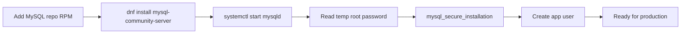

# How to Install MySQL on Amazon Linux 2023

Author: [nawazdhandala](https://www.github.com/nawazdhandala)

Tags: MySQL, Installation, Amazon Linux, AWS, Database

Description: Install MySQL 8.0 on Amazon Linux 2023 using the official MySQL community repository, open the firewall, and prepare the instance for application use.

---

## How It Works

Amazon Linux 2023 (AL2023) uses DNF as its package manager. The default repositories do not include MySQL, so you add the official MySQL community RPM repository. AL2023 is based on Fedora upstream, making it compatible with the EL9-series MySQL packages.



## Prerequisites

- Amazon Linux 2023 EC2 instance (or on-premises install)
- User with `sudo` access (typically `ec2-user`)
- Outbound internet access for package downloads

## Step 1 - Install the MySQL Repository

```bash
sudo dnf install -y https://dev.mysql.com/get/mysql84-community-release-el9-1.noarch.rpm
```

Verify the repo was registered.

```bash
sudo dnf repolist | grep mysql
```

To pin to MySQL 8.0 instead of 8.4, swap the enabled repositories.

```bash
sudo dnf config-manager --disable mysql-8.4-lts-community
sudo dnf config-manager --enable mysql80-community
```

## Step 2 - Install MySQL Server

```bash
sudo dnf install -y mysql-community-server
```

If you see a GPG key prompt, accept it to proceed.

## Step 3 - Start and Enable the Service

```bash
sudo systemctl enable --now mysqld
```

Check that mysqld is running.

```bash
sudo systemctl status mysqld
```

```text
● mysqld.service - MySQL Server
   Active: active (running)
```

## Step 4 - Retrieve the Temporary Root Password

```bash
sudo grep 'temporary password' /var/log/mysqld.log
```

```text
[Note] [MY-010454] [Server] A temporary password is generated for root@localhost: xYz#1AbCdE
```

Copy this password for use in the next step.

## Step 5 - Run the Security Script

```bash
sudo mysql_secure_installation
```

At the password prompt, paste the temporary password. You must set a new root password before you can make other changes. Accept all hardening prompts (remove anonymous users, disallow remote root login, remove test database, reload privileges).

## Step 6 - Connect and Create an Application User

```bash
mysql -u root -p
```

```sql
CREATE DATABASE appdb CHARACTER SET utf8mb4 COLLATE utf8mb4_unicode_ci;
CREATE USER 'appuser'@'localhost' IDENTIFIED BY 'SecurePass1!';
GRANT ALL PRIVILEGES ON appdb.* TO 'appuser'@'localhost';
FLUSH PRIVILEGES;
EXIT;
```

## Step 7 - Configure the EC2 Security Group

In the AWS Console or via the CLI, allow inbound traffic on TCP port 3306 from your application servers or VPC CIDR.

```bash
aws ec2 authorize-security-group-ingress \
  --group-id sg-0123456789abcdef0 \
  --protocol tcp \
  --port 3306 \
  --cidr 10.0.0.0/16
```

For local-only access (application on the same instance), no security group change is needed.

## Step 8 - Configure bind-address for Remote Access (Optional)

Edit the MySQL configuration to accept connections from the private IP.

```bash
sudo nano /etc/my.cnf
```

Add under `[mysqld]`:

```ini
bind-address = 0.0.0.0
```

Restart the service.

```bash
sudo systemctl restart mysqld
```

## Key File Locations

```text
/etc/my.cnf                   Primary configuration
/var/lib/mysql/               Data directory
/var/log/mysqld.log          Error log
```

## Verify the Installation

```bash
mysql --version
mysqladmin -u root -p status
```

## Summary

Amazon Linux 2023 requires adding the official MySQL community repository since MySQL is not in the default AL2023 repos. After installing and starting `mysqld`, retrieve the auto-generated temporary password from the error log, run `mysql_secure_installation`, and create a dedicated application user. Remember to open TCP port 3306 in the EC2 security group if the application tier is on a separate instance.
