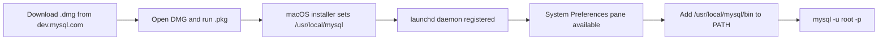

# How to Install MySQL on macOS Using the DMG Package

Author: [nawazdhandala](https://www.github.com/nawazdhandala)

Tags: MySQL, Installation, macOS, Database, Configuration

Description: Install MySQL 8.0 on macOS using the official DMG installer, configure the launch daemon, and connect from the Terminal using the mysql client.

---

## How It Works

Oracle distributes MySQL for macOS as a native DMG package containing a `.pkg` installer. The installer places the MySQL binaries in `/usr/local/mysql`, registers a launchd daemon (`com.oracle.oss.mysql.mysqld`), and installs a System Preferences pane for starting and stopping the server.



## Prerequisites

- macOS 12 Monterey, 13 Ventura, 14 Sonoma, or 15 Sequoia
- Administrator account
- ~600 MB free disk space

## Step 1 - Download the DMG Package

Visit [https://dev.mysql.com/downloads/mysql/](https://dev.mysql.com/downloads/mysql/).

Select:
- **Operating System**: macOS
- **OS Version**: macOS 14 (ARM) or macOS 14 (x86, 64-bit) depending on your Mac hardware

Click **Download** and skip the Oracle account login by clicking "No thanks, just start my download."

## Step 2 - Mount the DMG and Run the Installer

1. Double-click the downloaded `.dmg` file.
2. Double-click the `.pkg` file inside the mounted volume.
3. Follow the installer wizard: Introduction > License > Destination > Installation Type > Install.
4. Enter your macOS administrator password when prompted.

At the end of installation, a dialog shows a **temporary root password**. Copy it immediately - it is shown only once.

```text
Please remember to set a new password as soon as possible.
The root password is: AbCd1234!Xyz
```

## Step 3 - Start MySQL

Open **System Settings > MySQL** (the MySQL pane installed by the package). Click **Start MySQL Server**.

Alternatively, use the command line.

```bash
sudo /usr/local/mysql/support-files/mysql.server start
```

## Step 4 - Add MySQL to Your PATH

The installer does not modify your shell profile. Add the bin directory manually.

For Zsh (default on macOS Catalina+):

```bash
echo 'export PATH="/usr/local/mysql/bin:$PATH"' >> ~/.zshrc
source ~/.zshrc
```

For Bash:

```bash
echo 'export PATH="/usr/local/mysql/bin:$PATH"' >> ~/.bash_profile
source ~/.bash_profile
```

## Step 5 - Change the Temporary Root Password

Connect using the temporary password.

```bash
mysql -u root -p
```

Change the password immediately.

```sql
ALTER USER 'root'@'localhost' IDENTIFIED BY 'NewStrongPass1!';
FLUSH PRIVILEGES;
EXIT;
```

## Step 6 - Create an Application User

```bash
mysql -u root -p
```

```sql
CREATE DATABASE mydb CHARACTER SET utf8mb4 COLLATE utf8mb4_unicode_ci;
CREATE USER 'devuser'@'localhost' IDENTIFIED BY 'DevPass1!';
GRANT ALL PRIVILEGES ON mydb.* TO 'devuser'@'localhost';
FLUSH PRIVILEGES;
EXIT;
```

## Managing the MySQL Service

```bash
# Start
sudo /usr/local/mysql/support-files/mysql.server start

# Stop
sudo /usr/local/mysql/support-files/mysql.server stop

# Restart
sudo /usr/local/mysql/support-files/mysql.server restart

# Status
sudo /usr/local/mysql/support-files/mysql.server status
```

Or manage the launchd daemon directly.

```bash
sudo launchctl load  -w /Library/LaunchDaemons/com.oracle.oss.mysql.mysqld.plist
sudo launchctl unload -w /Library/LaunchDaemons/com.oracle.oss.mysql.mysqld.plist
```

## Key File Locations

```text
/usr/local/mysql/                    MySQL installation root
/usr/local/mysql/bin/                Client and server binaries
/usr/local/mysql/data/               Default data directory
/usr/local/mysql/my.cnf              Configuration file (create if absent)
/tmp/mysql.sock                      Unix socket
```

## Custom Configuration

Create or edit `/usr/local/mysql/my.cnf` to customize the server.

```ini
[mysqld]
character-set-server  = utf8mb4
collation-server      = utf8mb4_unicode_ci
max_connections       = 150
innodb_buffer_pool_size = 256M

[client]
default-character-set = utf8mb4
```

Restart MySQL after editing the configuration.

## Uninstalling

To remove MySQL installed via the DMG:

```bash
sudo rm -rf /usr/local/mysql
sudo rm -rf /usr/local/mysql*
sudo rm -rf /Library/StartupItems/MySQLCOM
sudo rm -rf /Library/PreferencePanes/My*
sudo rm /Library/LaunchDaemons/com.oracle.oss.mysql.mysqld.plist
sudo rm -rf /Library/Receipts/mysql*
sudo rm -rf /Library/Receipts/MySQL*
sudo rm -rf /var/db/receipts/com.mysql.*
```

## Summary

The MySQL DMG installer for macOS provides a native package that integrates with System Settings and launchd. A temporary root password is displayed at the end of installation; change it immediately using `ALTER USER`. Add `/usr/local/mysql/bin` to your PATH so the `mysql` command works in the terminal. For development machines, Homebrew is an alternative that simplifies upgrades, but the DMG package is the official Oracle distribution.
