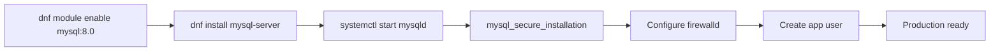

# How to Install MySQL on Rocky Linux 9

Author: [nawazdhandala](https://www.github.com/nawazdhandala)

Tags: MySQL, Installation, Rocky Linux, Linux, Database

Description: Install MySQL 8.0 on Rocky Linux 9 using the official MySQL community repository, configure SELinux and firewalld, and prepare for production use.

---

## How It Works

Rocky Linux 9 is a downstream rebuild of RHEL 9 and ships with MySQL 8.0 available through the AppStream module. Alternatively, you can use the official MySQL community Yum repository for more recent releases. This guide shows both methods and highlights the AppStream approach as the simpler path.



## Prerequisites

- Rocky Linux 9 (minimal or full install)
- User with `sudo` access
- Active internet connection

## Method 1 - AppStream Module (Recommended)

Rocky Linux 9 provides MySQL 8.0 through the DNF AppStream module. This is the easiest and most supported approach.

### Enable the MySQL Module

```bash
sudo dnf module enable mysql:8.0 -y
```

### Install MySQL Server

```bash
sudo dnf install -y mysql-server
```

## Method 2 - Official MySQL Community Repository

For MySQL 8.4 LTS or the latest 8.0 patch release:

```bash
sudo dnf install -y https://dev.mysql.com/get/mysql84-community-release-el9-1.noarch.rpm
sudo dnf install -y mysql-community-server
```

## Start and Enable the Service

```bash
sudo systemctl enable --now mysqld
```

For the AppStream install, check the service name.

```bash
sudo systemctl status mysqld
```

```text
● mysqld.service - MySQL 8.0 database server
     Active: active (running)
```

## Retrieve the Temporary Root Password

When using the official MySQL repository packages, a temporary password is written to the log.

```bash
sudo grep 'temporary password' /var/log/mysqld.log
```

For the AppStream package, the root account starts without a password and uses socket authentication.

## Secure the Installation

```bash
sudo mysql_secure_installation
```

Follow the prompts to set a root password (or change the temporary one), remove anonymous users, disable remote root login, and drop the test database.

## Connect and Configure

```bash
mysql -u root -p
```

```sql
CREATE DATABASE appdb CHARACTER SET utf8mb4 COLLATE utf8mb4_unicode_ci;
CREATE USER 'appuser'@'localhost' IDENTIFIED BY 'SecurePass1!';
GRANT ALL PRIVILEGES ON appdb.* TO 'appuser'@'localhost';
FLUSH PRIVILEGES;
EXIT;
```

## Configure firewalld

```bash
sudo firewall-cmd --permanent --add-service=mysql
sudo firewall-cmd --reload
sudo firewall-cmd --list-services
```

To restrict to a specific source IP range:

```bash
sudo firewall-cmd --permanent --remove-service=mysql
sudo firewall-cmd --permanent --add-rich-rule='rule family="ipv4" source address="10.10.0.0/16" service name="mysql" accept'
sudo firewall-cmd --reload
```

## SELinux Configuration

Rocky Linux 9 enforces SELinux by default. For a non-default data directory:

```bash
sudo semanage fcontext -a -t mysqld_db_t "/data/mysql(/.*)?"
sudo restorecon -Rv /data/mysql
```

## Verify the Installation

```bash
mysql --version
mysqladmin -u root -p version
```

## Key File Locations

```text
/etc/my.cnf                   Primary configuration
/etc/my.cnf.d/               Drop-in configuration files
/var/lib/mysql/               Data directory
/var/log/mysqld.log          Error log (official repo)
/var/log/mysql/mysqld.log    Error log (AppStream)
```

## Summary

Rocky Linux 9 provides MySQL 8.0 through the AppStream module, making installation straightforward with `dnf module enable` and `dnf install mysql-server`. The official MySQL community repository is an alternative for the latest release. Always configure firewalld to restrict access and run `mysql_secure_installation` before putting the server into production.
