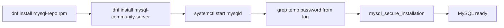

# How to Install MySQL Using the YUM Repository

Author: [OneUptime](https://oneuptime.com)

Tags: MySQL, Installation, YUM, RHEL, CentOS

Description: Add the official MySQL Yum/DNF repository to RHEL, CentOS, Rocky Linux, or AlmaLinux and install MySQL server with GPG signature verification.

---

## How It Works

Oracle provides an official MySQL community Yum repository that serves RPM packages for RHEL-compatible Linux distributions. Adding this repository allows you to install MySQL 8.0, 8.4 LTS, or MySQL 9.x and receive updates through the standard `dnf upgrade` workflow.



## Prerequisites

- RHEL 8/9, CentOS Stream 8/9, Rocky Linux 8/9, AlmaLinux 8/9, Fedora 38+
- User with `sudo` or root access
- Internet connectivity

## Step 1 - Add the MySQL Yum Repository

Download the repository RPM for your distribution. The following example targets EL9 (RHEL 9 / CentOS 9 Stream / Rocky Linux 9 / AlmaLinux 9).

```bash
sudo dnf install -y https://dev.mysql.com/get/mysql84-community-release-el9-1.noarch.rpm
```

For EL8:

```bash
sudo dnf install -y https://dev.mysql.com/get/mysql84-community-release-el8-1.noarch.rpm
```

For Fedora 40:

```bash
sudo dnf install -y https://dev.mysql.com/get/mysql84-community-release-fc40-1.noarch.rpm
```

## Step 2 - Import the MySQL GPG Key

The repository RPM includes the key, but you can also import it manually for verification.

```bash
sudo rpm --import https://repo.mysql.com/RPM-GPG-KEY-mysql-2023
```

## Step 3 - Select the MySQL Version

By default, the repository RPM enables MySQL 8.4 LTS. To use MySQL 8.0 instead:

```bash
sudo dnf config-manager --disable mysql-8.4-lts-community
sudo dnf config-manager --enable mysql80-community
```

Verify the enabled repositories.

```bash
sudo dnf repolist | grep mysql
```

```text
mysql80-community   MySQL 8.0 Community Server
mysql-tools-community   MySQL Tools Community
```

## Step 4 - Install MySQL Server

```bash
sudo dnf install -y mysql-community-server
```

DNF resolves dependencies and installs `mysql-community-server`, `mysql-community-client`, `mysql-community-libs`, and `mysql-community-common`.

## Step 5 - Start and Enable the Service

```bash
sudo systemctl enable --now mysqld
```

```bash
sudo systemctl status mysqld
```

```text
● mysqld.service - MySQL Server
     Active: active (running)
```

## Step 6 - Retrieve the Temporary Root Password

```bash
sudo grep 'temporary password' /var/log/mysqld.log
```

```text
[Note] [MY-010454] [Server] A temporary password is generated for root@localhost: xKj8#TemPwd
```

## Step 7 - Secure the Installation

```bash
sudo mysql_secure_installation
```

Use the temporary password at the first prompt. MySQL requires you to set a new password before making other changes. Accept all hardening prompts.

## Step 8 - Connect and Create an Application User

```bash
mysql -u root -p
```

```sql
CREATE DATABASE production CHARACTER SET utf8mb4 COLLATE utf8mb4_unicode_ci;
CREATE USER 'app'@'localhost' IDENTIFIED BY 'AppSecure1!';
GRANT ALL PRIVILEGES ON production.* TO 'app'@'localhost';
FLUSH PRIVILEGES;
EXIT;
```

## Updating MySQL via Yum

To update to the latest patch release:

```bash
sudo dnf update mysql-community-server
```

To check available versions:

```bash
sudo dnf list --available mysql-community-server
```

## Switching to a Different Major Version

Disable the current major version repo and enable the target one, then update.

```bash
sudo dnf config-manager --disable mysql80-community
sudo dnf config-manager --enable mysql-8.4-lts-community
sudo dnf update mysql-community-server
```

Always review the MySQL upgrade guide before performing major version upgrades.

## Key Repository Files

```text
/etc/yum.repos.d/mysql-community.repo   Repository definitions
/etc/yum.repos.d/mysql-tools-community.repo   Tools repo
```

View repo file:

```bash
cat /etc/yum.repos.d/mysql-community.repo
```

## Available Packages

```bash
dnf list mysql-community-*
```

Common packages:

```text
mysql-community-server     Database server
mysql-community-client     CLI client
mysql-community-libs       Shared libraries
mysql-shell                MySQL Shell (mysqlsh)
mysql-router               MySQL Router
mysql-workbench-community  Workbench GUI (Fedora only)
```

## Summary

The MySQL Yum repository provides the official MySQL RPM packages for RHEL-compatible distributions. Install the repository configuration RPM, select the desired MySQL version by toggling DNF repo entries, then install with `dnf install mysql-community-server`. After the first start, retrieve the auto-generated temporary password from the error log and run `mysql_secure_installation` to harden the server.
