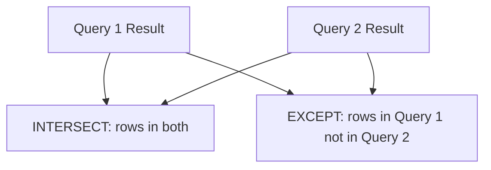

# How to Use INTERSECT and EXCEPT in MySQL 8.0+

Author: [nawazdhandala](https://www.github.com/nawazdhandala)

Tags: MySQL, SQL, INTERSECT, EXCEPT, Set Operation, Database

Description: Learn how to use INTERSECT and EXCEPT set operators in MySQL 8.0+ to find common rows between queries and rows present in one query but not another.

---

## How INTERSECT and EXCEPT Work

MySQL 8.0.31 introduced native support for `INTERSECT` and `EXCEPT` as standard SQL set operators.

- `INTERSECT` returns only the rows that appear in both result sets (the intersection of two sets).
- `EXCEPT` returns rows from the first result set that do not appear in the second (the difference).

Both operators remove duplicates by default, similar to UNION. Both INTERSECT ALL and EXCEPT ALL (which preserve duplicates) are also supported in MySQL 8.0.31+.



## Syntax

```sql
-- INTERSECT: rows common to both
SELECT columns FROM table_a
INTERSECT
SELECT columns FROM table_b;

-- EXCEPT: rows in first query not in second
SELECT columns FROM table_a
EXCEPT
SELECT columns FROM table_b;
```

## Examples

### Setup: Create Sample Tables

```sql
CREATE TABLE skills_required (
    skill VARCHAR(50) NOT NULL
);

CREATE TABLE skills_available (
    skill VARCHAR(50) NOT NULL
);

INSERT INTO skills_required (skill) VALUES
    ('Python'), ('SQL'), ('Docker'), ('Kubernetes'), ('Go');

INSERT INTO skills_available (skill) VALUES
    ('Python'), ('SQL'), ('JavaScript'), ('Docker'), ('React');
```

### INTERSECT: Find Common Skills

Find skills that are both required and available.

```sql
SELECT skill FROM skills_required
INTERSECT
SELECT skill FROM skills_available
ORDER BY skill;
```

```text
+--------+
| skill  |
+--------+
| Docker |
| Python |
| SQL    |
+--------+
```

### EXCEPT: Find Skills Gap

Find required skills that are not available (the skill gap).

```sql
SELECT skill FROM skills_required
EXCEPT
SELECT skill FROM skills_available
ORDER BY skill;
```

```text
+------------+
| skill      |
+------------+
| Go         |
| Kubernetes |
+------------+
```

### EXCEPT in Reverse: Find Unused Available Skills

Find skills available but not required.

```sql
SELECT skill FROM skills_available
EXCEPT
SELECT skill FROM skills_required
ORDER BY skill;
```

```text
+------------+
| skill      |
+------------+
| JavaScript |
| React      |
+------------+
```

### Practical Example: Customer Purchase Overlap

Set up customer purchase tables across two time periods.

```sql
CREATE TABLE purchases_q1 (
    customer_id INT,
    product_name VARCHAR(100)
);

CREATE TABLE purchases_q2 (
    customer_id INT,
    product_name VARCHAR(100)
);

INSERT INTO purchases_q1 (customer_id, product_name) VALUES
    (1, 'Laptop'), (1, 'Mouse'), (2, 'Keyboard'), (3, 'Monitor');

INSERT INTO purchases_q2 (customer_id, product_name) VALUES
    (1, 'Laptop'), (2, 'Mouse'), (2, 'Keyboard'), (4, 'Desk');

-- Products purchased in BOTH quarters by the same customer
SELECT customer_id, product_name FROM purchases_q1
INTERSECT
SELECT customer_id, product_name FROM purchases_q2;
```

```text
+-------------+--------------+
| customer_id | product_name |
+-------------+--------------+
| 1           | Laptop       |
| 2           | Keyboard     |
+-------------+--------------+
```

```sql
-- Products purchased in Q1 but NOT in Q2 by the same customer
SELECT customer_id, product_name FROM purchases_q1
EXCEPT
SELECT customer_id, product_name FROM purchases_q2;
```

```text
+-------------+--------------+
| customer_id | product_name |
+-------------+--------------+
| 1           | Mouse        |
| 3           | Monitor      |
+-------------+--------------+
```

### Emulation for MySQL Versions Before 8.0.31

For MySQL versions that lack native INTERSECT and EXCEPT, use these equivalents:

```sql
-- INTERSECT emulation using INNER JOIN
SELECT DISTINCT a.skill
FROM skills_required a
INNER JOIN skills_available b ON a.skill = b.skill;

-- EXCEPT emulation using LEFT JOIN anti-join
SELECT DISTINCT a.skill
FROM skills_required a
LEFT JOIN skills_available b ON a.skill = b.skill
WHERE b.skill IS NULL;
```

## Best Practices

- Use INTERSECT and EXCEPT only in MySQL 8.0.31 or later. Check your version with `SELECT VERSION();`.
- Both operators require matching column counts and compatible types, same as UNION.
- Apply ORDER BY after the last query in the set operation.
- For pre-8.0.31, use INNER JOIN for INTERSECT emulation and LEFT JOIN anti-join for EXCEPT emulation.
- Use `INTERSECT ALL` or `EXCEPT ALL` to preserve duplicate rows when duplicates are meaningful.

## Summary

MySQL 8.0.31+ natively supports INTERSECT and EXCEPT as standard SQL set operators. INTERSECT returns rows common to both result sets; EXCEPT returns rows in the first set that are absent from the second. Both deduplicate results by default. For older MySQL versions, these operations can be emulated with INNER JOIN and the LEFT JOIN anti-join pattern. Use them for data comparison, gap analysis, and finding overlap or discrepancies between data sources.
