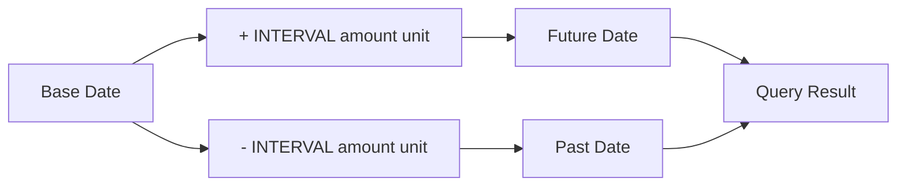

# How to Use MySQL INTERVAL for Date Arithmetic

Author: [nawazdhandala](https://www.github.com/nawazdhandala)

Tags: MySQL, SQL, Date Function, INTERVAL, Database

Description: Learn how to use MySQL INTERVAL expressions with DATE_ADD, DATE_SUB, and direct arithmetic operators to shift and compute date and time values.

---

## How MySQL INTERVAL Works

`INTERVAL` is a keyword that specifies a duration with a unit. It is used in combination with `DATE_ADD`, `DATE_SUB`, and the `+`/`-` operators on date and time values. MySQL supports a wide range of interval units from microseconds to years, as well as composite units like `HOUR_MINUTE`.



## INTERVAL Syntax

```sql
INTERVAL expr unit
```

Where `expr` is a numeric expression and `unit` is one of:

```text
MICROSECOND
SECOND
MINUTE
HOUR
DAY
WEEK
MONTH
QUARTER
YEAR
SECOND_MICROSECOND    'SS.ffffff'
MINUTE_MICROSECOND    'MM:SS.ffffff'
MINUTE_SECOND         'MM:SS'
HOUR_MICROSECOND      'HH:MM:SS.ffffff'
HOUR_SECOND           'HH:MM:SS'
HOUR_MINUTE           'HH:MM'
DAY_MICROSECOND       'DD HH:MM:SS.ffffff'
DAY_SECOND            'DD HH:MM:SS'
DAY_MINUTE            'DD HH:MM'
DAY_HOUR              'DD HH'
YEAR_MONTH            'YY-MM'
```

## Setup: Sample Table

```sql
CREATE TABLE campaigns (
    id           INT AUTO_INCREMENT PRIMARY KEY,
    name         VARCHAR(100),
    launch_date  DATE NOT NULL,
    duration_days INT NOT NULL
);

INSERT INTO campaigns (name, launch_date, duration_days) VALUES
('Spring Sale',        '2026-03-01', 30),
('Summer Promotion',   '2026-06-01', 90),
('Back to School',     '2026-08-15', 21),
('Holiday Campaign',   '2026-11-20', 45),
('New Year Kickoff',   '2026-12-26', 7);
```

## DATE_ADD with INTERVAL

```sql
SELECT
    name,
    launch_date,
    duration_days,
    DATE_ADD(launch_date, INTERVAL duration_days DAY)     AS end_date,
    DATE_ADD(launch_date, INTERVAL 1 WEEK)                AS one_week_in,
    DATE_ADD(launch_date, INTERVAL 3 MONTH)               AS three_months_later
FROM campaigns;
```

## DATE_SUB with INTERVAL

```sql
SELECT
    name,
    launch_date,
    DATE_SUB(launch_date, INTERVAL 7  DAY)   AS prep_start,
    DATE_SUB(launch_date, INTERVAL 1  MONTH) AS announced_at
FROM campaigns;
```

## Direct +/- Operator Syntax

MySQL supports `+` and `-` directly with INTERVAL values, which is more concise:

```sql
SELECT
    '2026-03-31' + INTERVAL 1 MONTH  AS next_month,
    '2026-03-31' - INTERVAL 2 WEEK   AS two_weeks_ago,
    NOW() + INTERVAL 30 MINUTE       AS session_expiry,
    NOW() - INTERVAL 1 YEAR          AS one_year_ago;
```

```text
+------------+---------------+---------------------+---------------------+
| next_month | two_weeks_ago | session_expiry      | one_year_ago        |
+------------+---------------+---------------------+---------------------+
| 2026-04-30 | 2026-03-17    | 2026-03-31 11:52:30 | 2025-03-31 11:22:30 |
+------------+---------------+---------------------+---------------------+
```

## Composite Interval Units

For intervals that span multiple sub-units, use composite forms:

```sql
-- Add 1 hour and 30 minutes:
SELECT NOW() + INTERVAL '1:30' HOUR_MINUTE AS one_thirty_later;

-- Add 2 days and 12 hours:
SELECT NOW() + INTERVAL '2 12' DAY_HOUR AS two_and_half_days;

-- Add 1 year and 6 months:
SELECT '2026-01-01' + INTERVAL '1-6' YEAR_MONTH AS eighteen_months;
```

## Practical Use Cases

**Find campaigns currently active:**

```sql
SELECT name, launch_date,
       DATE_ADD(launch_date, INTERVAL duration_days DAY) AS end_date
FROM campaigns
WHERE CURDATE() BETWEEN launch_date
                    AND DATE_ADD(launch_date, INTERVAL duration_days DAY);
```

**Generate a 12-month schedule from each campaign launch:**

```sql
SELECT
    name,
    launch_date + INTERVAL 0 MONTH AS month_0,
    launch_date + INTERVAL 1 MONTH AS month_1,
    launch_date + INTERVAL 2 MONTH AS month_2,
    launch_date + INTERVAL 3 MONTH AS month_3
FROM campaigns;
```

**Session expiry - tokens valid for 24 hours:**

```sql
CREATE TABLE tokens (
    token      CHAR(64) PRIMARY KEY,
    user_id    INT,
    created_at DATETIME NOT NULL DEFAULT NOW(),
    expires_at DATETIME NOT NULL DEFAULT (NOW() + INTERVAL 24 HOUR)
);

-- Find expired tokens:
SELECT token FROM tokens WHERE expires_at < NOW();

-- Extend active token:
UPDATE tokens
SET expires_at = NOW() + INTERVAL 24 HOUR
WHERE token = 'abc123';
```

**Bucket timestamps by 15-minute intervals:**

```sql
SELECT
    DATE_FORMAT(
        FROM_UNIXTIME(
            FLOOR(UNIX_TIMESTAMP(created_at) / (15*60)) * (15*60)
        ),
        '%Y-%m-%d %H:%i'
    ) AS bucket_15min,
    COUNT(*) AS events
FROM tokens
GROUP BY bucket_15min
ORDER BY bucket_15min;
```

## Best Practices

- Use the `+`/`-` operator syntax for readability when both operands are on the same line.
- MONTH arithmetic wraps correctly to the last day of the month: `'2026-01-31' + INTERVAL 1 MONTH` = `'2026-02-28'`.
- Use `INTERVAL` in WHERE clauses with range conditions rather than calling functions on indexed columns: `WHERE created_at > NOW() - INTERVAL 7 DAY` is index-friendly.
- For fixed-duration business rules (session expiry, trial periods), store the expiry datetime at write time using `DEFAULT (NOW() + INTERVAL N UNIT)` rather than computing it on every read.

## Summary

MySQL `INTERVAL` expressions provide a clean, readable syntax for date and time arithmetic. Used with `DATE_ADD`, `DATE_SUB`, or the `+`/`-` operators, they shift datetime values by any unit from microseconds to years. Composite units like `HOUR_MINUTE` and `YEAR_MONTH` handle multi-level shifts in a single expression. Because `INTERVAL` can be used directly in WHERE clauses without wrapping indexed columns in functions, it enables efficient range filtering on date columns.
