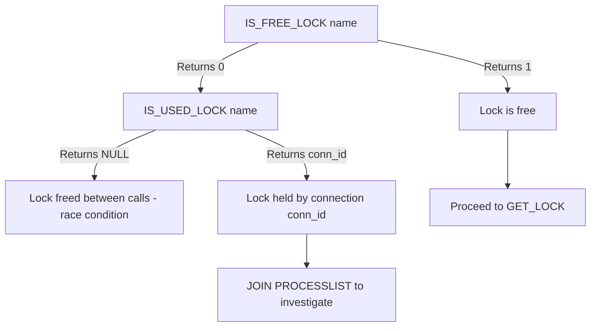
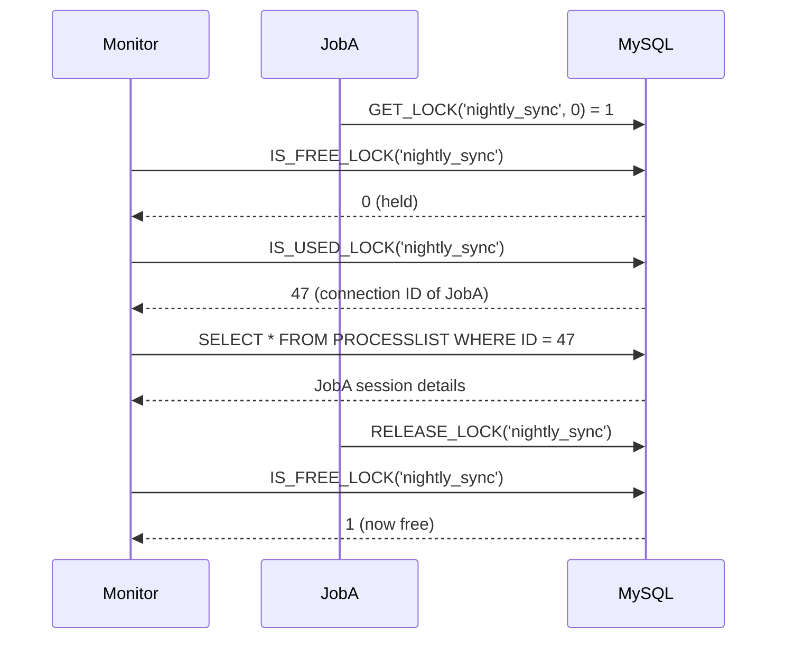

# How to Use IS_FREE_LOCK() and IS_USED_LOCK() in MySQL

Author: [OneUptime](https://oneuptime.com)

Tags: MySQL, Lock, Concurrency, Function, Advisory Lock

Description: Learn how MySQL IS_FREE_LOCK() and IS_USED_LOCK() let you inspect the state of named advisory locks before acquiring them to build safe, non-blocking coordination patterns.

---

## Introduction

`IS_FREE_LOCK()` and `IS_USED_LOCK()` are inspection functions for MySQL's user-level (advisory) lock system. They answer two important questions before you attempt to acquire a lock:

- `IS_FREE_LOCK(name)`: Is this lock currently available?
- `IS_USED_LOCK(name)`: If it is held, which connection holds it?

Used together with `GET_LOCK()` and `RELEASE_LOCK()`, they enable non-blocking lock inspection, deadlock prevention, and operational visibility into background job coordination.

## Function signatures and return values

```sql
IS_FREE_LOCK(str)
IS_USED_LOCK(str)
```

### IS_FREE_LOCK()

| Return | Meaning |
|---|---|
| `1` | Lock is free (not held by any session) |
| `0` | Lock is currently held |
| `NULL` | Error (e.g. invalid argument) |

### IS_USED_LOCK()

| Return | Meaning |
|---|---|
| Connection ID (integer) | Lock is held by that connection |
| `NULL` | Lock is free (not held) |

## Basic inspection examples

```sql
-- Check if a lock is free before trying to acquire it
SELECT IS_FREE_LOCK('batch_export') AS is_free;
-- 1 = free, 0 = held

-- Find out which connection holds the lock
SELECT IS_USED_LOCK('batch_export') AS held_by;
-- NULL = free, or an integer connection ID

-- Cross-reference with SHOW PROCESSLIST
SELECT *
FROM information_schema.PROCESSLIST
WHERE ID = IS_USED_LOCK('batch_export');
```

## Building a non-blocking lock check

```sql
DELIMITER $$

CREATE PROCEDURE check_and_run_job(IN p_lock_name VARCHAR(64))
BEGIN
  DECLARE owner_conn INT;
  SET owner_conn = IS_USED_LOCK(p_lock_name);

  IF owner_conn IS NULL THEN
    -- Lock is free; attempt to acquire
    IF GET_LOCK(p_lock_name, 0) = 1 THEN
      SELECT CONCAT('Lock acquired by connection ', CONNECTION_ID()) AS status;
      -- ... run job logic here ...
      DO RELEASE_LOCK(p_lock_name);
    ELSE
      SELECT 'Could not acquire lock (race condition)' AS status;
    END IF;
  ELSE
    SELECT CONCAT('Job already running in connection ', owner_conn) AS status;
  END IF;
END$$

DELIMITER ;
```

## Investigating who holds a lock

```sql
-- Find the lock holder's full session details
SELECT
  p.ID              AS connection_id,
  p.USER            AS db_user,
  p.HOST            AS client_host,
  p.DB              AS current_db,
  p.COMMAND         AS command,
  p.TIME            AS seconds_running,
  p.STATE           AS state,
  p.INFO            AS current_query
FROM information_schema.PROCESSLIST AS p
WHERE p.ID = IS_USED_LOCK('batch_export');
```

## Waiting for a lock to become free (polling pattern)

Advisory lock functions do not natively support event-based waiting outside of `GET_LOCK()`. If you need to poll, use a loop with a brief `SLEEP()`:

```sql
DELIMITER $$

CREATE PROCEDURE wait_for_lock(
  IN  p_lock_name VARCHAR(64),
  IN  p_max_wait  INT,          -- maximum seconds to wait
  OUT p_acquired  TINYINT
)
BEGIN
  DECLARE elapsed INT DEFAULT 0;
  DECLARE poll_interval DECIMAL(3,1) DEFAULT 0.5;

  SET p_acquired = 0;

  WHILE elapsed < p_max_wait DO
    IF IS_FREE_LOCK(p_lock_name) = 1 THEN
      IF GET_LOCK(p_lock_name, 0) = 1 THEN
        SET p_acquired = 1;
        SET elapsed = p_max_wait; -- break loop
      END IF;
    ELSE
      DO SLEEP(poll_interval);
      SET elapsed = elapsed + poll_interval;
    END IF;
  END WHILE;
END$$

DELIMITER ;

CALL wait_for_lock('my_job', 30, @got_it);
SELECT @got_it AS lock_acquired;
```

## Dashboard query: all held advisory locks

Advisory locks are tracked in the Performance Schema `metadata_locks` table when `performance_schema` is enabled:

```sql
SELECT
  ml.OBJECT_NAME   AS lock_name,
  ml.LOCK_STATUS   AS status,
  ml.OWNER_THREAD_ID,
  t.PROCESSLIST_ID AS connection_id,
  t.PROCESSLIST_USER AS db_user
FROM performance_schema.metadata_locks AS ml
JOIN performance_schema.threads AS t
  ON t.THREAD_ID = ml.OWNER_THREAD_ID
WHERE ml.OBJECT_TYPE = 'USER LEVEL LOCK';
```

## IS_FREE_LOCK vs IS_USED_LOCK comparison

| Question | Function to use |
|---|---|
| Is this lock currently available? | `IS_FREE_LOCK(name)` |
| Which session holds this lock? | `IS_USED_LOCK(name)` |
| Wait for it to become available | `GET_LOCK(name, timeout)` |

## Lock state decision tree



## Concurrent job coordination flow



## Summary

`IS_FREE_LOCK(name)` returns `1` if the named advisory lock is available and `0` if it is currently held. `IS_USED_LOCK(name)` returns the connection ID of the session holding the lock, or `NULL` if it is free. Together they provide read-only lock inspection without side effects, making them ideal for operational dashboards, pre-flight checks before `GET_LOCK()`, and diagnosing which background job is holding a shared resource.
