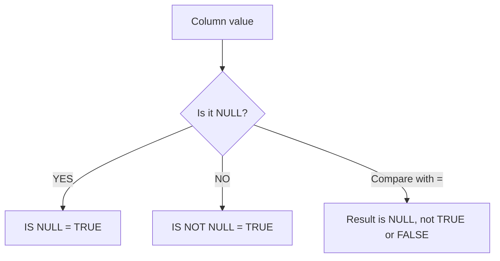

# How to Use IS NULL and IS NOT NULL in MySQL

Author: [nawazdhandala](https://www.github.com/nawazdhandala)

Tags: MySQL, SQL, NULL, Database, Query

Description: Learn how to filter NULL and non-NULL values in MySQL using IS NULL and IS NOT NULL with practical examples covering joins, aggregation, and COALESCE.

---

## Understanding NULL in MySQL

NULL represents the absence of a value - it is not zero, not an empty string, and not false. Because NULL is unknown, standard comparison operators such as `=`, `!=`, `<`, and `>` cannot be used to test for it. Any comparison with NULL yields NULL (unknown), not TRUE or FALSE.



This is why MySQL provides the dedicated `IS NULL` and `IS NOT NULL` predicates.

## Syntax

```sql
-- Filter rows where column is NULL
SELECT * FROM table_name WHERE column_name IS NULL;

-- Filter rows where column is not NULL
SELECT * FROM table_name WHERE column_name IS NOT NULL;
```

## Setup: Sample Table

```sql
CREATE TABLE employees (
    id       INT PRIMARY KEY AUTO_INCREMENT,
    name     VARCHAR(100) NOT NULL,
    dept_id  INT,
    manager_id INT,
    salary   DECIMAL(10,2)
);

INSERT INTO employees (name, dept_id, manager_id, salary) VALUES
    ('Alice',   1, NULL,  95000.00),
    ('Bob',     2, 1,     72000.00),
    ('Carol',   1, 1,    105000.00),
    ('Dave',    3, NULL,  88000.00),
    ('Eve',  NULL, 2,     65000.00),
    ('Frank', NULL, NULL, NULL);
```

## Finding Rows with NULL Values

### IS NULL

Retrieve employees who have no assigned department.

```sql
SELECT id, name, dept_id
FROM employees
WHERE dept_id IS NULL;
```

```text
+----+-------+---------+
| id | name  | dept_id |
+----+-------+---------+
|  5 | Eve   | NULL    |
|  6 | Frank | NULL    |
+----+-------+---------+
```

### IS NOT NULL

Retrieve employees who do have a department assigned.

```sql
SELECT id, name, dept_id
FROM employees
WHERE dept_id IS NOT NULL;
```

```text
+----+-------+---------+
| id | name  | dept_id |
+----+-------+---------+
|  1 | Alice |       1 |
|  2 | Bob   |       2 |
|  3 | Carol |       1 |
|  4 | Dave  |       3 |
+----+-------+---------+
```

## Why = NULL Does Not Work

A common mistake is writing `WHERE column = NULL`. This always returns no rows because any expression compared with NULL evaluates to NULL (unknown), never TRUE.

```sql
-- Wrong: returns 0 rows even though NULL values exist
SELECT * FROM employees WHERE dept_id = NULL;

-- Correct
SELECT * FROM employees WHERE dept_id IS NULL;
```

## NULL in JOIN Conditions

NULL values in join columns are never matched, because `NULL = NULL` evaluates to NULL, not TRUE. This is important when using INNER JOIN versus LEFT JOIN.

```sql
CREATE TABLE departments (
    id   INT PRIMARY KEY,
    name VARCHAR(100)
);

INSERT INTO departments VALUES (1,'Engineering'),(2,'Marketing'),(3,'Finance');

-- INNER JOIN excludes employees with NULL dept_id
SELECT e.name, d.name AS department
FROM employees e
INNER JOIN departments d ON e.dept_id = d.id;
```

```text
+-------+-------------+
| name  | department  |
+-------+-------------+
| Alice | Engineering |
| Bob   | Marketing   |
| Carol | Engineering |
| Dave  | Finance     |
+-------+-------------+
```

```sql
-- LEFT JOIN keeps employees without a department; dept_id appears as NULL
SELECT e.name, d.name AS department
FROM employees e
LEFT JOIN departments d ON e.dept_id = d.id
WHERE d.id IS NULL;
```

```text
+-------+------------+
| name  | department |
+-------+------------+
| Eve   | NULL       |
| Frank | NULL       |
+-------+------------+
```

## NULL with Aggregate Functions

Aggregate functions such as `COUNT()`, `SUM()`, and `AVG()` ignore NULL values. Use `COUNT(*)` versus `COUNT(column)` to see the difference.

```sql
SELECT
    COUNT(*)       AS total_rows,
    COUNT(salary)  AS rows_with_salary,
    COUNT(dept_id) AS rows_with_dept,
    AVG(salary)    AS avg_salary
FROM employees;
```

```text
+------------+------------------+----------------+------------+
| total_rows | rows_with_salary | rows_with_dept | avg_salary |
+------------+------------------+----------------+------------+
|          6 |                5 |              4 | 85000.0000 |
+------------+------------------+----------------+------------+
```

Note that `avg_salary` is computed over 5 rows (Frank's NULL salary is excluded automatically).

## Replacing NULL with COALESCE and IFNULL

Use `COALESCE()` or `IFNULL()` to substitute a default value for NULL in query output.

```sql
SELECT
    name,
    COALESCE(dept_id, 0)        AS dept_id,
    IFNULL(salary, 0.00)        AS salary,
    CASE WHEN manager_id IS NULL THEN 'Top-level' ELSE 'Has manager' END AS level
FROM employees;
```

```text
+-------+---------+-----------+-------------+
| name  | dept_id | salary    | level       |
+-------+---------+-----------+-------------+
| Alice |       1 | 95000.00  | Top-level   |
| Bob   |       2 | 72000.00  | Has manager |
| Carol |       1 | 105000.00 | Has manager |
| Dave  |       3 | 88000.00  | Top-level   |
| Eve   |       0 | 65000.00  | Has manager |
| Frank |       0 | 0.00      | Top-level   |
+-------+---------+-----------+-------------+
```

## NULL in ORDER BY

By default, MySQL sorts NULL values first in ascending order and last in descending order.

```sql
-- NULLs appear first when sorting ASC
SELECT name, salary FROM employees ORDER BY salary ASC;

-- Force NULLs last in ASC order using CASE
SELECT name, salary
FROM employees
ORDER BY CASE WHEN salary IS NULL THEN 1 ELSE 0 END, salary ASC;
```

## Checking for NULL with Spaceship Operator

MySQL also supports the NULL-safe equality operator `<=>`, which returns TRUE when both sides are NULL.

```sql
-- Returns rows where dept_id equals 1, but also works safely with NULLs
SELECT name FROM employees WHERE dept_id <=> 1;

-- NULL-safe comparison: both sides NULL returns 1 (TRUE)
SELECT NULL <=> NULL;   -- 1
SELECT NULL = NULL;     -- NULL
```

## Best Practices

- Always use `IS NULL` / `IS NOT NULL` instead of `= NULL` / `!= NULL`.
- When designing schemas, decide intentionally whether a column should allow NULL; mark columns NOT NULL when a missing value is not a valid state.
- Use `COALESCE()` to provide fallback values in SELECT lists and calculations.
- Remember that NULL columns in GROUP BY are grouped together as one group.
- Index columns can be NULL in MySQL; if you frequently filter by IS NULL, add an index on that column.

## Summary

NULL represents an unknown or missing value in MySQL. Standard comparison operators cannot test for NULL; you must use `IS NULL` or `IS NOT NULL`. NULL values are excluded from aggregate calculations, are never matched in join conditions, and sort before non-NULL values in ascending order. Pair IS NULL checks with `COALESCE()` or `IFNULL()` to substitute sensible defaults in query output.
