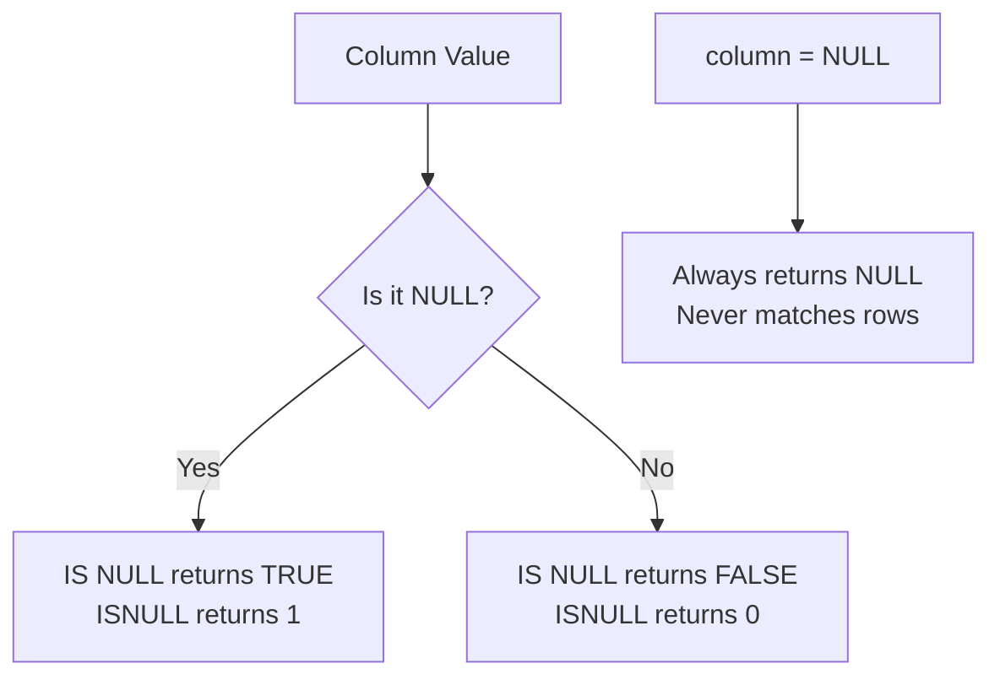

# How to Use ISNULL() and IS NULL in MySQL

Author: [nawazdhandala](https://www.github.com/nawazdhandala)

Tags: MySQL, SQL, NULL Handling, Conditional Function, Database

Description: Learn the difference between MySQL ISNULL() function and the IS NULL operator, and how to use both to detect and handle NULL values in queries.

---

## NULL in MySQL

`NULL` in MySQL represents the absence of a value. It is not zero, not an empty string, and not false. Because `NULL` is unknown, comparisons like `column = NULL` always return `NULL` (not `TRUE`), which means standard equality checks silently miss rows with NULL values.

MySQL provides two constructs for NULL detection:

- `IS NULL` - a standard SQL comparison operator
- `ISNULL()` - a MySQL function that returns 1 or 0



## Syntax

```sql
-- IS NULL operator (standard SQL)
expression IS NULL
expression IS NOT NULL

-- ISNULL() function (MySQL-specific)
ISNULL(expression)
```

`ISNULL(expr)` returns `1` if `expr` is `NULL`, otherwise `0`. It is equivalent to `expr IS NULL` in a boolean context but returns an integer, making it useful in `SELECT` lists and calculations.

## Setup: Sample Table

```sql
CREATE TABLE employees (
    id         INT AUTO_INCREMENT PRIMARY KEY,
    name       VARCHAR(100) NOT NULL,
    department VARCHAR(50),
    manager_id INT,
    salary     DECIMAL(10, 2),
    resigned_at DATE
);

INSERT INTO employees (name, department, manager_id, salary, resigned_at) VALUES
('Alice',   'Engineering', NULL, 95000.00, NULL),
('Bob',     'Marketing',   1,    72000.00, NULL),
('Carol',   'Engineering', 1,    88000.00, '2025-11-01'),
('Dave',    NULL,          2,    NULL,     NULL),
('Eve',     'HR',          2,    65000.00, '2026-01-15'),
('Frank',   NULL,          NULL, NULL,     NULL);
```

## IS NULL and IS NOT NULL

```sql
-- Find employees with no department assigned
SELECT name, department
FROM employees
WHERE department IS NULL;
```

```text
+-------+------------+
| name  | department |
+-------+------------+
| Dave  | NULL       |
| Frank | NULL       |
+-------+------------+
```

```sql
-- Find employees who are still active (have not resigned)
SELECT name, department
FROM employees
WHERE resigned_at IS NULL;
```

```sql
-- Find employees with a known salary
SELECT name, salary
FROM employees
WHERE salary IS NOT NULL;
```

## Why `= NULL` Does Not Work

```sql
-- This returns NO rows, even though NULL values exist
SELECT name FROM employees WHERE department = NULL;

-- This is the correct way
SELECT name FROM employees WHERE department IS NULL;
```

`= NULL` evaluates to `NULL` for every row, which is not `TRUE`, so no rows are returned.

## ISNULL() Function

`ISNULL()` returns an integer `1` or `0`, making it convenient in `SELECT` output and sorting:

```sql
SELECT
    name,
    department,
    ISNULL(department)  AS dept_missing,
    ISNULL(salary)      AS salary_missing,
    ISNULL(manager_id)  AS no_manager
FROM employees;
```

```text
+-------+------------+--------------+----------------+------------+
| name  | department | dept_missing | salary_missing | no_manager |
+-------+------------+--------------+----------------+------------+
| Alice | Engineering|            0 |              0 |          1 |
| Bob   | Marketing  |            0 |              0 |          0 |
| Carol | Engineering|            0 |              0 |          0 |
| Dave  | NULL       |            1 |              1 |          0 |
| Eve   | HR         |            0 |              0 |          0 |
| Frank | NULL       |            1 |              1 |          1 |
+-------+------------+--------------+----------------+------------+
```

## Using ISNULL() to Sort NULLs Last

By default, `ORDER BY` sorts `NULL` values first in ascending order. Use `ISNULL()` as a sort key to push NULLs to the end:

```sql
SELECT name, salary
FROM employees
ORDER BY ISNULL(salary), salary ASC;
```

```text
+-------+-----------+
| name  | salary    |
+-------+-----------+
| Eve   |  65000.00 |
| Bob   |  72000.00 |
| Carol |  88000.00 |
| Alice |  95000.00 |
| Dave  |      NULL |  <- sorted last
| Frank |      NULL |
+-------+-----------+
```

## Counting NULL vs Non-NULL Values

```sql
SELECT
    COUNT(*)           AS total_rows,
    COUNT(department)  AS with_department,
    COUNT(*) - COUNT(department) AS missing_department,
    SUM(ISNULL(salary))            AS missing_salary
FROM employees;
```

Note: `COUNT(column)` ignores `NULL` values, while `COUNT(*)` counts every row. Subtracting the two gives the NULL count. `SUM(ISNULL(salary))` sums up the 1s returned by `ISNULL()` for a direct NULL count.

## Combining IS NULL with CASE

```sql
SELECT
    name,
    CASE
        WHEN resigned_at IS NOT NULL THEN 'Former'
        WHEN department IS NULL      THEN 'Unassigned'
        ELSE 'Active'
    END AS status
FROM employees;
```

## IS NULL with LEFT JOIN to Find Missing References

A common pattern is detecting rows in one table that have no matching row in another:

```sql
CREATE TABLE departments (
    dept_name VARCHAR(50) PRIMARY KEY
);

INSERT INTO departments VALUES ('Engineering'), ('Marketing'), ('HR');

-- Find employees whose department does not exist in the departments table
SELECT e.name, e.department
FROM employees e
LEFT JOIN departments d ON e.department = d.dept_name
WHERE d.dept_name IS NULL;
```

This returns employees with a `NULL` department or one that does not match any entry in `departments`.

## ISNULL() vs IFNULL() vs COALESCE()

```text
ISNULL(expr)           - returns 1 if NULL, 0 otherwise (detection only)
IFNULL(expr, fallback) - returns fallback if expr is NULL
COALESCE(a, b, c, ...) - returns first non-NULL argument from the list
```

```sql
SELECT
    name,
    ISNULL(department)              AS is_null_flag,
    IFNULL(department, 'Unknown')   AS dept_or_default,
    COALESCE(department, 'Unknown') AS dept_coalesce
FROM employees;
```

## Summary

`IS NULL` and `IS NOT NULL` are the standard SQL operators for testing whether a value is `NULL`. Never use `= NULL` because it always evaluates to `NULL` and matches nothing. `ISNULL(expr)` is the MySQL function equivalent that returns `1` or `0`, which is convenient for sorting NULLs last or summing NULL counts in aggregate queries. For substituting a fallback value, use `IFNULL()` or `COALESCE()` instead.
