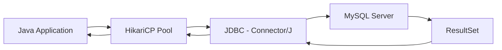

# How to Set Up MySQL with Java using JDBC

Author: [nawazdhandala](https://www.github.com/nawazdhandala)

Tags: MySQL, Java, JDBC, Database, Connection Pool

Description: Learn how to connect a Java application to MySQL using JDBC with prepared statements, HikariCP connection pooling, and transaction management.

---

## How MySQL JDBC Works

JDBC (Java Database Connectivity) is the standard Java API for relational databases. The MySQL Connector/J driver implements JDBC and handles the network communication with MySQL. In production applications, HikariCP is the de-facto standard connection pool that wraps JDBC for efficient connection reuse.



## Dependencies (Maven)

```xml
<dependencies>
    <!-- MySQL JDBC Driver -->
    <dependency>
        <groupId>com.mysql</groupId>
        <artifactId>mysql-connector-j</artifactId>
        <version>9.1.0</version>
    </dependency>

    <!-- HikariCP Connection Pool -->
    <dependency>
        <groupId>com.zaxxer</groupId>
        <artifactId>HikariCP</artifactId>
        <version>5.1.0</version>
    </dependency>
</dependencies>
```

## Connection Pool Setup with HikariCP

```java
import com.zaxxer.hikari.HikariConfig;
import com.zaxxer.hikari.HikariDataSource;
import javax.sql.DataSource;

public class DatabaseConfig {

    private static final HikariDataSource dataSource;

    static {
        HikariConfig config = new HikariConfig();
        config.setJdbcUrl("jdbc:mysql://localhost:3306/myapp"
                        + "?serverTimezone=UTC"
                        + "&characterEncoding=utf8mb4"
                        + "&useSSL=false");
        config.setUsername("appuser");
        config.setPassword("secret");
        config.setMaximumPoolSize(10);
        config.setMinimumIdle(2);
        config.setConnectionTimeout(30_000);
        config.setIdleTimeout(600_000);
        config.setMaxLifetime(1_800_000);
        dataSource = new HikariDataSource(config);
    }

    public static DataSource get() {
        return dataSource;
    }
}
```

## Setup: Create Sample Table

```sql
CREATE TABLE products (
    id         INT AUTO_INCREMENT PRIMARY KEY,
    name       VARCHAR(100) NOT NULL,
    price      DECIMAL(10,2) NOT NULL,
    stock      INT NOT NULL DEFAULT 0,
    created_at DATETIME NOT NULL DEFAULT NOW()
);
```

## CRUD Operations

```java
import java.sql.*;
import java.util.*;

public class ProductRepository {

    // Create
    public int createProduct(String name, double price, int stock) throws SQLException {
        String sql = "INSERT INTO products (name, price, stock) VALUES (?, ?, ?)";
        try (Connection conn = DatabaseConfig.get().getConnection();
             PreparedStatement ps = conn.prepareStatement(sql, Statement.RETURN_GENERATED_KEYS)) {

            ps.setString(1, name);
            ps.setDouble(2, price);
            ps.setInt(3, stock);
            ps.executeUpdate();

            try (ResultSet keys = ps.getGeneratedKeys()) {
                if (keys.next()) return keys.getInt(1);
            }
        }
        throw new SQLException("Insert failed, no generated key");
    }

    // Read
    public Optional<Map<String, Object>> getProduct(int id) throws SQLException {
        String sql = "SELECT id, name, price, stock FROM products WHERE id = ?";
        try (Connection conn = DatabaseConfig.get().getConnection();
             PreparedStatement ps = conn.prepareStatement(sql)) {

            ps.setInt(1, id);
            try (ResultSet rs = ps.executeQuery()) {
                if (rs.next()) {
                    Map<String, Object> row = new HashMap<>();
                    row.put("id",    rs.getInt("id"));
                    row.put("name",  rs.getString("name"));
                    row.put("price", rs.getBigDecimal("price"));
                    row.put("stock", rs.getInt("stock"));
                    return Optional.of(row);
                }
            }
        }
        return Optional.empty();
    }

    // Update
    public int updateStock(int id, int delta) throws SQLException {
        String sql = "UPDATE products SET stock = stock + ? WHERE id = ?";
        try (Connection conn = DatabaseConfig.get().getConnection();
             PreparedStatement ps = conn.prepareStatement(sql)) {

            ps.setInt(1, delta);
            ps.setInt(2, id);
            return ps.executeUpdate();
        }
    }

    // Delete
    public int deleteProduct(int id) throws SQLException {
        String sql = "DELETE FROM products WHERE id = ?";
        try (Connection conn = DatabaseConfig.get().getConnection();
             PreparedStatement ps = conn.prepareStatement(sql)) {

            ps.setInt(1, id);
            return ps.executeUpdate();
        }
    }
}
```

## Transactions

```java
public void transferStock(int fromId, int toId, int quantity) throws SQLException {
    String deduct = "UPDATE products SET stock = stock - ? WHERE id = ? AND stock >= ?";
    String add    = "UPDATE products SET stock = stock + ? WHERE id = ?";

    try (Connection conn = DatabaseConfig.get().getConnection()) {
        conn.setAutoCommit(false);
        try (PreparedStatement psDeduct = conn.prepareStatement(deduct);
             PreparedStatement psAdd    = conn.prepareStatement(add)) {

            psDeduct.setInt(1, quantity);
            psDeduct.setInt(2, fromId);
            psDeduct.setInt(3, quantity);
            int affected = psDeduct.executeUpdate();

            if (affected == 0) {
                conn.rollback();
                throw new IllegalStateException("Insufficient stock in source product");
            }

            psAdd.setInt(1, quantity);
            psAdd.setInt(2, toId);
            psAdd.executeUpdate();

            conn.commit();
        } catch (SQLException ex) {
            conn.rollback();
            throw ex;
        } finally {
            conn.setAutoCommit(true);
        }
    }
}
```

## Batch Inserts

```java
public void bulkInsert(List<String[]> products) throws SQLException {
    String sql = "INSERT INTO products (name, price, stock) VALUES (?, ?, ?)";
    try (Connection conn = DatabaseConfig.get().getConnection();
         PreparedStatement ps = conn.prepareStatement(sql)) {

        conn.setAutoCommit(false);
        for (String[] p : products) {
            ps.setString(1, p[0]);
            ps.setDouble(2, Double.parseDouble(p[1]));
            ps.setInt(3, Integer.parseInt(p[2]));
            ps.addBatch();
        }
        ps.executeBatch();
        conn.commit();
    }
}
```

## Listing All Results

```java
public List<Map<String, Object>> listProducts() throws SQLException {
    List<Map<String, Object>> result = new ArrayList<>();
    String sql = "SELECT id, name, price, stock FROM products ORDER BY id";

    try (Connection conn = DatabaseConfig.get().getConnection();
         PreparedStatement ps = conn.prepareStatement(sql);
         ResultSet rs = ps.executeQuery()) {

        while (rs.next()) {
            Map<String, Object> row = new HashMap<>();
            row.put("id",    rs.getInt("id"));
            row.put("name",  rs.getString("name"));
            row.put("price", rs.getBigDecimal("price"));
            row.put("stock", rs.getInt("stock"));
            result.add(row);
        }
    }
    return result;
}
```

## Best Practices

- Always use `PreparedStatement` with `?` placeholders - never concatenate user input into SQL strings.
- Use try-with-resources (`try (Connection ...)`) to guarantee that connections, statements, and result sets are closed.
- Use HikariCP in production; avoid `DriverManager.getConnection()` per request - it has no pooling.
- Set `serverTimezone=UTC` in the JDBC URL to prevent timezone mismatches.
- Set `autoCommit = false` for multi-statement transactions; remember to restore it in a `finally` block.
- Use `executeBatch()` for bulk inserts - it is dramatically faster than individual `executeUpdate()` calls.

## Summary

Connecting Java to MySQL requires the Connector/J JDBC driver and a connection pool like HikariCP. Always use `PreparedStatement` with parameter binding for security and performance. Wrap multi-statement operations in manual transaction management with `setAutoCommit(false)` / `commit()` / `rollback()`. Use try-with-resources to automatically close connections, statements, and result sets. HikariCP handles connection lifecycle, health checking, and pooling transparently.
