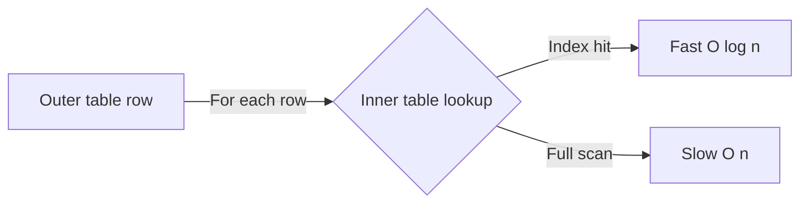
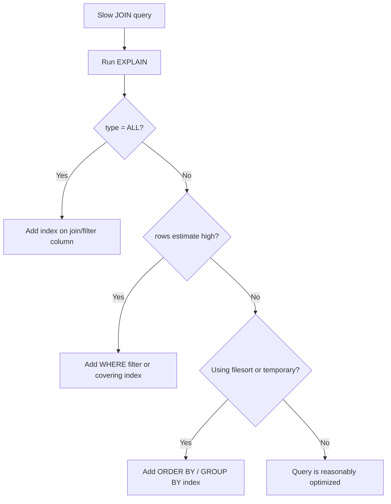

# How to Optimize JOIN Performance in MySQL

Author: [nawazdhandala](https://www.github.com/nawazdhandala)

Tags: MySQL, SQL, Join, Performance, Index, Database

Description: Learn practical techniques to speed up JOIN queries in MySQL, including indexing strategies, EXPLAIN analysis, join order hints, and query rewrites for large tables.

---

Slow JOIN queries are among the most common MySQL performance problems. This guide covers the tools and techniques you need to diagnose and fix them.

## How MySQL executes joins

MySQL uses a Nested Loop Join (NLJ) algorithm by default. For each row in the outer (driving) table, MySQL searches the inner table for matching rows.



The optimizer chooses the driving table and join order. You influence this choice with indexes, statistics, and hints.

## Step 1: Run EXPLAIN

Always start with `EXPLAIN`:

```sql
EXPLAIN
SELECT o.order_id, c.name, p.name
FROM orders o
INNER JOIN customers c ON o.customer_id = c.customer_id
INNER JOIN products  p ON o.product_id  = p.product_id
WHERE o.order_date > '2026-01-01';
```

Key columns to check:

| Column | What to look for |
|---|---|
| `type` | `ref`, `eq_ref`, `range` are good; `ALL` is bad |
| `key` | Should show the index being used |
| `rows` | Estimated rows scanned - lower is better |
| `Extra` | `Using index` is good; `Using filesort`, `Using temporary` may need attention |

For MySQL 8, use `EXPLAIN ANALYZE` for actual row counts:

```sql
EXPLAIN ANALYZE
SELECT o.order_id, c.name
FROM orders o
INNER JOIN customers c ON o.customer_id = c.customer_id
WHERE o.order_date > '2026-01-01'\G
```

## Step 2: Index every join column

The single most impactful optimisation is indexing the columns used in `ON` clauses:

```sql
-- Index on the foreign key side
CREATE INDEX idx_orders_customer_id ON orders (customer_id);
CREATE INDEX idx_orders_product_id  ON orders (product_id);
CREATE INDEX idx_order_items_order  ON order_items (order_id);
```

Primary keys are automatically indexed. Foreign keys are not automatically indexed in MySQL - you must create them manually.

## Step 3: Filter early with WHERE

Place selective filters on the driving table so fewer rows enter the join:

```sql
-- Good: filter applied before join
SELECT o.order_id, c.name
FROM orders o
INNER JOIN customers c ON o.customer_id = c.customer_id
WHERE o.order_date > '2026-01-01'    -- high selectivity filter on driving table
  AND o.status = 'shipped';

-- Less efficient: no filter on the driving table
SELECT o.order_id, c.name
FROM orders o
INNER JOIN customers c ON o.customer_id = c.customer_id;
```

## Step 4: Use covering indexes

A covering index includes all columns the query needs, avoiding a trip to the row data:

```sql
-- Query only needs order_date, customer_id, status from orders
CREATE INDEX idx_orders_covering
    ON orders (order_date, customer_id, status);
```

EXPLAIN will show `Using index` in the Extra column when a covering index is used.

## Step 5: Avoid functions on join columns

Wrapping a join column in a function prevents index use:

```sql
-- Bad: index on order_date cannot be used
SELECT * FROM orders o
INNER JOIN customers c ON o.customer_id = c.customer_id
WHERE YEAR(o.order_date) = 2026;

-- Good: range comparison allows index
WHERE o.order_date >= '2026-01-01' AND o.order_date < '2027-01-01';
```

## Step 6: Check join order with EXPLAIN

MySQL's optimizer usually picks the best join order, but you can inspect it:

```sql
EXPLAIN FORMAT=JSON
SELECT c.name, o.order_date
FROM customers c
INNER JOIN orders o ON c.customer_id = o.customer_id
WHERE c.city = 'London'\G
```

Look for the `"nested_loop"` array in the JSON output to see the actual join order chosen.

## Step 7: Use STRAIGHT_JOIN when the optimizer chooses poorly

If you are confident a different join order is better, use `STRAIGHT_JOIN` to force the order written in the query:

```sql
SELECT STRAIGHT_JOIN c.name, o.order_date
FROM customers c
INNER JOIN orders o ON c.customer_id = o.customer_id
WHERE c.city = 'London';
```

Only apply this after confirming with `EXPLAIN` that the forced order is actually faster.

## Step 8: Limit columns in SELECT

Selecting only the columns you need reduces data transfer and can allow covering index usage:

```sql
-- Instead of SELECT *
SELECT c.name, o.order_date, o.total
FROM customers c
INNER JOIN orders o ON c.customer_id = o.customer_id;
```

## Step 9: Use join_buffer_size for non-indexed joins

When a join cannot use an index (block nested loop algorithm), MySQL uses the join buffer. Increasing `join_buffer_size` can help:

```sql
-- Session level
SET SESSION join_buffer_size = 4 * 1024 * 1024;  -- 4 MB

-- Confirm the algorithm
EXPLAIN
SELECT ...
-- Look for "Using join buffer (Block Nested Loop)" in Extra
```

The long-term fix is always to add the missing index.

## Step 10: Consider partitioning for very large tables

Partition pruning can reduce the number of rows scanned in a join:

```sql
CREATE TABLE orders (
    order_id   INT,
    order_date DATE,
    customer_id INT,
    ...
) PARTITION BY RANGE (YEAR(order_date)) (
    PARTITION p2024 VALUES LESS THAN (2025),
    PARTITION p2025 VALUES LESS THAN (2026),
    PARTITION p2026 VALUES LESS THAN (2027)
);
```

Filtering on `order_date` lets MySQL skip irrelevant partitions before the join.

## Quick optimisation checklist



## Summary

Optimizing MySQL JOIN performance starts with `EXPLAIN` to identify full table scans, then adding indexes on every join column and applying selective `WHERE` filters early. Avoid functions on join columns, select only the columns you need, and use `STRAIGHT_JOIN` sparingly to override the optimizer when you have confirmed a better join order.
