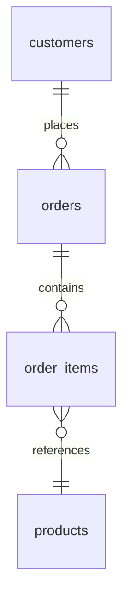

# How to Join Three or More Tables in MySQL

Author: [nawazdhandala](https://www.github.com/nawazdhandala)

Tags: MySQL, SQL, Join, Database, Query

Description: Learn how to join three or more tables in MySQL using INNER JOIN, LEFT JOIN, and aliases, with practical examples and tips for keeping multi-table queries readable.

---

Joining more than two tables in MySQL is a natural extension of two-table joins. MySQL evaluates joins left to right, so you chain additional `JOIN ... ON ...` clauses after the first join. The result set grows with each join step, and MySQL's optimizer decides the most efficient execution order.

## Schema used in this guide

```sql
CREATE TABLE customers (
    customer_id INT PRIMARY KEY,
    name        VARCHAR(100),
    city        VARCHAR(60)
);

CREATE TABLE orders (
    order_id    INT PRIMARY KEY,
    customer_id INT,
    order_date  DATE,
    FOREIGN KEY (customer_id) REFERENCES customers(customer_id)
);

CREATE TABLE order_items (
    item_id    INT PRIMARY KEY,
    order_id   INT,
    product_id INT,
    quantity   INT,
    FOREIGN KEY (order_id) REFERENCES orders(order_id)
);

CREATE TABLE products (
    product_id INT PRIMARY KEY,
    name       VARCHAR(100),
    price      DECIMAL(10,2)
);
```

## How the join chain works



## Joining three tables

```sql
SELECT
    c.name        AS customer,
    o.order_date,
    p.name        AS product,
    oi.quantity
FROM customers c
INNER JOIN orders      o  ON c.customer_id = o.customer_id
INNER JOIN order_items oi ON o.order_id    = oi.order_id
INNER JOIN products    p  ON oi.product_id = p.product_id
ORDER BY o.order_date DESC;
```

MySQL processes this as:
1. Join `customers` and `orders` on `customer_id`.
2. Join that result with `order_items` on `order_id`.
3. Join that result with `products` on `product_id`.

## Using LEFT JOIN to keep rows with no matches

If some orders have no items yet, use `LEFT JOIN` to keep them in the result:

```sql
SELECT
    c.name      AS customer,
    o.order_id,
    o.order_date,
    p.name      AS product,
    oi.quantity
FROM customers c
INNER JOIN orders      o  ON c.customer_id = o.customer_id
LEFT JOIN  order_items oi ON o.order_id    = oi.order_id
LEFT JOIN  products    p  ON oi.product_id = p.product_id;
```

Rows where `oi.item_id IS NULL` represent orders that have no line items.

## Mixing join types

You can mix `INNER JOIN`, `LEFT JOIN`, and `RIGHT JOIN` in the same query. Each join type applies only to the two tables it connects.

```sql
SELECT
    c.name,
    o.order_id,
    p.name AS product
FROM customers c
INNER JOIN orders      o  ON c.customer_id = o.customer_id
LEFT JOIN  order_items oi ON o.order_id    = oi.order_id
LEFT JOIN  products    p  ON oi.product_id = p.product_id
WHERE c.city = 'London';
```

## Four-table join example

```sql
CREATE TABLE categories (
    category_id INT PRIMARY KEY,
    name        VARCHAR(60)
);

ALTER TABLE products ADD COLUMN category_id INT;
ALTER TABLE products ADD FOREIGN KEY (category_id) REFERENCES categories(category_id);

SELECT
    c.name     AS customer,
    o.order_id,
    p.name     AS product,
    cat.name   AS category
FROM customers   c
INNER JOIN orders      o   ON c.customer_id  = o.customer_id
INNER JOIN order_items oi  ON o.order_id     = oi.order_id
INNER JOIN products    p   ON oi.product_id  = p.product_id
INNER JOIN categories  cat ON p.category_id  = cat.category_id;
```

## Using table aliases to reduce noise

Aliases are essential when joining many tables to keep `ON` clauses short and readable:

```sql
-- Without aliases (hard to read)
SELECT customers.name, orders.order_date, products.name
FROM customers
INNER JOIN orders      ON customers.customer_id = orders.customer_id
INNER JOIN order_items ON orders.order_id        = order_items.order_id
INNER JOIN products    ON order_items.product_id = products.product_id;

-- With aliases (much cleaner)
SELECT c.name, o.order_date, p.name
FROM customers c
INNER JOIN orders      o  ON c.customer_id = o.customer_id
INNER JOIN order_items oi ON o.order_id    = oi.order_id
INNER JOIN products    p  ON oi.product_id = p.product_id;
```

## Avoiding duplicate column names in SELECT *

When you use `SELECT *` across multiple joins, columns with the same name (such as `name`) appear multiple times and are hard to distinguish. Always alias ambiguous columns:

```sql
SELECT
    c.customer_id,
    c.name  AS customer_name,
    p.name  AS product_name,
    p.price
FROM customers c
INNER JOIN orders      o  ON c.customer_id = o.customer_id
INNER JOIN order_items oi ON o.order_id    = oi.order_id
INNER JOIN products    p  ON oi.product_id = p.product_id;
```

## Performance tips

- Create indexes on every column used in an `ON` clause.
- Run `EXPLAIN` to verify that index lookups are used.
- Filter early with `WHERE` to reduce intermediate row counts.

```sql
EXPLAIN
SELECT c.name, o.order_date, p.name
FROM customers c
INNER JOIN orders      o  ON c.customer_id = o.customer_id
INNER JOIN order_items oi ON o.order_id    = oi.order_id
INNER JOIN products    p  ON oi.product_id = p.product_id
WHERE c.city = 'London';
```

Look for `Using index` or `ref` access type in the `Extra` and `type` columns of the EXPLAIN output.

## Summary

Joining three or more tables in MySQL is done by chaining `JOIN ... ON ...` clauses. Use `INNER JOIN` when all rows must match and `LEFT JOIN` when you want to keep unmatched rows. Assign short aliases to every table, index every join column, and run `EXPLAIN` to confirm that the optimizer is using those indexes efficiently.
