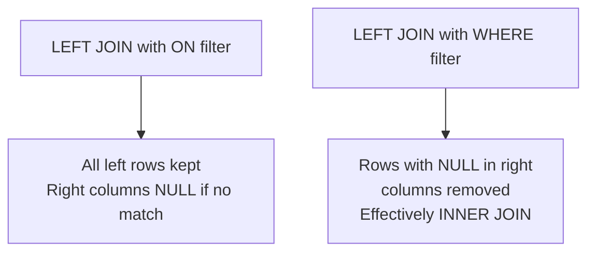

# How to Use JOIN with WHERE vs ON in MySQL

Author: [nawazdhandala](https://www.github.com/nawazdhandala)

Tags: MySQL, SQL, Join, Database, Query

Description: Learn the key difference between filtering in the ON clause and the WHERE clause in MySQL joins, and how this choice changes the results of LEFT JOIN and INNER JOIN queries.

---

One of the most common sources of subtle bugs in SQL is putting a filter condition in the wrong place: `ON` vs `WHERE`. The distinction matters only for outer joins (`LEFT JOIN`, `RIGHT JOIN`), but understanding it is essential for writing correct queries.

## How the logical order works

```
FROM / JOIN (including ON) -> WHERE -> GROUP BY -> HAVING -> SELECT
```

`ON` is evaluated during the join step. `WHERE` is evaluated after all joins are complete. For inner joins, this produces identical results. For outer joins, it does not.

## INNER JOIN: ON and WHERE are equivalent

```sql
CREATE TABLE customers (customer_id INT PRIMARY KEY, name VARCHAR(100));
CREATE TABLE orders (order_id INT PRIMARY KEY, customer_id INT, status VARCHAR(20));

INSERT INTO customers VALUES (1,'Alice'),(2,'Bob'),(3,'Carol');
INSERT INTO orders VALUES (101,1,'shipped'),(102,1,'pending'),(103,2,'shipped');

-- Filter in ON
SELECT c.name, o.order_id
FROM customers c
INNER JOIN orders o ON c.customer_id = o.customer_id
                   AND o.status = 'shipped';

-- Filter in WHERE
SELECT c.name, o.order_id
FROM customers c
INNER JOIN orders o ON c.customer_id = o.customer_id
WHERE o.status = 'shipped';
```

Both queries return the same two rows: Alice/101 and Bob/103. With `INNER JOIN`, MySQL discards non-matching rows regardless of whether the condition is in `ON` or `WHERE`.

## LEFT JOIN: ON and WHERE produce different results

```sql
-- Filter in ON: keeps all customers, NULL for non-matching orders
SELECT c.name, o.order_id, o.status
FROM customers c
LEFT JOIN orders o ON c.customer_id = o.customer_id
                  AND o.status = 'shipped';
```

Result:

| name  | order_id | status  |
|-------|----------|---------|
| Alice | 101      | shipped |
| Bob   | 103      | shipped |
| Alice | NULL     | NULL    |
| Carol | NULL     | NULL    |

Alice appears twice: once with the matching shipped order, and once because the pending order did not match the `ON` condition and the left row is preserved with NULLs.

```sql
-- Filter in WHERE: excludes non-matching rows, effectively an INNER JOIN
SELECT c.name, o.order_id, o.status
FROM customers c
LEFT JOIN orders o ON c.customer_id = o.customer_id
WHERE o.status = 'shipped';
```

Result:

| name  | order_id | status  |
|-------|----------|---------|
| Alice | 101      | shipped |
| Bob   | 103      | shipped |

Carol is gone. Once a `LEFT JOIN` produces a row with `NULL` in the right-table columns, a `WHERE` condition on a right-table column evaluates `NULL = 'shipped'` as `FALSE` and discards the row. The `LEFT JOIN` has been silently turned into an `INNER JOIN`.

## Visual comparison



## When to put conditions in ON vs WHERE

| Goal | Put condition in |
|---|---|
| Filter which right-table rows qualify for the join while keeping all left rows | ON |
| Filter final result rows after the join (including discarding unmatched rows) | WHERE |
| Filter left-table rows | WHERE (ON technically works too for INNER JOIN) |

## Practical example: active departments, all employees

```sql
CREATE TABLE departments (department_id INT PRIMARY KEY, name VARCHAR(60), active TINYINT);
CREATE TABLE employees  (employee_id INT PRIMARY KEY, name VARCHAR(100), department_id INT);

-- Show all employees; only show department name if the department is active
SELECT e.name, d.name AS department
FROM employees e
LEFT JOIN departments d ON e.department_id = d.department_id
                       AND d.active = 1;
```

Employees in inactive departments appear with `NULL` in the `department` column.

```sql
-- Only show employees in active departments (excludes employees in inactive ones)
SELECT e.name, d.name AS department
FROM employees e
LEFT JOIN departments d ON e.department_id = d.department_id
WHERE d.active = 1;
```

## Anti-join with WHERE IS NULL

When finding rows with no match, the `IS NULL` check must be in `WHERE`, not `ON`:

```sql
-- Correct: find customers with no orders
SELECT c.name
FROM customers c
LEFT JOIN orders o ON c.customer_id = o.customer_id
WHERE o.order_id IS NULL;

-- Wrong: the IS NULL in ON creates a different join condition
SELECT c.name
FROM customers c
LEFT JOIN orders o ON c.customer_id = o.customer_id
                  AND o.order_id IS NULL;
```

## Summary

For `INNER JOIN`, placing a condition in `ON` or `WHERE` produces the same result. For `LEFT JOIN` (and `RIGHT JOIN`), conditions in `ON` filter the right-table rows considered during the join while preserving all left-table rows. Conditions in `WHERE` are applied after the join and can eliminate rows that were preserved by the outer join, effectively converting it to an inner join. Put right-table filters in `ON` when you want to preserve the outer join semantics; put them in `WHERE` when you want to exclude those rows from the final result.
