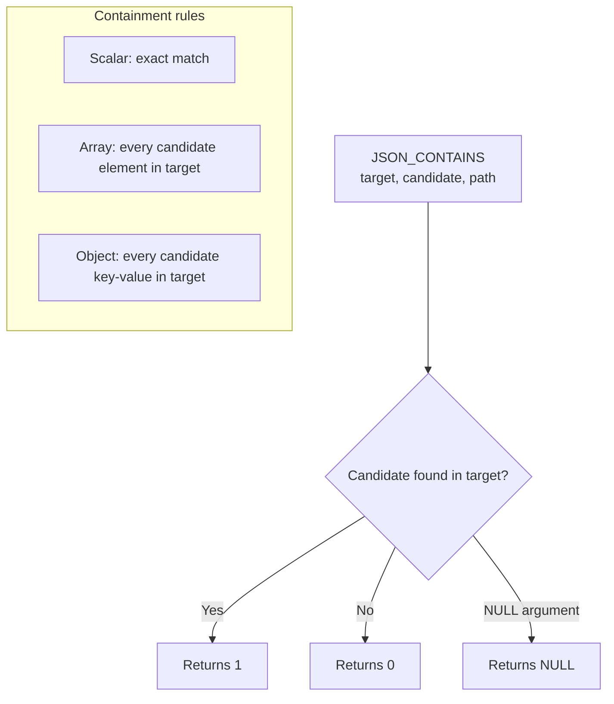

# How to Use JSON_CONTAINS() in MySQL

Author: [nawazdhandala](https://www.github.com/nawazdhandala)

Tags: MySQL, SQL, JSON, Database

Description: Learn how to use MySQL JSON_CONTAINS() to test whether a JSON document contains a specified value or sub-document at an optional path, with practical filtering examples.

---

## What JSON_CONTAINS() Does

`JSON_CONTAINS()` checks whether a target JSON document contains a candidate JSON value. It returns `1` if the candidate is found, `0` if not, and `NULL` if either argument is `NULL`.

"Contains" has specific semantics:
- A scalar is contained if it equals the target
- An array is contained if every element of the candidate is in the target array (subset check)
- An object is contained if every key/value pair in the candidate exists in the target object



## Syntax

```sql
JSON_CONTAINS(target_doc, candidate_doc [, path])
```

- `target_doc` - the JSON column or document to search in
- `candidate_doc` - the JSON value to look for (must be a valid JSON expression)
- `path` (optional) - limit the search to this path within `target_doc`

## Setup: Sample Table

```sql
CREATE TABLE articles (
    id      INT AUTO_INCREMENT PRIMARY KEY,
    title   VARCHAR(200),
    meta    JSON
);

INSERT INTO articles (title, meta) VALUES
('MySQL JSON Guide',
 '{"author": "Alice", "tags": ["mysql", "database", "json"], "views": 1500, "featured": true}'),
('Python Tutorial',
 '{"author": "Bob",   "tags": ["python", "beginner"],        "views": 800,  "featured": false}'),
('Database Design',
 '{"author": "Alice", "tags": ["mysql", "design", "sql"],    "views": 3200, "featured": true}'),
('NoSQL vs SQL',
 '{"author": "Carol", "tags": ["nosql", "sql", "database"],  "views": 620,  "featured": false}');
```

## Checking for a Value in an Array

To test whether a JSON array contains a specific string value, pass the value as a JSON string (with embedded quotes):

```sql
-- Find articles tagged with 'mysql'
SELECT title
FROM articles
WHERE JSON_CONTAINS(meta -> '$.tags', '"mysql"');
```

```text
+--------------------+
| title              |
+--------------------+
| MySQL JSON Guide   |
| Database Design    |
+--------------------+
```

Important: the candidate must be valid JSON. A JSON string value requires its own double-quotes inside the outer string literal: `'"mysql"'` not `'mysql'`.

## Checking for a Scalar Value

```sql
-- Find articles where featured is true
SELECT title
FROM articles
WHERE JSON_CONTAINS(meta, 'true', '$.featured');
```

```sql
-- Find articles with exactly 800 views
SELECT title
FROM articles
WHERE JSON_CONTAINS(meta, '800', '$.views');
```

## Subset Check on Arrays

`JSON_CONTAINS` with an array candidate checks whether all elements of the candidate array exist in the target:

```sql
-- Find articles that have both 'mysql' AND 'sql' tags
SELECT title
FROM articles
WHERE JSON_CONTAINS(meta -> '$.tags', '["mysql", "sql"]');
```

```text
+------------------+
| title            |
+------------------+
| Database Design  |
+------------------+
```

Only "Database Design" has both tags. "MySQL JSON Guide" has `mysql` but not `sql`.

## Checking for a Sub-Object

```sql
-- Find articles where author is Alice (object key-value check)
SELECT title
FROM articles
WHERE JSON_CONTAINS(meta, '{"author": "Alice"}');
```

## Using JSON_CONTAINS() in SELECT List

```sql
SELECT
    title,
    JSON_CONTAINS(meta -> '$.tags', '"database"') AS has_database_tag,
    JSON_CONTAINS(meta, 'true', '$.featured')      AS is_featured
FROM articles;
```

```text
+--------------------+------------------+------------+
| title              | has_database_tag | is_featured|
+--------------------+------------------+------------+
| MySQL JSON Guide   |                1 |          1 |
| Python Tutorial    |                0 |          0 |
| Database Design    |                0 |          1 |
| NoSQL vs SQL       |                1 |          0 |
+--------------------+------------------+------------+
```

## JSON_CONTAINS() with Multi-Value Index (MySQL 8.0.17+)

For frequent tag searches, create a multi-value index to avoid full-table scans:

```sql
CREATE TABLE indexed_articles (
    id    INT AUTO_INCREMENT PRIMARY KEY,
    title VARCHAR(200),
    meta  JSON,
    INDEX idx_tags ((CAST(meta ->> '$.tags' AS CHAR(50) ARRAY)))
);

-- Insert data matching prior structure
INSERT INTO indexed_articles (title, meta)
SELECT title, meta FROM articles;

-- This query can use the multi-value index
SELECT title FROM indexed_articles
WHERE JSON_CONTAINS(meta -> '$.tags', '"mysql"');
```

Alternatively, use the `MEMBER OF` operator which also benefits from multi-value indexes:

```sql
SELECT title FROM indexed_articles
WHERE 'mysql' MEMBER OF (meta -> '$.tags');
```

## Combining JSON_CONTAINS() with Other Conditions

```sql
-- Featured articles with the 'database' tag and more than 1000 views
SELECT title, meta ->> '$.views' AS views
FROM articles
WHERE JSON_CONTAINS(meta -> '$.tags', '"database"')
  AND JSON_CONTAINS(meta, 'true', '$.featured')
  AND (meta ->> '$.views') > 1000;
```

## NULL Behavior

```sql
SELECT JSON_CONTAINS(NULL, '"test"');           -- NULL
SELECT JSON_CONTAINS('["a","b"]', NULL);        -- NULL
SELECT JSON_CONTAINS('["a","b"]', '"c"');       -- 0
```

## Summary

`JSON_CONTAINS()` returns 1 when a JSON document contains the specified candidate value at an optional path, 0 when it does not, and NULL when any argument is NULL. Array containment checks whether every element of the candidate array is present in the target array. For high-performance tag and array membership queries in MySQL 8.0.17+, create a multi-value index and use `MEMBER OF` or `JSON_CONTAINS()` to leverage it. Always quote string candidates as valid JSON (e.g., `'"value"'`) rather than plain strings.
