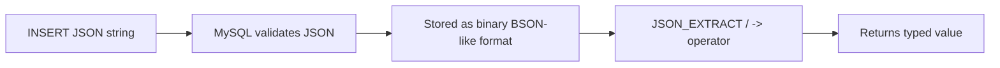

# How to Use JSON Data Type in MySQL 5.7+

Author: [nawazdhandala](https://www.github.com/nawazdhandala)

Tags: MySQL, SQL, JSON, DDL, Schema, NoSQL

Description: Store, query, and index JSON data in MySQL 5.7+ using the native JSON column type, JSON functions, and generated columns for indexing.

---

## How It Works

MySQL 5.7 introduced a native `JSON` data type that validates JSON on insert, stores it in an optimised binary format, and provides a rich set of functions for querying and modifying individual keys without rewriting the entire document.



## Creating a Table with a JSON Column

```sql
CREATE TABLE products (
    id         INT UNSIGNED AUTO_INCREMENT PRIMARY KEY,
    name       VARCHAR(255) NOT NULL,
    price      DECIMAL(10,2) NOT NULL,
    attributes JSON,
    created_at DATETIME NOT NULL DEFAULT CURRENT_TIMESTAMP
);
```

## Inserting JSON Data

```sql
INSERT INTO products (name, price, attributes) VALUES
(
    'Running Shoe',
    89.99,
    '{"color": "blue", "size": 10, "tags": ["sport", "outdoor"], "specs": {"weight": 280, "drop": 8}}'
),
(
    'Casual Sneaker',
    59.99,
    '{"color": "white", "size": 9, "tags": ["casual"], "specs": {"weight": 320, "drop": 0}}'
),
(
    'Hiking Boot',
    129.99,
    '{"color": "brown", "size": 11, "tags": ["outdoor", "waterproof"], "specs": {"weight": 520, "drop": 4}}'
);
```

## Querying JSON Values

### Using JSON_EXTRACT

`JSON_EXTRACT(column, path)` retrieves a value at a given JSON path.

```sql
SELECT name, JSON_EXTRACT(attributes, '$.color') AS color
FROM products;
```

```text
+----------------+--------+
| name           | color  |
+----------------+--------+
| Running Shoe   | "blue" |
| Casual Sneaker | "white"|
| Hiking Boot    | "brown"|
+----------------+--------+
```

### Using the -> Shorthand Operator

The `->` operator is shorthand for `JSON_EXTRACT`.

```sql
SELECT name, attributes->'$.color' AS color
FROM products;
```

### Using ->> to Remove Quotes

The `->>` operator unquotes the result, returning a plain string instead of a JSON string.

```sql
SELECT name, attributes->>'$.color' AS color
FROM products;
```

```text
+----------------+-------+
| name           | color |
+----------------+-------+
| Running Shoe   | blue  |
| Casual Sneaker | white |
| Hiking Boot    | brown |
+----------------+-------+
```

### Querying Nested Objects

```sql
SELECT name, attributes->>'$.specs.weight' AS weight_grams
FROM products
ORDER BY CAST(attributes->>'$.specs.weight' AS UNSIGNED);
```

```text
+----------------+--------------+
| name           | weight_grams |
+----------------+--------------+
| Running Shoe   | 280          |
| Casual Sneaker | 320          |
| Hiking Boot    | 520          |
+----------------+--------------+
```

### Filtering with JSON Values in WHERE

```sql
SELECT name, price
FROM products
WHERE attributes->>'$.color' = 'blue';
```

### Querying JSON Arrays

```sql
-- Products tagged 'outdoor'
SELECT name
FROM products
WHERE JSON_CONTAINS(attributes->'$.tags', '"outdoor"');
```

```text
+--------------+
| name         |
+--------------+
| Running Shoe |
| Hiking Boot  |
+--------------+
```

## Modifying JSON Data

### JSON_SET - Set or Add Keys

```sql
UPDATE products
SET attributes = JSON_SET(attributes, '$.color', 'navy', '$.in_stock', true)
WHERE id = 1;
```

### JSON_REMOVE - Remove a Key

```sql
UPDATE products
SET attributes = JSON_REMOVE(attributes, '$.specs.drop')
WHERE id = 2;
```

### JSON_ARRAY_APPEND - Append to an Array

```sql
UPDATE products
SET attributes = JSON_ARRAY_APPEND(attributes, '$.tags', 'sale')
WHERE id = 1;
```

## Indexing JSON Data with Generated Columns

MySQL cannot index a JSON column directly. Create a generated (virtual or stored) column and index that.

```sql
ALTER TABLE products
    ADD COLUMN color VARCHAR(50)
        GENERATED ALWAYS AS (attributes->>'$.color') VIRTUAL,
    ADD INDEX idx_color (color);

-- Now this query uses the index
SELECT name FROM products WHERE color = 'blue';
```

## JSON Utility Functions

```sql
-- Check if a string is valid JSON
SELECT JSON_VALID('{"key": "value"}');   -- 1
SELECT JSON_VALID('not json');            -- 0

-- Pretty-print JSON
SELECT JSON_PRETTY(attributes) FROM products WHERE id = 1\G

-- Count array elements
SELECT name, JSON_LENGTH(attributes->'$.tags') AS tag_count
FROM products;

-- List all keys in a JSON object
SELECT name, JSON_KEYS(attributes) AS keys
FROM products;
```

## Complete Working Example

```sql
-- Create table
CREATE TABLE user_preferences (
    user_id    INT UNSIGNED PRIMARY KEY,
    prefs      JSON NOT NULL DEFAULT (JSON_OBJECT()),
    updated_at DATETIME NOT NULL DEFAULT CURRENT_TIMESTAMP
                                 ON UPDATE CURRENT_TIMESTAMP
);

-- Insert preferences
INSERT INTO user_preferences (user_id, prefs) VALUES
(1, '{"theme": "dark", "language": "en", "notifications": {"email": true, "sms": false}}'),
(2, '{"theme": "light", "language": "fr", "notifications": {"email": false, "sms": true}}');

-- Query a nested value
SELECT user_id, prefs->>'$.theme' AS theme,
       prefs->>'$.notifications.email' AS email_notif
FROM user_preferences;
```

```text
+---------+-------+-------------+
| user_id | theme | email_notif |
+---------+-------+-------------+
|       1 | dark  | true        |
|       2 | light | false       |
+---------+-------+-------------+
```

## Best Practices

- Use `JSON` columns for truly schema-less or semi-structured data, not as a way to avoid proper normalisation.
- Create generated column indexes on JSON paths you query frequently in `WHERE` clauses.
- Use `->>` (unquoting operator) when comparing JSON string values to avoid quoting issues.
- Validate JSON on the application side before inserting to provide better error messages than MySQL's generic constraint error.
- Keep JSON documents small; large documents increase memory pressure since MySQL must parse the whole document even for single-key access.

## Summary

MySQL's native `JSON` type validates documents on insert, stores them in an efficient binary format, and exposes a rich set of functions including `JSON_EXTRACT`, `JSON_SET`, `JSON_CONTAINS`, and `JSON_ARRAY_APPEND`. Use the `->` and `->>` shorthand operators for readable queries. Since JSON columns cannot be indexed directly, create generated columns over frequently queried JSON paths and index those instead.
