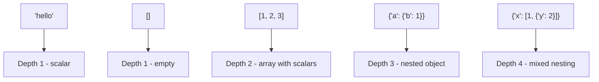

# How to Use JSON_DEPTH() in MySQL

Author: [nawazdhandala](https://www.github.com/nawazdhandala)

Tags: MySQL, SQL, JSON, Database

Description: Learn how to use MySQL JSON_DEPTH() to measure the maximum nesting depth of a JSON document, useful for complexity checks and schema validation.

---

## What JSON_DEPTH() Does

`JSON_DEPTH()` returns the maximum nesting depth of a JSON document. The depth rules are:

- A scalar (number, string, boolean, null) has depth 1
- An empty array `[]` or empty object `{}` has depth 1
- A non-empty array or object has depth equal to 1 plus the maximum depth of its elements or values



## Syntax

```sql
JSON_DEPTH(json_doc)
```

Returns an integer, or `NULL` if `json_doc` is `NULL`.

## Depth Examples

```sql
SELECT
    JSON_DEPTH('"hello"')                    AS scalar,          -- 1
    JSON_DEPTH('42')                          AS number,         -- 1
    JSON_DEPTH('null')                        AS null_val,       -- 1
    JSON_DEPTH('[]')                          AS empty_array,    -- 1
    JSON_DEPTH('{}')                          AS empty_object,   -- 1
    JSON_DEPTH('[1, 2, 3]')                   AS flat_array,     -- 2
    JSON_DEPTH('{"a": 1, "b": 2}')            AS flat_object,    -- 2
    JSON_DEPTH('{"a": {"b": 1}}')             AS nested_obj,     -- 3
    JSON_DEPTH('{"a": [1, {"c": 2}]}')        AS deep_mixed,     -- 4
    JSON_DEPTH('[[[1]]]')                     AS triple_nested;  -- 4
```

## Setup: Sample Table

```sql
CREATE TABLE documents (
    id      INT AUTO_INCREMENT PRIMARY KEY,
    name    VARCHAR(100),
    payload JSON
);

INSERT INTO documents (name, payload) VALUES
('flat config',
 '{"host": "localhost", "port": 5432}'),
('nested config',
 '{"db": {"host": "localhost", "port": 5432, "creds": {"user": "app", "pass": "secret"}}}'),
('deeply nested',
 '{"level1": {"level2": {"level3": {"level4": {"value": 42}}}}}'),
('array of objects',
 '[{"id": 1, "name": "Alice"}, {"id": 2, "name": "Bob"}]'),
('simple scalar list',
 '[1, 2, 3, 4, 5]');
```

## Measuring Document Depth

```sql
SELECT
    name,
    JSON_DEPTH(payload) AS depth
FROM documents
ORDER BY depth DESC;
```

```text
+--------------------+-------+
| name               | depth |
+--------------------+-------+
| deeply nested      |     6 |
| nested config      |     4 |
| array of objects   |     3 |
| flat config        |     2 |
| simple scalar list |     2 |
+--------------------+-------+
```

## Enforcing Depth Limits with CHECK Constraints

Deeply nested JSON can hurt query performance and readability. You can enforce a maximum depth at insert time with a `CHECK` constraint (MySQL 8.0.16+):

```sql
CREATE TABLE controlled_docs (
    id      INT AUTO_INCREMENT PRIMARY KEY,
    payload JSON,
    CONSTRAINT chk_depth CHECK (JSON_DEPTH(payload) <= 4)
);

-- This succeeds (depth = 3)
INSERT INTO controlled_docs (payload) VALUES ('{"a": {"b": {"c": 1}}}');

-- This fails (depth = 5)
INSERT INTO controlled_docs (payload) VALUES ('{"a": {"b": {"c": {"d": {"e": 1}}}}}');
-- ERROR 3819: Check constraint 'chk_depth' is violated.
```

## Finding Overly Deep Documents

```sql
-- Find documents deeper than a threshold
SELECT id, name, JSON_DEPTH(payload) AS depth
FROM documents
WHERE JSON_DEPTH(payload) > 3
ORDER BY depth DESC;
```

## Using JSON_DEPTH() in Monitoring Queries

```sql
-- Report depth distribution across a table
SELECT
    JSON_DEPTH(payload) AS depth,
    COUNT(*)            AS document_count
FROM documents
GROUP BY JSON_DEPTH(payload)
ORDER BY depth;
```

## Depth vs Length vs Type

These three functions inspect different structural properties:

```sql
SELECT
    JSON_DEPTH('[{"a": [1, 2]}, {"b": 3}]')   AS depth,   -- 4
    JSON_LENGTH('[{"a": [1, 2]}, {"b": 3}]')  AS length,  -- 2 (top-level array elements)
    JSON_TYPE('[{"a": [1, 2]}, {"b": 3}]')    AS type;    -- ARRAY
```

- `JSON_DEPTH()` - how deep the nesting goes
- `JSON_LENGTH()` - how many elements at the top (or given) level
- `JSON_TYPE()` - what type the value is

## NULL Handling

```sql
SELECT JSON_DEPTH(NULL);   -- NULL
SELECT JSON_DEPTH('null'); -- 1  (JSON null is a valid scalar)
```

## Summary

`JSON_DEPTH()` measures how deeply nested a JSON document is, returning 1 for scalars and empty containers, and N+1 for each additional level of nesting. It is useful for validating incoming data complexity, enforcing depth limits via `CHECK` constraints, monitoring schema drift in JSON columns, and debugging unexpectedly complex documents. Pair it with `JSON_LENGTH()` and `JSON_TYPE()` for a complete structural profile of any JSON value.
