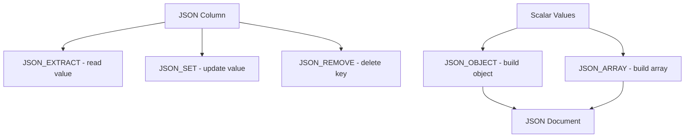

# How to Use MySQL JSON Functions (JSON_EXTRACT, JSON_SET, JSON_ARRAY)

Author: [nawazdhandala](https://www.github.com/nawazdhandala)

Tags: MySQL, SQL, JSON, Database

Description: Learn how to use MySQL JSON functions including JSON_EXTRACT, JSON_SET, and JSON_ARRAY to store, query, and modify JSON data in relational tables.

---

## How MySQL JSON Functions Work

MySQL 5.7 introduced a native `JSON` column type along with a comprehensive set of functions for reading, writing, and manipulating JSON documents. JSON functions let you access nested fields, update specific keys, and build new documents without parsing JSON in application code.



## Setup: Sample Table

```sql
CREATE TABLE users (
    id         INT AUTO_INCREMENT PRIMARY KEY,
    username   VARCHAR(50),
    profile    JSON,
    settings   JSON
);

INSERT INTO users (username, profile, settings) VALUES
('alice',
 '{"age": 30, "city": "New York", "tags": ["admin", "editor"], "address": {"zip": "10001"}}',
 '{"theme": "dark", "notifications": true, "lang": "en"}'),
('bob',
 '{"age": 25, "city": "Chicago",  "tags": ["viewer"],          "address": {"zip": "60601"}}',
 '{"theme": "light", "notifications": false, "lang": "en"}'),
('carol',
 '{"age": 35, "city": "Seattle",  "tags": ["editor"],          "address": {"zip": "98101"}}',
 '{"theme": "dark", "notifications": true,  "lang": "fr"}');
```

## JSON_EXTRACT

`JSON_EXTRACT` retrieves a value from a JSON document using a path expression. The shorthand operator `->` is equivalent.

**Syntax:**

```sql
JSON_EXTRACT(json_doc, path)
json_doc -> path          -- shorthand (returns JSON)
json_doc ->> path         -- unquoting shorthand (returns string)
```

**Path notation basics:**

```text
$           - root of the document
$.key       - top-level key
$.key.sub   - nested key
$.array[0]  - first element of an array
$.array[*]  - all elements
```

**Example - extract the city field:**

```sql
SELECT
    username,
    JSON_EXTRACT(profile, '$.city')  AS city_json,
    profile ->> '$.city'              AS city_text
FROM users;
```

```text
+----------+-----------+-----------+
| username | city_json | city_text |
+----------+-----------+-----------+
| alice    | "New York"| New York  |
| bob      | "Chicago" | Chicago   |
| carol    | "Seattle" | Seattle   |
+----------+-----------+-----------+
```

Note: `->` returns the value as a JSON string (with quotes), while `->>` unquotes it to a plain string.

**Example - extract nested field:**

```sql
SELECT username, profile ->> '$.address.zip' AS zip
FROM users;
```

**Example - filter by JSON value:**

```sql
SELECT username FROM users
WHERE profile ->> '$.city' = 'New York';
```

## JSON_SET

`JSON_SET` updates existing keys and inserts new keys. It replaces existing values and adds missing ones.

**Syntax:**

```sql
JSON_SET(json_doc, path, value [, path, value ...])
```

**Example - update a user's city:**

```sql
UPDATE users
SET profile = JSON_SET(profile, '$.city', 'Brooklyn')
WHERE username = 'alice';
```

**Example - add a new key:**

```sql
UPDATE users
SET profile = JSON_SET(profile, '$.verified', TRUE)
WHERE username = 'bob';
```

**Comparison of JSON modification functions:**

```text
JSON_SET    - insert or replace
JSON_INSERT - insert only (does not overwrite existing keys)
JSON_REPLACE - replace only (does not add new keys)
JSON_REMOVE - remove a key
```

## JSON_ARRAY

`JSON_ARRAY` constructs a JSON array from a list of values.

**Syntax:**

```sql
JSON_ARRAY(val1, val2, ...)
```

**Example - build an array:**

```sql
SELECT JSON_ARRAY('admin', 'editor', 'viewer') AS roles;
-- Result: ["admin", "editor", "viewer"]
```

**Example - store array in a column:**

```sql
UPDATE users
SET profile = JSON_SET(profile, '$.tags', JSON_ARRAY('admin', 'superuser'))
WHERE username = 'alice';
```

## JSON_OBJECT

`JSON_OBJECT` builds a JSON object from key-value pairs.

```sql
SELECT JSON_OBJECT(
    'username', username,
    'city',     profile ->> '$.city'
) AS summary
FROM users;
```

## JSON_CONTAINS and JSON_SEARCH

**JSON_CONTAINS** checks whether a document contains a given value at a path:

```sql
SELECT username
FROM users
WHERE JSON_CONTAINS(profile -> '$.tags', '"admin"');
```

**JSON_SEARCH** finds the path of a value within a document:

```sql
SELECT username, JSON_SEARCH(profile, 'one', 'editor') AS path
FROM users;
```

## JSON_ARRAYAGG and JSON_OBJECTAGG

These aggregate functions build JSON from grouped rows.

```sql
SELECT
    profile ->> '$.city' AS city,
    JSON_ARRAYAGG(username) AS users_in_city
FROM users
GROUP BY city;
```

## Generated Columns on JSON Fields

Create a virtual generated column to index a JSON field for fast lookups:

```sql
ALTER TABLE users
    ADD COLUMN city VARCHAR(100)
    GENERATED ALWAYS AS (profile ->> '$.city') VIRTUAL;

CREATE INDEX idx_users_city ON users (city);
```

## Best Practices

- Use `->>` (unquoting) when comparing JSON string values against SQL string literals.
- Index frequently queried JSON fields using generated columns rather than full-document scans.
- Validate JSON structure at the application layer before inserting, since MySQL will reject malformed JSON at write time.
- Avoid deeply nested JSON documents in high-volume tables - flat documents are faster to parse.
- Consider normalizing frequently queried JSON attributes into dedicated columns when query patterns stabilize.

## Summary

MySQL JSON functions provide a complete toolkit for working with semi-structured data. `JSON_EXTRACT` (and the `->` / `->>` operators) reads values by path. `JSON_SET` inserts or updates keys within a document. `JSON_ARRAY` and `JSON_OBJECT` construct new JSON values from SQL expressions. Together with generated column indexes, these functions let you query JSON data nearly as efficiently as structured relational columns.
