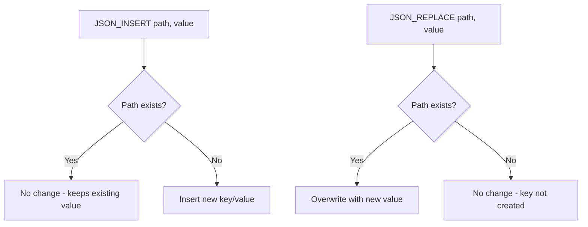

# How to Use JSON_INSERT() and JSON_REPLACE() in MySQL

Author: [nawazdhandala](https://www.github.com/nawazdhandala)

Tags: MySQL, SQL, JSON, Database

Description: Learn the difference between MySQL JSON_INSERT() and JSON_REPLACE(), and when to use each to safely modify JSON documents without overwriting or creating unintended keys.

---

## The Three JSON Modification Functions

MySQL provides three functions for modifying JSON documents, each with different insert/overwrite behavior:

| Function | Existing key | Missing key |
|---|---|---|
| `JSON_SET` | Overwrites | Inserts |
| `JSON_INSERT` | Leaves unchanged | Inserts |
| `JSON_REPLACE` | Overwrites | Leaves unchanged |

Understanding this distinction prevents accidental data loss and simplifies safe-update patterns.



## Syntax

```sql
JSON_INSERT(json_doc, path, value [, path, value ...])
JSON_REPLACE(json_doc, path, value [, path, value ...])
```

Both accept multiple path-value pairs in a single call. Paths use the `$` notation (e.g., `$.name`, `$.address.city`, `$.tags[0]`).

## Setup: Sample Table

```sql
CREATE TABLE user_profiles (
    id       INT AUTO_INCREMENT PRIMARY KEY,
    username VARCHAR(50),
    profile  JSON
);

INSERT INTO user_profiles (username, profile) VALUES
('alice', '{"age": 30, "city": "New York", "verified": true}'),
('bob',   '{"age": 25, "city": "Chicago"}'),
('carol', '{"age": 35, "city": "Seattle", "tags": ["editor"]}');
```

## JSON_INSERT(): Add New Fields Without Overwriting

Use `JSON_INSERT()` when you want to add a key only if it does not already exist. If the key exists, the existing value is preserved.

```sql
-- Add 'country' to all profiles (does not exist yet)
-- Add 'verified' flag, but preserve it for alice (already set to true)
UPDATE user_profiles
SET profile = JSON_INSERT(
    profile,
    '$.country',  'US',
    '$.verified', FALSE
);

SELECT username, profile FROM user_profiles;
```

```text
+----------+------------------------------------------------------------------+
| username | profile                                                          |
+----------+------------------------------------------------------------------+
| alice    | {"age": 30, "city": "New York", "verified": true, "country": "US"}|
| bob      | {"age": 25, "city": "Chicago", "verified": false, "country": "US"}|
| carol    | {"age": 35, "city": "Seattle", "tags": ["editor"], "verified": false, "country": "US"} |
+----------+------------------------------------------------------------------+
```

Note: Alice's `verified` stayed `true` because `JSON_INSERT` does not overwrite existing keys. Bob and Carol got `verified: false` because they lacked the key.

## JSON_REPLACE(): Update Existing Fields Only

Use `JSON_REPLACE()` when you want to update a key only if it already exists. If the key is absent, nothing is changed.

```sql
-- Update 'city' for all users, but only if they already have a city field
UPDATE user_profiles
SET profile = JSON_REPLACE(
    profile,
    '$.city',    'Los Angeles',
    '$.newfield', 'will not appear'  -- key does not exist, so it is ignored
);

SELECT username, profile ->> '$.city' AS city,
       profile ->> '$.newfield'       AS newfield
FROM user_profiles;
```

```text
+----------+-------------+----------+
| username | city        | newfield |
+----------+-------------+----------+
| alice    | Los Angeles | NULL     |
| bob      | Los Angeles | NULL     |
| carol    | Los Angeles | NULL     |
+----------+-------------+----------+
```

`$.newfield` was not inserted because `JSON_REPLACE` only touches existing paths.

## Resetting Data with JSON_INSERT()

A practical use case is providing default values for keys that may be missing without disturbing rows that already have values:

```sql
-- Set default notification preferences for users who do not have them yet
UPDATE user_profiles
SET profile = JSON_INSERT(
    profile,
    '$.notifications.email', TRUE,
    '$.notifications.sms',   FALSE,
    '$.timezone',            'UTC'
);
```

## Safely Overwriting a Specific Nested Value

```sql
-- Update only alice's age
UPDATE user_profiles
SET profile = JSON_REPLACE(profile, '$.age', 31)
WHERE username = 'alice';

-- Confirm: bob's age is unchanged
SELECT username, profile ->> '$.age' AS age FROM user_profiles;
```

## Combining JSON_INSERT() and JSON_REPLACE()

For complex migrations, combine both:

```sql
-- Add new required fields if missing, and update existing deprecated fields
UPDATE user_profiles
SET profile = JSON_INSERT(
                  JSON_REPLACE(profile, '$.city', UPPER(profile ->> '$.city')),
                  '$.schema_version', 2
              );
```

## Inserting into Arrays

Both functions can add elements to arrays by specifying an index path:

```sql
-- INSERT: add element at index 0 only if that slot is empty
-- REPLACE: overwrite element at index 0 if it exists

-- Using JSON_ARRAY_APPEND for end-of-array insertion (more reliable)
UPDATE user_profiles
SET profile = JSON_ARRAY_APPEND(profile, '$.tags', 'subscriber')
WHERE username = 'carol';

-- Using JSON_INSERT to add a new array if tags does not exist
UPDATE user_profiles
SET profile = JSON_INSERT(profile, '$.tags', JSON_ARRAY('reader'))
WHERE username = 'bob';
```

## Multiple Path-Value Pairs in One Call

Both functions accept multiple pairs, applied left to right:

```sql
SELECT JSON_INSERT(
    '{"a": 1}',
    '$.b', 2,
    '$.c', 3,
    '$.a', 99   -- already exists, so ignored by INSERT
) AS result;
-- {"a": 1, "b": 2, "c": 3}

SELECT JSON_REPLACE(
    '{"a": 1}',
    '$.a', 99,  -- exists, replaced
    '$.d', 4    -- does not exist, ignored
) AS result;
-- {"a": 99}
```

## Summary

`JSON_INSERT()` adds new key-value pairs to a JSON document while leaving existing keys unchanged - ideal for setting defaults and backfilling missing fields. `JSON_REPLACE()` updates only keys that already exist and ignores missing paths - ideal for safe updates where you do not want to accidentally create new fields. Use `JSON_SET()` when you want the combined behavior of inserting missing keys and replacing existing ones.
