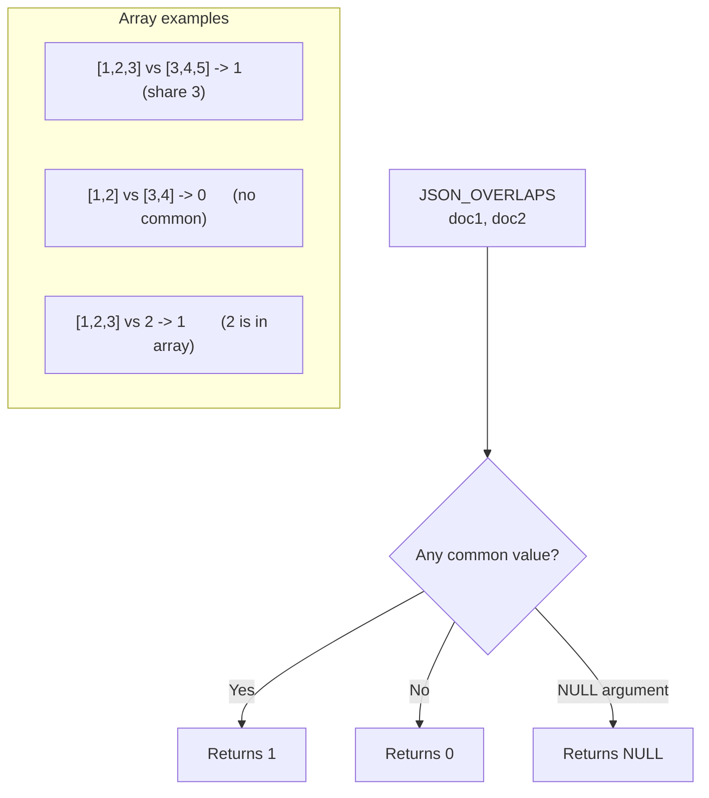

# How to Use JSON_OVERLAPS() in MySQL 8.0+

Author: [nawazdhandala](https://www.github.com/nawazdhandala)

Tags: MySQL, SQL, JSON, Database, MySQL 8

Description: Learn how to use MySQL 8.0.17+ JSON_OVERLAPS() to test whether two JSON documents share any common values, ideal for array intersection and tag matching queries.

---

## What JSON_OVERLAPS() Does

`JSON_OVERLAPS()` returns `1` if two JSON documents have any value in common, and `0` if they do not share any values. It was introduced in MySQL 8.0.17.

Overlap rules:
- Two arrays overlap if they share at least one element
- Two objects overlap if they share at least one key-value pair
- Two scalars overlap if they are equal
- An array and a scalar overlap if the scalar is an element of the array



## Syntax

```sql
JSON_OVERLAPS(json_doc1, json_doc2)
```

Both arguments must be valid JSON. Returns `NULL` if either is `NULL`.

## Basic Examples

```sql
-- Arrays sharing an element
SELECT JSON_OVERLAPS('[1, 2, 3]', '[3, 4, 5]') AS overlap;   -- 1

-- Arrays with no common elements
SELECT JSON_OVERLAPS('[1, 2]', '[3, 4]') AS overlap;          -- 0

-- Scalar vs array (scalar is contained in array)
SELECT JSON_OVERLAPS('[1, 2, 3]', '2') AS overlap;            -- 1

-- Objects sharing a key-value pair
SELECT JSON_OVERLAPS('{"a": 1, "b": 2}', '{"b": 2, "c": 3}') AS overlap;  -- 1

-- Objects with same key but different value - no overlap
SELECT JSON_OVERLAPS('{"a": 1}', '{"a": 2}') AS overlap;     -- 0
```

## Setup: Sample Table

```sql
CREATE TABLE products (
    id       INT AUTO_INCREMENT PRIMARY KEY,
    name     VARCHAR(100),
    tags     JSON,
    regions  JSON
);

INSERT INTO products (name, tags, regions) VALUES
('Widget A', '["sale", "new", "featured"]',     '["NA", "EU"]'),
('Widget B', '["clearance", "sale"]',            '["NA", "APAC"]'),
('Gadget X', '["premium", "featured", "new"]',  '["EU", "APAC"]'),
('Gadget Y', '["new"]',                         '["NA"]'),
('Service Z', '["enterprise", "featured"]',     '["EU", "NA", "APAC"]');
```

## Finding Products with Overlapping Tags

```sql
-- Find products that have any of these tags: 'sale' or 'clearance'
SELECT name, tags
FROM products
WHERE JSON_OVERLAPS(tags, '["sale", "clearance"]');
```

```text
+----------+----------------------------+
| name     | tags                       |
+----------+----------------------------+
| Widget A | ["sale", "new", "featured"]|
| Widget B | ["clearance", "sale"]      |
+----------+----------------------------+
```

## Finding Products Available in Specific Regions

```sql
-- Products available in either EU or APAC
SELECT name, regions
FROM products
WHERE JSON_OVERLAPS(regions, '["EU", "APAC"]');
```

```text
+----------+---------------+
| name     | regions       |
+----------+---------------+
| Widget A | ["NA", "EU"]  |
| Widget B | ["NA", "APAC"]|
| Gadget X | ["EU", "APAC"]|
| Service Z| ["EU", "NA", "APAC"] |
+----------+---------------+
```

## Combining Conditions

```sql
-- Featured products available in NA
SELECT name, tags, regions
FROM products
WHERE JSON_OVERLAPS(tags, '["featured"]')
  AND JSON_OVERLAPS(regions, '["NA"]');
```

## Using JSON_OVERLAPS() in SELECT for Scoring

```sql
-- Score products by how many target tags they match
SELECT
    name,
    tags,
    JSON_OVERLAPS(tags, '["sale", "new"]')     AS matches_promo,
    JSON_OVERLAPS(tags, '["premium", "featured"]') AS matches_premium
FROM products;
```

## JSON_OVERLAPS() vs JSON_CONTAINS()

| Function | Use case |
|---|---|
| `JSON_OVERLAPS(a, b)` | Do the two sets share any element? (intersection check) |
| `JSON_CONTAINS(a, b)` | Does `a` contain all elements of `b`? (subset check) |

```sql
SET @haystack = '["a", "b", "c"]';
SET @needle   = '["b", "c"]';

SELECT
    JSON_OVERLAPS(@haystack, @needle)  AS overlaps,  -- 1 (share b and c)
    JSON_CONTAINS(@haystack, @needle)  AS contains;  -- 1 (haystack has all of needle)

SET @partial = '["b", "z"]';
SELECT
    JSON_OVERLAPS(@haystack, @partial) AS overlaps,  -- 1 (share b)
    JSON_CONTAINS(@haystack, @partial) AS contains;  -- 0 (haystack lacks z)
```

## Multi-Value Index for Performance (MySQL 8.0.17+)

Create a multi-value index to speed up `JSON_OVERLAPS()` queries on array columns:

```sql
CREATE TABLE indexed_products (
    id   INT AUTO_INCREMENT PRIMARY KEY,
    name VARCHAR(100),
    tags JSON,
    INDEX idx_tags ((CAST(tags AS CHAR(50) ARRAY)))
);

INSERT INTO indexed_products (name, tags)
SELECT name, tags FROM products;

-- This query can use the multi-value index
SELECT name FROM indexed_products
WHERE JSON_OVERLAPS(tags, '["sale", "new"]');
```

## NULL Handling

```sql
SELECT JSON_OVERLAPS(NULL, '[1, 2]');   -- NULL
SELECT JSON_OVERLAPS('[1, 2]', NULL);   -- NULL
```

## Summary

`JSON_OVERLAPS()` checks whether two JSON documents have any value in common. For arrays this is an intersection test, for objects it checks for shared key-value pairs, and for scalars it is an equality test. It is particularly useful for tag-based filtering queries where you want to find rows matching any item from a set. For high-performance array queries, pair it with a multi-value index. Use `JSON_CONTAINS()` instead when you need to verify that one document is a complete subset of another.
