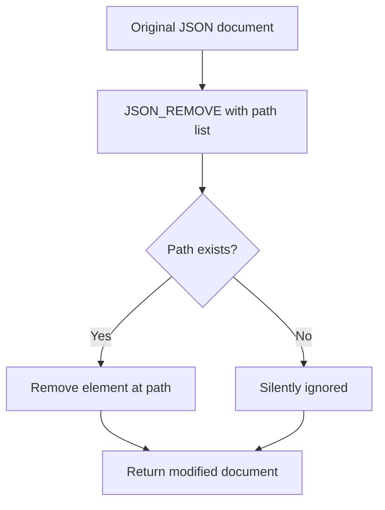

# How to Use JSON_REMOVE() Function in MySQL

Author: [nawazdhandala](https://www.github.com/nawazdhandala)

Tags: MySQL, SQL, JSON, Database

Description: Learn how to use MySQL JSON_REMOVE() to delete keys, nested fields, and array elements from JSON documents stored in MySQL columns.

---

## What JSON_REMOVE() Does

`JSON_REMOVE()` deletes one or more elements from a JSON document identified by their path expressions. It returns the modified document. If a path does not exist, it is silently ignored. The original column is not modified unless you use the result in an `UPDATE` statement.



## Syntax

```sql
JSON_REMOVE(json_doc, path [, path ...])
```

- `json_doc` - the JSON column or expression
- `path` - one or more JSON path expressions (e.g., `$.key`, `$.nested.key`, `$.array[0]`)

Multiple paths are removed left to right. Paths that no longer exist after a prior removal in the same call are silently skipped.

## Setup: Sample Table

```sql
CREATE TABLE products (
    id         INT AUTO_INCREMENT PRIMARY KEY,
    name       VARCHAR(100),
    attributes JSON
);

INSERT INTO products (name, attributes) VALUES
('Laptop Pro',
 '{"brand": "TechCorp", "cpu": "i9", "ram_gb": 32, "legacy_id": "LP-001",
   "tags": ["featured", "sale", "new"],
   "internal": {"cost": 800, "supplier": "SupplierA"}}'),
('Budget Phone',
 '{"brand": "PhoneCo", "storage_gb": 128, "color": "black",
   "tags": ["budget", "sale"],
   "internal": {"cost": 150, "supplier": "SupplierB"}}'),
('Wireless Mouse',
 '{"brand": "ClickInc", "dpi": 1600, "wireless": true, "legacy_id": "WM-042",
   "tags": ["accessory"]}');
```

## Removing a Single Key

```sql
-- Remove the legacy_id field from all products
UPDATE products
SET attributes = JSON_REMOVE(attributes, '$.legacy_id');

SELECT name, attributes ->> '$.legacy_id' AS legacy_id FROM products;
-- All return NULL (key removed)
```

## Removing Multiple Keys in One Call

```sql
-- Remove internal cost and supplier from a product being made public
UPDATE products
SET attributes = JSON_REMOVE(
    attributes,
    '$.internal.cost',
    '$.internal.supplier'
)
WHERE name = 'Laptop Pro';
```

## Removing a Nested Object Entirely

```sql
-- Remove the entire internal object
UPDATE products
SET attributes = JSON_REMOVE(attributes, '$.internal')
WHERE name = 'Budget Phone';

SELECT name, attributes FROM products WHERE name = 'Budget Phone';
```

## Removing Array Elements by Index

```sql
-- Remove the first element from the tags array
UPDATE products
SET attributes = JSON_REMOVE(attributes, '$.tags[0]')
WHERE name = 'Laptop Pro';

-- Before: ["featured", "sale", "new"]
-- After:  ["sale", "new"]
```

Note: array elements shift down after removal. Remove from the end to avoid shifting issues when deleting multiple elements:

```sql
-- Remove last element of tags array safely
-- First check the length
SELECT
    name,
    JSON_LENGTH(attributes, '$.tags') AS tag_count,
    attributes -> '$.tags' AS tags
FROM products;

-- Remove element at a known last position
UPDATE products
SET attributes = JSON_REMOVE(
    attributes,
    CONCAT('$.tags[', JSON_LENGTH(attributes, '$.tags') - 1, ']')
)
WHERE name = 'Wireless Mouse';
```

## Conditional Removal with WHERE

Only remove a key when certain conditions are met:

```sql
-- Remove 'sale' tag from the tags array only for products where the tag is present
-- (Check with JSON_CONTAINS first, then remove by index)
SELECT
    id,
    name,
    JSON_SEARCH(attributes, 'one', 'sale', NULL, '$.tags') AS sale_path
FROM products
WHERE JSON_CONTAINS(attributes -> '$.tags', '"sale"');
```

For removing by value rather than index, use application-side logic or a stored procedure that finds the index first and then calls `JSON_REMOVE`.

## Testing Without Updating

Use `SELECT` to preview the result before committing an `UPDATE`:

```sql
-- Preview what the document looks like after removal
SELECT
    name,
    JSON_REMOVE(attributes, '$.legacy_id', '$.internal') AS cleaned_attributes
FROM products;
```

## Handling Paths That Do Not Exist

`JSON_REMOVE()` silently ignores nonexistent paths and returns the document unchanged for those paths:

```sql
SELECT JSON_REMOVE('{"a": 1, "b": 2}', '$.c', '$.d') AS result;
-- {"a": 1, "b": 2}  (nothing removed, c and d do not exist)

SELECT JSON_REMOVE('{"a": 1, "b": 2}', '$.a', '$.b') AS result;
-- {}  (both removed, empty object remains)
```

## NULL Handling

If `json_doc` is `NULL`, the result is `NULL`:

```sql
SELECT JSON_REMOVE(NULL, '$.key');  -- NULL
```

## Removing Keys Before Exposing Data to Clients

A common pattern is stripping sensitive internal fields before returning data:

```sql
SELECT
    id,
    name,
    JSON_REMOVE(
        attributes,
        '$.internal',
        '$.legacy_id'
    ) AS public_attributes
FROM products;
```

## Summary

`JSON_REMOVE()` deletes one or more elements from a JSON document using path expressions. Multiple paths can be supplied in a single call and are processed left to right. Nonexistent paths are silently ignored. Use it to strip deprecated keys, remove sensitive internal fields before exposing data, and delete array elements by index. For removing array elements by value rather than index, identify the index with `JSON_SEARCH()` first, then pass the resolved path to `JSON_REMOVE()`.
