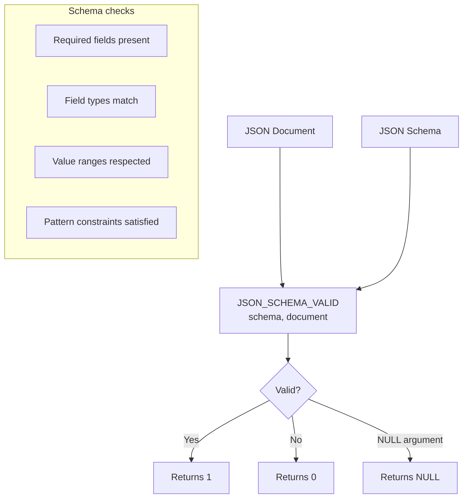

# How to Use JSON_SCHEMA_VALID() in MySQL 8.0+

Author: [nawazdhandala](https://www.github.com/nawazdhandala)

Tags: MySQL, SQL, JSON, Database, MySQL 8

Description: Learn how to use MySQL 8.0.17+ JSON_SCHEMA_VALID() to validate JSON documents against a JSON Schema definition for structural and type enforcement.

---

## What JSON_SCHEMA_VALID() Does

`JSON_SCHEMA_VALID()` validates a JSON document against a JSON Schema (a subset of JSON Schema Draft 4). It returns:

- `1` if the document is valid according to the schema
- `0` if the document fails validation
- `NULL` if either argument is `NULL`

It was introduced in MySQL 8.0.17 and is commonly used in `CHECK` constraints to enforce the structure of JSON columns at the database level.



## Syntax

```sql
JSON_SCHEMA_VALID(schema, document)
```

- `schema` - a JSON Schema object as a JSON value
- `document` - the JSON document to validate

## Basic Example

```sql
SET @schema = '{
  "type": "object",
  "required": ["name", "age"],
  "properties": {
    "name": {"type": "string"},
    "age":  {"type": "integer", "minimum": 0, "maximum": 150}
  }
}';

-- Valid document
SELECT JSON_SCHEMA_VALID(@schema, '{"name": "Alice", "age": 30}') AS valid;  -- 1

-- Missing required field
SELECT JSON_SCHEMA_VALID(@schema, '{"name": "Bob"}') AS valid;               -- 0

-- Wrong type
SELECT JSON_SCHEMA_VALID(@schema, '{"name": "Carol", "age": "thirty"}') AS valid; -- 0

-- Age out of range
SELECT JSON_SCHEMA_VALID(@schema, '{"name": "Dave", "age": -5}') AS valid;   -- 0
```

## Supported JSON Schema Keywords

MySQL 8.0 supports a subset of JSON Schema Draft 4:

| Keyword | Description |
|---|---|
| `type` | Value type: `string`, `number`, `integer`, `boolean`, `array`, `object`, `null` |
| `required` | Array of required property names |
| `properties` | Object property schemas |
| `minimum` / `maximum` | Numeric range |
| `minLength` / `maxLength` | String length |
| `pattern` | String regex pattern |
| `enum` | Allowed values list |
| `items` | Schema for array elements |
| `minItems` / `maxItems` | Array length |
| `uniqueItems` | Whether array elements must be unique |

## Setup: Using JSON_SCHEMA_VALID() in a CHECK Constraint

```sql
CREATE TABLE orders (
    id         INT AUTO_INCREMENT PRIMARY KEY,
    customer   VARCHAR(100),
    payload    JSON,
    created_at DATETIME DEFAULT CURRENT_TIMESTAMP,
    CONSTRAINT chk_order_schema CHECK (
        JSON_SCHEMA_VALID(
            '{
              "type": "object",
              "required": ["items", "shipping_address"],
              "properties": {
                "items": {
                  "type": "array",
                  "minItems": 1,
                  "items": {
                    "type": "object",
                    "required": ["sku", "qty"],
                    "properties": {
                      "sku": {"type": "string"},
                      "qty": {"type": "integer", "minimum": 1}
                    }
                  }
                },
                "shipping_address": {"type": "string", "minLength": 5},
                "discount": {"type": "number", "minimum": 0, "maximum": 1}
              }
            }',
            payload
        )
    )
);
```

Valid insert:

```sql
INSERT INTO orders (customer, payload) VALUES (
    'Alice',
    '{"items": [{"sku": "A1", "qty": 2}, {"sku": "B3", "qty": 1}],
      "shipping_address": "123 Main St, Seattle WA",
      "discount": 0.10}'
);
-- Success
```

Invalid insert (missing shipping_address):

```sql
INSERT INTO orders (customer, payload) VALUES (
    'Bob',
    '{"items": [{"sku": "C2", "qty": 1}]}'
);
-- ERROR 3819: Check constraint 'chk_order_schema' is violated.
```

## Using JSON_SCHEMA_VALID() for Filtering

```sql
CREATE TABLE event_log (
    id      INT AUTO_INCREMENT PRIMARY KEY,
    source  VARCHAR(50),
    payload JSON
);

INSERT INTO event_log (source, payload) VALUES
('app',    '{"type": "login",    "user_id": 101, "ts": 1711900800}'),
('legacy', '{"event": "clicked", "element": "button"}'),
('app',    '{"type": "purchase", "user_id": 102, "amount": 49.99}'),
('sensor', '[1, 2, 3]');

-- Find rows conforming to the expected event schema
SELECT id, source, payload
FROM event_log
WHERE JSON_SCHEMA_VALID(
    '{"type": "object", "required": ["type", "user_id"], "properties": {"type": {"type": "string"}, "user_id": {"type": "integer"}}}',
    payload
) = 1;
```

## Enum Constraint

```sql
SELECT JSON_SCHEMA_VALID(
    '{"type": "string", "enum": ["active", "inactive", "pending"]}',
    '"active"'
) AS valid;  -- 1

SELECT JSON_SCHEMA_VALID(
    '{"type": "string", "enum": ["active", "inactive", "pending"]}',
    '"deleted"'
) AS valid;  -- 0
```

## Pattern Matching for Strings

```sql
SELECT JSON_SCHEMA_VALID(
    '{"type": "string", "pattern": "^[A-Z]{2}-[0-9]{4}$"}',
    '"US-1234"'
) AS valid;  -- 1

SELECT JSON_SCHEMA_VALID(
    '{"type": "string", "pattern": "^[A-Z]{2}-[0-9]{4}$"}',
    '"invalid"'
) AS valid;  -- 0
```

## Checking an Existing Column

```sql
-- Audit which rows in event_log do NOT match the expected schema
SET @required_schema = '{"type": "object", "required": ["type", "user_id"]}';

SELECT id, source
FROM event_log
WHERE JSON_SCHEMA_VALID(@required_schema, payload) = 0;
```

## NULL Handling

```sql
SELECT JSON_SCHEMA_VALID(NULL, '{"a": 1}');  -- NULL
SELECT JSON_SCHEMA_VALID('{"type": "object"}', NULL);  -- NULL
```

## Summary

`JSON_SCHEMA_VALID()` validates a JSON document against a JSON Schema definition, returning 1 for valid, 0 for invalid, and NULL for null inputs. It is most powerful as a `CHECK` constraint, enforcing document structure at the database level without application-layer validation. Supported keywords cover type checking, required fields, string patterns, numeric ranges, and array constraints. Use it to catch malformed payloads at insert time and to audit existing rows for schema compliance.
