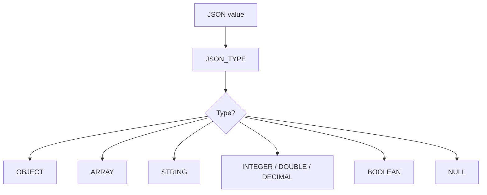

# How to Use JSON_TYPE() in MySQL

Author: [nawazdhandala](https://www.github.com/nawazdhandala)

Tags: MySQL, SQL, JSON, Database

Description: Learn how to use MySQL JSON_TYPE() to determine the type of a JSON value or a value at a specific path, enabling type-safe queries and conditional logic.

---

## What JSON_TYPE() Does

`JSON_TYPE()` returns a string describing the type of a JSON value. This lets you inspect whether a value is an object, array, string, number, boolean, or null before operating on it.

Possible return values:

| Return value | JSON type |
|---|---|
| `OBJECT` | JSON object `{}` |
| `ARRAY` | JSON array `[]` |
| `STRING` | JSON string |
| `INTEGER` | JSON integer number |
| `DOUBLE` | JSON floating-point number |
| `DECIMAL` | JSON decimal number |
| `BOOLEAN` | JSON `true` or `false` |
| `NULL` | JSON `null` literal |



## Syntax

```sql
JSON_TYPE(json_val)
```

- `json_val` - a JSON column, expression, or path extraction result
- Returns a string, or SQL `NULL` if the argument is SQL `NULL`

## Basic Examples

```sql
SELECT
    JSON_TYPE('{}')           AS obj,
    JSON_TYPE('[]')           AS arr,
    JSON_TYPE('"hello"')      AS str,
    JSON_TYPE('42')           AS int_val,
    JSON_TYPE('3.14')         AS dbl_val,
    JSON_TYPE('true')         AS bool_t,
    JSON_TYPE('false')        AS bool_f,
    JSON_TYPE('null')         AS null_val;
```

```text
+--------+-------+--------+---------+---------+--------+--------+----------+
| obj    | arr   | str    | int_val | dbl_val | bool_t | bool_f | null_val |
+--------+-------+--------+---------+---------+--------+--------+----------+
| OBJECT | ARRAY | STRING | INTEGER | DOUBLE  | BOOLEAN| BOOLEAN| NULL     |
+--------+-------+--------+---------+---------+--------+--------+----------+
```

Note: `JSON_TYPE('null')` returns the string `"NULL"`, while `JSON_TYPE(NULL)` (SQL NULL argument) returns SQL `NULL`.

## Setup: Sample Table

```sql
CREATE TABLE flexible_records (
    id      INT AUTO_INCREMENT PRIMARY KEY,
    name    VARCHAR(100),
    payload JSON
);

INSERT INTO flexible_records (name, payload) VALUES
('user profile',   '{"name": "Alice", "age": 30, "verified": true, "score": 4.8}'),
('product list',   '[{"id": 1, "sku": "A1"}, {"id": 2, "sku": "B2"}]'),
('scalar string',  '"just a string"'),
('scalar number',  '42'),
('empty object',   '{}'),
('null record',    'null');
```

## Checking Types of Stored JSON

```sql
SELECT
    name,
    JSON_TYPE(payload) AS payload_type
FROM flexible_records;
```

```text
+----------------+--------------+
| name           | payload_type |
+----------------+--------------+
| user profile   | OBJECT       |
| product list   | ARRAY        |
| scalar string  | STRING       |
| scalar number  | INTEGER      |
| empty object   | OBJECT       |
| null record    | NULL         |
+----------------+--------------+
```

## Checking Type at a Specific Path

```sql
SELECT
    name,
    JSON_TYPE(payload -> '$.verified') AS verified_type,
    JSON_TYPE(payload -> '$.age')      AS age_type,
    JSON_TYPE(payload -> '$.score')    AS score_type,
    JSON_TYPE(payload -> '$.name')     AS name_type
FROM flexible_records
WHERE JSON_TYPE(payload) = 'OBJECT';
```

```text
+----------------+---------------+----------+------------+-----------+
| name           | verified_type | age_type | score_type | name_type |
+----------------+---------------+----------+------------+-----------+
| user profile   | BOOLEAN       | INTEGER  | DOUBLE     | STRING    |
| empty object   | NULL          | NULL     | NULL       | NULL      |
+----------------+---------------+----------+------------+-----------+
```

## Type-Based Filtering

```sql
-- Process only records that are objects
SELECT name, payload ->> '$.name' AS user_name
FROM flexible_records
WHERE JSON_TYPE(payload) = 'OBJECT'
  AND JSON_TYPE(payload -> '$.name') = 'STRING';
```

```sql
-- Find fields that store numbers
SELECT name
FROM flexible_records
WHERE JSON_TYPE(payload -> '$.age') IN ('INTEGER', 'DOUBLE', 'DECIMAL');
```

## Using JSON_TYPE() in CASE Expressions

```sql
SELECT
    name,
    CASE JSON_TYPE(payload)
        WHEN 'OBJECT' THEN CONCAT('Object with ', JSON_LENGTH(payload), ' keys')
        WHEN 'ARRAY'  THEN CONCAT('Array with ',  JSON_LENGTH(payload), ' elements')
        WHEN 'NULL'   THEN 'Empty record'
        ELSE CONCAT('Scalar: ', JSON_TYPE(payload))
    END AS description
FROM flexible_records;
```

## Validating Before Type-Dependent Operations

```sql
-- Only sum numeric values, skip others
SELECT
    name,
    CASE
        WHEN JSON_TYPE(payload -> '$.age') IN ('INTEGER', 'DOUBLE')
        THEN payload -> '$.age' + 0
        ELSE NULL
    END AS age_numeric
FROM flexible_records;
```

## NULL Handling

```sql
SELECT JSON_TYPE(NULL);        -- SQL NULL (not the string "NULL")
SELECT JSON_TYPE('null');      -- The string "NULL" (JSON null type)
```

Distinguish between SQL `NULL` (missing argument) and the JSON `null` literal - `JSON_TYPE('null')` returns the string `"NULL"`.

## Summary

`JSON_TYPE()` returns a string identifying the type of any JSON value: `OBJECT`, `ARRAY`, `STRING`, `INTEGER`, `DOUBLE`, `DECIMAL`, `BOOLEAN`, or `NULL`. Use it to guard type-dependent operations, filter rows by the structure of their JSON columns, and build descriptive reports about mixed-schema JSON data. Combine it with `JSON_LENGTH()` for objects and arrays, and with `JSON_DEPTH()` to fully profile a JSON document's structure.
