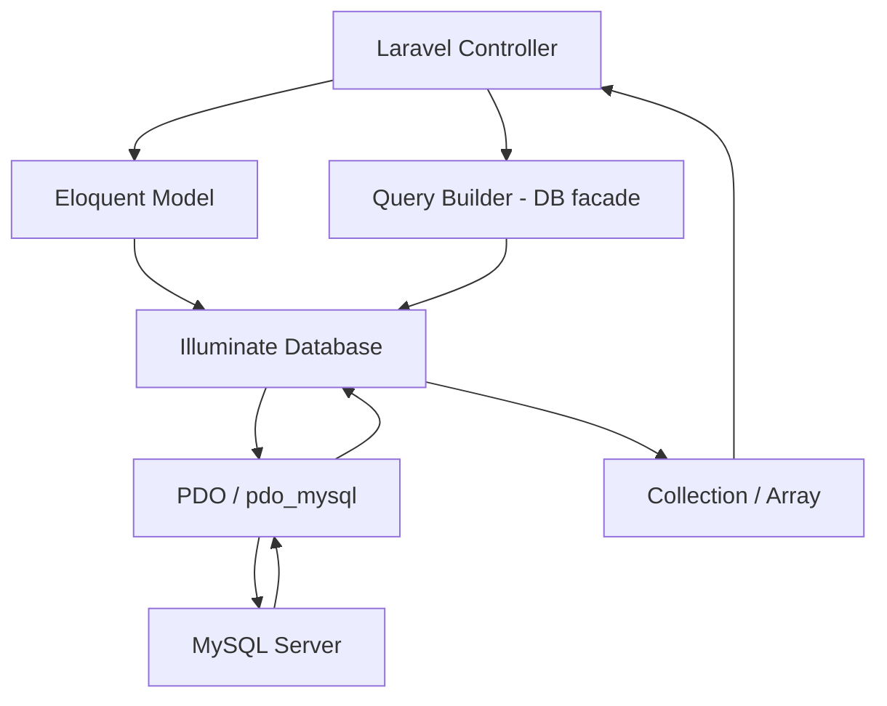

# How to Use MySQL with Laravel (PHP)

Author: [nawazdhandala](https://www.github.com/nawazdhandala)

Tags: MySQL, PHP, Laravel, Eloquent, ORM, Database

Description: Learn how to use MySQL with Laravel including Eloquent ORM, Query Builder, migrations, and relationships to build data-driven PHP applications.

---

## How Laravel Connects to MySQL

Laravel uses the Illuminate Database component, which wraps PDO. Configuration lives in `config/database.php` with credentials stored in `.env`. Laravel provides two query interfaces: the Eloquent ORM (active record pattern) and the fluent Query Builder.



## .env Configuration

```text
DB_CONNECTION=mysql
DB_HOST=127.0.0.1
DB_PORT=3306
DB_DATABASE=myapp
DB_USERNAME=appuser
DB_PASSWORD=secret
DB_CHARSET=utf8mb4
DB_COLLATION=utf8mb4_unicode_ci
```

## Migration

Create and run a migration to define the table schema:

```bash
php artisan make:migration create_products_table
```

```php
// database/migrations/xxxx_create_products_table.php
use Illuminate\Database\Migrations\Migration;
use Illuminate\Database\Schema\Blueprint;
use Illuminate\Support\Facades\Schema;

return new class extends Migration {

    public function up(): void {
        Schema::create('products', function (Blueprint $table) {
            $table->id();
            $table->string('name', 100);
            $table->decimal('price', 10, 2);
            $table->integer('stock')->default(0);
            $table->string('category', 50)->nullable();
            $table->timestamps();  // adds created_at and updated_at
        });
    }

    public function down(): void {
        Schema::dropIfExists('products');
    }
};
```

```bash
php artisan migrate
```

## Eloquent Model

```php
namespace App\Models;

use Illuminate\Database\Eloquent\Model;
use Illuminate\Database\Eloquent\Relations\HasMany;

class Product extends Model {
    protected $fillable = ['name', 'price', 'stock', 'category'];

    protected $casts = [
        'price' => 'decimal:2',
        'stock' => 'integer',
    ];

    public function reviews(): HasMany {
        return $this->hasMany(Review::class);
    }
}
```

## CRUD with Eloquent

```php
// Create
$product = Product::create([
    'name'     => 'Wireless Keyboard',
    'price'    => 49.99,
    'stock'    => 100,
    'category' => 'Electronics',
]);
echo $product->id;

// Read all
$products = Product::all();

// Read with conditions
$electronics = Product::where('category', 'Electronics')
    ->where('price', '<=', 100)
    ->orderBy('name')
    ->get();

// Read single
$product = Product::findOrFail(1);

// Update
$product->update(['stock' => $product->stock + 10]);

// Update multiple
Product::where('category', 'Electronics')
    ->update(['price' => \DB::raw('price * 0.9')]);

// Delete
$product->delete();
Product::where('stock', 0)->delete();
```

## Eloquent Relationships

```php
// Order belongs to User, has many OrderItems
class Order extends Model {
    public function user(): \Illuminate\Database\Eloquent\Relations\BelongsTo {
        return $this->belongsTo(User::class);
    }
    public function items(): \Illuminate\Database\Eloquent\Relations\HasMany {
        return $this->hasMany(OrderItem::class);
    }
}

// Eager load to avoid N+1:
$orders = Order::with(['user', 'items.product'])
    ->where('status', 'pending')
    ->get();

foreach ($orders as $order) {
    echo $order->user->name . ': ' . $order->items->count() . ' items';
}
```

## Query Builder

The Query Builder provides a fluent interface without needing a model:

```php
use Illuminate\Support\Facades\DB;

// Select with aggregates
$stats = DB::table('products')
    ->select('category', DB::raw('COUNT(*) as count'), DB::raw('AVG(price) as avg_price'))
    ->groupBy('category')
    ->orderByDesc('count')
    ->get();

// Join query
$orders = DB::table('orders')
    ->join('users', 'orders.user_id', '=', 'users.id')
    ->select('orders.id', 'users.name', 'orders.total')
    ->where('orders.status', 'shipped')
    ->get();

// Raw where
$results = DB::table('products')
    ->whereRaw('LOWER(name) LIKE ?', ['%keyboard%'])
    ->get();
```

## Transactions

```php
use Illuminate\Support\Facades\DB;

DB::transaction(function () use ($userId, $productId, $quantity) {
    $product = Product::lockForUpdate()->findOrFail($productId);

    if ($product->stock < $quantity) {
        throw new \RuntimeException('Insufficient stock');
    }

    $product->decrement('stock', $quantity);

    Order::create([
        'user_id'    => $userId,
        'product_id' => $productId,
        'quantity'   => $quantity,
        'total'      => $product->price * $quantity,
    ]);
});
```

## Pagination

```php
// Automatic pagination (returns LengthAwarePaginator):
$products = Product::where('category', 'Electronics')
    ->paginate(20);

// Cursor pagination (efficient for large datasets):
$products = Product::orderBy('id')->cursorPaginate(20);

// Return paginated JSON in API:
return response()->json($products);
```

## Scopes

```php
class Product extends Model {
    // Local scope
    public function scopeInStock($query) {
        return $query->where('stock', '>', 0);
    }
    public function scopeByCategory($query, string $category) {
        return $query->where('category', $category);
    }
}

// Usage:
$available = Product::inStock()->byCategory('Electronics')->orderBy('price')->get();
```

## Best Practices

- Always list fillable columns in `$fillable` (or `$guarded`) to prevent mass-assignment vulnerabilities.
- Use eager loading (`with()`) for relationships that are accessed in a loop.
- Use `findOrFail()` instead of `find()` when a missing record should return a 404.
- Wrap complex multi-table writes in `DB::transaction()` to ensure atomicity.
- Use database migrations for all schema changes - never alter production tables manually.
- Use `lockForUpdate()` when reading a row that you plan to modify based on its current value.

## Summary

Laravel integrates MySQL through Eloquent ORM and the fluent Query Builder. Eloquent models map to tables with `$fillable` protection and support relationships like `hasMany`, `belongsTo`, and `belongsToMany`. Migrations version-control the schema. `DB::transaction()` wraps multi-statement operations atomically. Pagination is built in with `paginate()` and `cursorPaginate()`. Query scopes keep common filter logic reusable. Together these tools make MySQL data access in PHP fast to develop and easy to maintain.
