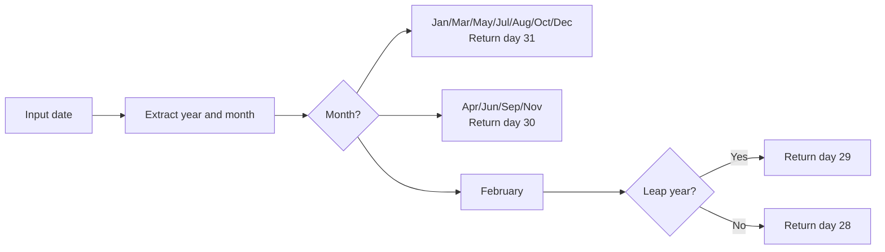

# How to Use LAST_DAY() Function in MySQL

Author: [nawazdhandala](https://www.github.com/nawazdhandala)

Tags: MySQL, SQL, Date Function, Database

Description: Learn how to use MySQL LAST_DAY() to find the last day of a month for any given date, useful for month-end reports and date range calculations.

---

## What Is the LAST_DAY() Function?

`LAST_DAY()` returns the last day of the month for a given date or datetime value. It automatically handles varying month lengths and correctly accounts for leap years.

**Syntax:**

```sql
LAST_DAY(date)
```

- Returns a `DATE` value representing the last day of the month.
- Returns `NULL` if `date` is `NULL` or an invalid date.

---

## Basic Examples

```sql
SELECT LAST_DAY('2026-03-10');
-- Returns: '2026-03-31'

SELECT LAST_DAY('2026-02-01');
-- Returns: '2026-02-28'  (non-leap year)

SELECT LAST_DAY('2024-02-01');
-- Returns: '2024-02-29'  (2024 is a leap year)

SELECT LAST_DAY('2026-01-31');
-- Returns: '2026-01-31'  (already the last day)

SELECT LAST_DAY('2026-12-01');
-- Returns: '2026-12-31'

SELECT LAST_DAY(NOW());
-- Returns: last day of the current month

SELECT LAST_DAY(NULL);
-- Returns: NULL
```

---

## How LAST_DAY() Handles Different Month Lengths



---

## Finding the First Day of a Month

Combine `LAST_DAY()` with `DATE_ADD()` to get the first day of the next month, or use it to find the first day of the current month:

```sql
-- First day of current month
SELECT DATE_FORMAT(CURDATE(), '%Y-%m-01') AS first_of_month;

-- First day of next month
SELECT DATE_ADD(LAST_DAY(CURDATE()), INTERVAL 1 DAY) AS first_of_next_month;

-- Last day of previous month (= first day of current month - 1 day)
SELECT DATE_SUB(DATE_FORMAT(CURDATE(), '%Y-%m-01'), INTERVAL 1 DAY) AS last_day_prev_month;
```

---

## Generating Monthly Date Ranges

```sql
-- Get start and end dates for each month in 2026 Q1
SELECT
    DATE_FORMAT(m.month_start, '%Y-%m-01') AS month_start,
    LAST_DAY(m.month_start)                AS month_end
FROM (
    SELECT '2026-01-01' AS month_start
    UNION ALL SELECT '2026-02-01'
    UNION ALL SELECT '2026-03-01'
) m;
```

Result:

| month_start | month_end  |
|-------------|------------|
| 2026-01-01  | 2026-01-31 |
| 2026-02-01  | 2026-02-28 |
| 2026-03-01  | 2026-03-31 |

---

## Month-to-Date Queries

```sql
CREATE TABLE orders (
    id INT AUTO_INCREMENT PRIMARY KEY,
    order_date DATE,
    amount DECIMAL(10, 2)
);

-- All orders from the beginning of this month to today
SELECT id, order_date, amount
FROM orders
WHERE order_date >= DATE_FORMAT(CURDATE(), '%Y-%m-01')
  AND order_date <= CURDATE();

-- All orders for the entire current month (including future dates in the month)
SELECT id, order_date, amount
FROM orders
WHERE order_date BETWEEN DATE_FORMAT(CURDATE(), '%Y-%m-01') AND LAST_DAY(CURDATE());
```

---

## Determining Days Remaining in the Month

```sql
SELECT
    CURDATE()                              AS today,
    LAST_DAY(CURDATE())                   AS month_end,
    DATEDIFF(LAST_DAY(CURDATE()), CURDATE()) AS days_remaining;
```

---

## Total Days in a Month

```sql
SELECT
    MONTHNAME(CURDATE())                   AS month_name,
    DAYOFMONTH(LAST_DAY(CURDATE()))        AS days_in_month;

-- For all months in 2026
SELECT
    m.month_date,
    MONTHNAME(m.month_date)                AS month_name,
    DAYOFMONTH(LAST_DAY(m.month_date))    AS days_in_month
FROM (
    SELECT '2026-01-01' AS month_date
    UNION ALL SELECT '2026-02-01'
    UNION ALL SELECT '2026-03-01'
    UNION ALL SELECT '2026-04-01'
    UNION ALL SELECT '2026-05-01'
    UNION ALL SELECT '2026-06-01'
    UNION ALL SELECT '2026-07-01'
    UNION ALL SELECT '2026-08-01'
    UNION ALL SELECT '2026-09-01'
    UNION ALL SELECT '2026-10-01'
    UNION ALL SELECT '2026-11-01'
    UNION ALL SELECT '2026-12-01'
) m;
```

---

## Month-End Close Reporting

```sql
-- Flag orders that landed on the last day of their month
SELECT
    id,
    order_date,
    amount,
    CASE WHEN order_date = LAST_DAY(order_date) THEN 'Month-End' ELSE 'Regular' END AS day_type
FROM orders;
```

---

## Combining LAST_DAY() with DATE_ADD() for Month Arithmetic

```sql
-- Subscription expiry: last day of month 3 months from now
SELECT
    user_id,
    LAST_DAY(DATE_ADD(CURDATE(), INTERVAL 3 MONTH)) AS expiry_date
FROM subscriptions;
```

---

## LAST_DAY() with Invalid Dates

```sql
SELECT LAST_DAY('2026-00-01');
-- Returns: NULL  (month 0 is invalid)

SELECT LAST_DAY('2026-13-01');
-- Returns: NULL  (month 13 is invalid)
```

---

## Summary

`LAST_DAY()` returns the last calendar day of the month for any input date, correctly handling varying month lengths including February in leap years. It is essential for month-end reporting, building date ranges, calculating remaining days in a month, and determining total days per month. Combine it with `DATE_FORMAT()` to derive the first day of the month, and with `DATE_ADD()` to find the first day of the next month.
