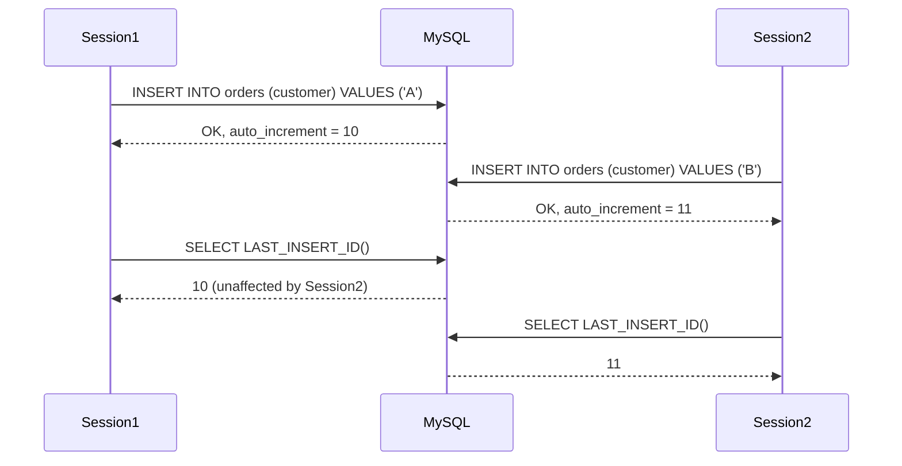
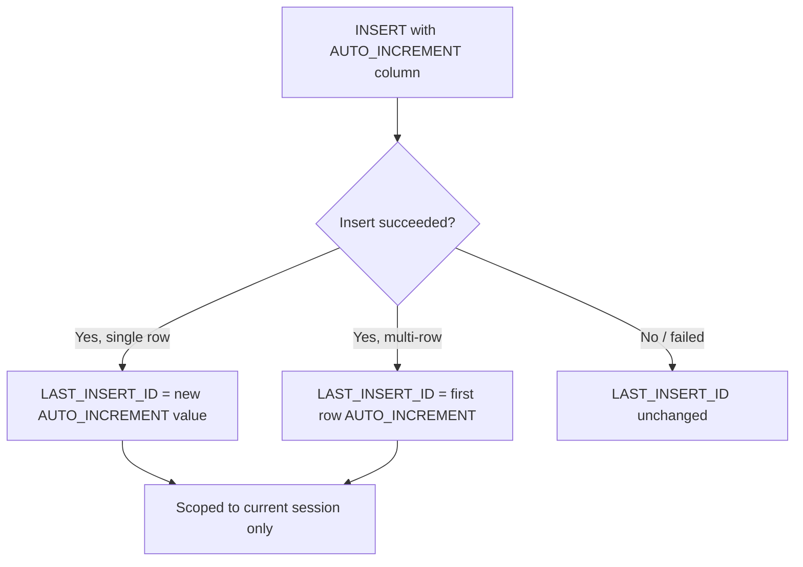

# How to Use LAST_INSERT_ID() in MySQL

Author: [OneUptime](https://oneuptime.com)

Tags: MySQL, Function, Auto Increment, Insert, Primary Key

Description: Learn how MySQL LAST_INSERT_ID() works to retrieve auto-increment values after inserts, handle multi-row inserts, and use it safely in concurrent applications.

---

## Introduction

`LAST_INSERT_ID()` returns the value generated for an `AUTO_INCREMENT` column by the most recent `INSERT` statement in the current session. It is one of the most commonly used MySQL functions when building applications that need to insert a parent row and immediately link child rows to it.

## Basic usage

```sql
CREATE TABLE orders (
  id         INT UNSIGNED AUTO_INCREMENT PRIMARY KEY,
  customer   VARCHAR(100) NOT NULL,
  created_at TIMESTAMP DEFAULT CURRENT_TIMESTAMP
);

INSERT INTO orders (customer) VALUES ('Acme Corp');

SELECT LAST_INSERT_ID();
-- Returns: 1  (the generated id for the row above)
```

## Key behavior rules

| Scenario | Return value |
|---|---|
| Single-row INSERT | The new AUTO_INCREMENT value |
| Multi-row INSERT | The AUTO_INCREMENT of the **first** inserted row |
| INSERT that fails | 0 (unchanged from the previous successful insert) |
| No AUTO_INCREMENT column | 0 |
| Different session | Each session sees its own `LAST_INSERT_ID()` |

## Multi-row INSERT

```sql
INSERT INTO orders (customer) VALUES
  ('Beta LLC'),    -- gets id 2
  ('Gamma Ltd'),   -- gets id 3
  ('Delta Inc');   -- gets id 4

SELECT LAST_INSERT_ID();
-- Returns: 2  (the FIRST row of the batch, not the last)
```

If you need the last ID of a multi-row batch, add the row count minus one:

```sql
SELECT LAST_INSERT_ID() + ROW_COUNT() - 1 AS last_id_in_batch;
```

## Parent-child insert pattern

```sql
CREATE TABLE order_items (
  id         INT UNSIGNED AUTO_INCREMENT PRIMARY KEY,
  order_id   INT UNSIGNED NOT NULL,
  product    VARCHAR(100) NOT NULL,
  qty        INT NOT NULL,
  FOREIGN KEY (order_id) REFERENCES orders(id)
);

-- Insert parent
INSERT INTO orders (customer) VALUES ('Widget Co');
SET @order_id = LAST_INSERT_ID();

-- Insert children using the captured id
INSERT INTO order_items (order_id, product, qty) VALUES
  (@order_id, 'Widget A', 5),
  (@order_id, 'Widget B', 2);
```

## Using LAST_INSERT_ID() in a stored procedure

```sql
DELIMITER $$

CREATE PROCEDURE create_order(
  IN  p_customer VARCHAR(100),
  OUT p_order_id INT UNSIGNED
)
BEGIN
  INSERT INTO orders (customer) VALUES (p_customer);
  SET p_order_id = LAST_INSERT_ID();
END$$

DELIMITER ;

CALL create_order('New Client', @new_id);
SELECT @new_id AS created_order_id;
```

## Setting LAST_INSERT_ID() explicitly

You can set `LAST_INSERT_ID()` to an arbitrary value with a single-argument call. This is sometimes used to pass a value through a trigger or simulate a sequence counter:

```sql
-- Set to a specific value
SELECT LAST_INSERT_ID(42);
SELECT LAST_INSERT_ID(); -- returns 42

-- Sequence counter pattern using a helper table
CREATE TABLE sequence_counters (
  name    VARCHAR(50) PRIMARY KEY,
  seq_val BIGINT UNSIGNED NOT NULL DEFAULT 0
);

INSERT INTO sequence_counters (name) VALUES ('invoice_seq');

UPDATE sequence_counters
SET seq_val = LAST_INSERT_ID(seq_val + 1)
WHERE name = 'invoice_seq';

SELECT LAST_INSERT_ID() AS next_invoice_num;
```

## Session isolation

`LAST_INSERT_ID()` is strictly per-session. Concurrent inserts from other connections never interfere:



## Common pitfalls

### The function is reset by a failed INSERT

```sql
-- Successful insert
INSERT INTO orders (customer) VALUES ('Safe Co');
SELECT LAST_INSERT_ID(); -- 5

-- Failed insert (duplicate key, etc.)
INSERT INTO orders (id, customer) VALUES (5, 'Fail Co');
-- ERROR 1062: Duplicate entry

SELECT LAST_INSERT_ID(); -- still 5, not changed on failure
```

### Calling LAST_INSERT_ID() after a SELECT

`LAST_INSERT_ID()` is not affected by `SELECT` statements, only by INSERT/REPLACE/multi-row operations that generate an AUTO_INCREMENT value.

```sql
INSERT INTO orders (customer) VALUES ('Persist Co');
SELECT id FROM orders WHERE customer = 'Other Co'; -- does not reset LAST_INSERT_ID
SELECT LAST_INSERT_ID(); -- still the value from the INSERT above
```

## Flow diagram



## Summary

`LAST_INSERT_ID()` returns the AUTO_INCREMENT value generated for the most recent `INSERT` in the current session. For multi-row inserts it returns the value for the first row in the batch. It is session-isolated, so concurrent inserts from other connections have no effect. Use it to implement reliable parent-child insert patterns, sequence counters, and stored procedures that need to propagate generated keys to the caller.
