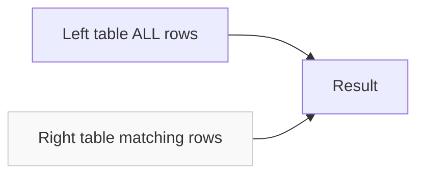

# How to Use LEFT JOIN to Find Missing Rows in MySQL

Author: [nawazdhandala](https://www.github.com/nawazdhandala)

Tags: MySQL, SQL, Join, Database, Query

Description: Learn how to use LEFT JOIN with a NULL check to find rows in one table that have no matching rows in another, a common pattern for detecting missing or orphaned records.

---

One of the most practical uses of `LEFT JOIN` is finding rows in a "parent" table that have no corresponding rows in a "child" table, or vice versa. This pattern is sometimes called an anti-join.

## How it works

`LEFT JOIN` returns every row from the left table. When there is no matching row in the right table, MySQL fills the right table's columns with `NULL`. Filtering for `NULL` on a right-table column isolates the unmatched rows.



## Schema

```sql
CREATE TABLE customers (
    customer_id INT PRIMARY KEY,
    name        VARCHAR(100)
);

CREATE TABLE orders (
    order_id    INT PRIMARY KEY,
    customer_id INT,
    order_date  DATE
);

INSERT INTO customers VALUES (1,'Alice'),(2,'Bob'),(3,'Carol'),(4,'Dave');
INSERT INTO orders VALUES (101,1,'2026-01-10'),(102,1,'2026-02-15'),(103,3,'2026-03-01');
```

## Finding customers who have never placed an order

```sql
SELECT c.customer_id, c.name
FROM customers c
LEFT JOIN orders o ON c.customer_id = o.customer_id
WHERE o.order_id IS NULL;
```

Result:

| customer_id | name |
|---|---|
| 2 | Bob |
| 4 | Dave |

The `WHERE o.order_id IS NULL` filter keeps only the rows where the join found no match.

## Why IS NULL on the right table

After a `LEFT JOIN`, any non-nullable column in the right table (such as a primary key) will be `NULL` only when there was no match. This makes primary keys the safest column to test:

```sql
-- Safe: order_id is primary key and never NULL in real data
WHERE o.order_id IS NULL

-- Works but fragile: customer_id could legitimately be NULL in the orders table
WHERE o.customer_id IS NULL
```

## Finding orphaned child rows

The same pattern works in reverse: find rows in the child table with no matching parent.

```sql
-- Orders referencing non-existent customers
SELECT o.order_id, o.customer_id
FROM orders o
LEFT JOIN customers c ON o.customer_id = c.customer_id
WHERE c.customer_id IS NULL;
```

## Anti-join vs NOT IN vs NOT EXISTS

All three approaches identify missing matches, but behave differently with NULLs:

```sql
-- LEFT JOIN anti-join (safe with NULLs)
SELECT c.customer_id
FROM customers c
LEFT JOIN orders o ON c.customer_id = o.customer_id
WHERE o.order_id IS NULL;

-- NOT IN (unsafe if subquery result contains NULL)
SELECT customer_id
FROM customers
WHERE customer_id NOT IN (SELECT customer_id FROM orders);

-- NOT EXISTS (safe with NULLs, often same plan as LEFT JOIN anti-join)
SELECT c.customer_id
FROM customers c
WHERE NOT EXISTS (
    SELECT 1 FROM orders o WHERE o.customer_id = c.customer_id
);
```

Use the `LEFT JOIN` or `NOT EXISTS` form to avoid surprises when the subquery can return `NULL` values.

## Checking multiple missing relationships at once

```sql
CREATE TABLE email_preferences (
    customer_id INT PRIMARY KEY,
    opted_in    TINYINT
);

SELECT c.name,
       CASE WHEN o.order_id           IS NULL THEN 'No orders'      END AS order_status,
       CASE WHEN ep.customer_id       IS NULL THEN 'No email prefs' END AS email_status
FROM customers c
LEFT JOIN orders           o  ON c.customer_id = o.customer_id
LEFT JOIN email_preferences ep ON c.customer_id = ep.customer_id
WHERE o.order_id IS NULL
   OR ep.customer_id IS NULL;
```

## Performance

Index the join column on both sides:

```sql
CREATE INDEX idx_orders_customer ON orders (customer_id);
```

Run `EXPLAIN` to confirm that the join uses an index lookup, not a full table scan:

```sql
EXPLAIN
SELECT c.customer_id, c.name
FROM customers c
LEFT JOIN orders o ON c.customer_id = o.customer_id
WHERE o.order_id IS NULL;
```

Look for `ref` or `eq_ref` in the `type` column for the `orders` table. A `NULL` in the `key` column indicates a missing index.

## Summary

To find missing rows with `LEFT JOIN`: join the left table (the one you want to inspect) to the right table, then filter with `WHERE right_table.primary_key IS NULL`. This anti-join pattern is safe with `NULL` values, efficient when the join column is indexed, and more readable than equivalent `NOT IN` subqueries.
