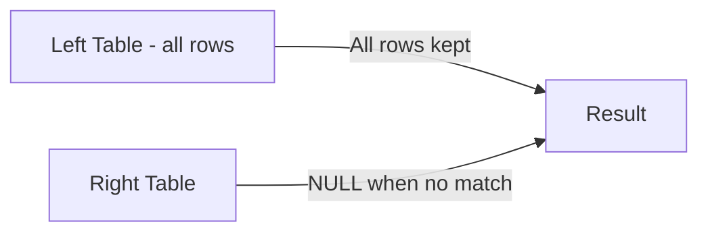

# How to Use LEFT JOIN in MySQL

Author: [nawazdhandala](https://www.github.com/nawazdhandala)

Tags: MySQL, SQL, JOIN, Database, Query

Description: Learn how LEFT JOIN in MySQL returns all rows from the left table and matching rows from the right table, with NULLs for unmatched rows.

---

## How LEFT JOIN Works

A LEFT JOIN (also called LEFT OUTER JOIN) returns all rows from the left table, and the matched rows from the right table. When there is no match in the right table, the result contains NULL for every column from the right table. This makes it useful for finding records in one table that may or may not have a related record in another table.



## Syntax

```sql
SELECT column_list
FROM left_table
LEFT JOIN right_table ON left_table.column = right_table.column;
```

`LEFT OUTER JOIN` and `LEFT JOIN` are synonyms in MySQL.

## Examples

### Setup: Create Sample Tables

```sql
CREATE TABLE customers (
    id INT PRIMARY KEY AUTO_INCREMENT,
    name VARCHAR(100) NOT NULL,
    email VARCHAR(150)
);

CREATE TABLE orders (
    id INT PRIMARY KEY AUTO_INCREMENT,
    customer_id INT,
    amount DECIMAL(10, 2),
    order_date DATE
);

INSERT INTO customers (name, email) VALUES
    ('Alice', 'alice@example.com'),
    ('Bob', 'bob@example.com'),
    ('Carol', 'carol@example.com'),
    ('Dave', 'dave@example.com');

INSERT INTO orders (customer_id, amount, order_date) VALUES
    (1, 150.00, '2026-01-10'),
    (1, 200.00, '2026-02-15'),
    (2, 75.00, '2026-01-20'),
    (3, 300.00, '2026-03-01');
```

### Basic LEFT JOIN

Retrieve all customers and their orders. Customers with no orders will show NULL for order columns.

```sql
SELECT c.name AS customer, o.id AS order_id, o.amount, o.order_date
FROM customers c
LEFT JOIN orders o ON c.id = o.customer_id
ORDER BY c.name, o.order_date;
```

```text
+----------+----------+--------+------------+
| customer | order_id | amount | order_date |
+----------+----------+--------+------------+
| Alice    | 1        | 150.00 | 2026-01-10 |
| Alice    | 2        | 200.00 | 2026-02-15 |
| Bob      | 3        |  75.00 | 2026-01-20 |
| Carol    | 4        | 300.00 | 2026-03-01 |
| Dave     | NULL     |   NULL | NULL       |
+----------+----------+--------+------------+
```

Dave has no orders, so all order columns appear as NULL.

### Finding Rows with No Match (Anti-Join Pattern)

Use a WHERE clause filtering for NULL to find customers who have never placed an order.

```sql
SELECT c.name AS customer, c.email
FROM customers c
LEFT JOIN orders o ON c.id = o.customer_id
WHERE o.id IS NULL;
```

```text
+----------+------------------+
| customer | email            |
+----------+------------------+
| Dave     | dave@example.com |
+----------+------------------+
```

### LEFT JOIN with Aggregation

Count orders per customer, including customers with zero orders.

```sql
SELECT c.name AS customer,
       COUNT(o.id) AS total_orders,
       COALESCE(SUM(o.amount), 0) AS total_spent
FROM customers c
LEFT JOIN orders o ON c.id = o.customer_id
GROUP BY c.id, c.name
ORDER BY total_spent DESC;
```

```text
+----------+--------------+-------------+
| customer | total_orders | total_spent |
+----------+--------------+-------------+
| Carol    | 1            |      300.00 |
| Alice    | 2            |      350.00 |
| Bob      | 1            |       75.00 |
| Dave     | 0            |        0.00 |
+----------+--------------+-------------+
```

Note: `COUNT(o.id)` counts only non-NULL values, so Dave correctly shows 0. `COALESCE` converts NULL sums to 0.

### Filtering on the Right Table Without Turning LEFT JOIN Into INNER JOIN

When you filter on a right-table column in the WHERE clause, rows with NULL matches are excluded, effectively turning the LEFT JOIN into an INNER JOIN. Put the filter in the ON clause instead to preserve all left-table rows.

```sql
-- Wrong: excludes Dave because NULL does not satisfy the filter
SELECT c.name, o.amount
FROM customers c
LEFT JOIN orders o ON c.id = o.customer_id
WHERE o.amount > 100;

-- Correct: filter inside ON clause, Dave still appears
SELECT c.name, o.amount
FROM customers c
LEFT JOIN orders o ON c.id = o.customer_id AND o.amount > 100;
```

## Best Practices

- Use `COALESCE` or `IFNULL` to replace NULLs with default values in the final output.
- Place right-table filters in the ON condition rather than WHERE to avoid accidentally converting a LEFT JOIN to an INNER JOIN.
- Index the join column on the right table to avoid full scans when the left table is large.
- Use the anti-join pattern (`WHERE right_table.id IS NULL`) instead of `NOT IN` subqueries - it is typically faster.
- Alias both tables for readability, especially in multi-table queries.

## Summary

LEFT JOIN is essential for querying data where a relationship may or may not exist. It preserves every row from the left table and fills in NULLs when the right table has no matching row. The anti-join pattern - filtering for NULLs after a LEFT JOIN - is an efficient way to find orphaned records. Always be careful with WHERE filters on right-table columns, as they can silently convert your LEFT JOIN into an INNER JOIN.
