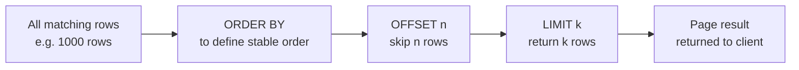

# How to Use LIMIT and OFFSET in MySQL for Pagination

Author: [nawazdhandala](https://www.github.com/nawazdhandala)

Tags: MySQL, SQL, DML, Limit, Offset, Pagination

Description: Paginate MySQL query results with LIMIT and OFFSET, implement keyset-based cursor pagination for large datasets, and avoid common performance pitfalls.

---

## How It Works

`LIMIT` restricts the number of rows returned. `OFFSET` skips a specified number of rows before returning results. Together they implement page-based pagination, though offset pagination becomes slow on large datasets due to how MySQL must scan and discard offset rows.



## Syntax

```sql
SELECT columns
FROM table
[WHERE ...]
ORDER BY col
LIMIT row_count [OFFSET skip_count];

-- Alternative two-argument form:
LIMIT skip_count, row_count
```

Both forms are equivalent. The two-argument form is less readable; prefer the `LIMIT ... OFFSET ...` form.

## Sample Data

```sql
CREATE TABLE products (
    id         INT UNSIGNED AUTO_INCREMENT PRIMARY KEY,
    name       VARCHAR(255)   NOT NULL,
    price      DECIMAL(10,2)  NOT NULL,
    category   VARCHAR(50)    NOT NULL,
    created_at DATETIME       NOT NULL DEFAULT CURRENT_TIMESTAMP
);

INSERT INTO products (name, price, category) VALUES
    ('Widget A',         9.99,  'Hardware'),
    ('Gadget B',        29.99,  'Hardware'),
    ('Doohickey C',      4.99,  'Hardware'),
    ('SQL Handbook',    39.99,  'Books'),
    ('MySQL Cookbook',  49.99,  'Books'),
    ('Notepad',          2.99,  'Office'),
    ('USB Hub',         19.99,  'Hardware'),
    ('Pen Set',          5.99,  'Office'),
    ('Keyboard',        79.99,  'Hardware'),
    ('Monitor',        299.99,  'Hardware'),
    ('Desk Lamp',       24.99,  'Office'),
    ('Cable Pack',       9.99,  'Hardware');
```

## Basic LIMIT

Return the first 5 rows.

```sql
SELECT id, name, price
FROM products
ORDER BY id
LIMIT 5;
```

```text
+----+-------------+-------+
| id | name        | price |
+----+-------------+-------+
|  1 | Widget A    |  9.99 |
|  2 | Gadget B    | 29.99 |
|  3 | Doohickey C |  4.99 |
|  4 | SQL Handbook| 39.99 |
|  5 | MySQL Cookbook| 49.99|
+----+-------------+-------+
```

## Offset Pagination

Calculate the offset from the page number and page size.

```sql
-- Page 1: rows 1-3 (OFFSET 0)
SELECT id, name, price FROM products ORDER BY id LIMIT 3 OFFSET 0;

-- Page 2: rows 4-6 (OFFSET 3)
SELECT id, name, price FROM products ORDER BY id LIMIT 3 OFFSET 3;

-- Page 3: rows 7-9 (OFFSET 6)
SELECT id, name, price FROM products ORDER BY id LIMIT 3 OFFSET 6;
```

The formula: `OFFSET = (page_number - 1) * page_size`.

## Getting the Total Count for Pagination UI

Many UIs need the total page count. Run a count query alongside the data query.

```sql
-- Total count
SELECT COUNT(*) AS total_rows FROM products WHERE category = 'Hardware';

-- Page data
SELECT id, name, price
FROM products
WHERE category = 'Hardware'
ORDER BY id
LIMIT 4 OFFSET 0;
```

## SQL_CALC_FOUND_ROWS (Legacy Approach)

An older MySQL feature that computes the total count in one pass. This is deprecated in MySQL 8.0.17.

```sql
SELECT SQL_CALC_FOUND_ROWS id, name
FROM products
LIMIT 3 OFFSET 0;

SELECT FOUND_ROWS() AS total;
```

Prefer a separate `COUNT(*)` query instead.

## Performance Problem with Large OFFSETs

When `OFFSET` is large, MySQL must read and discard all skipped rows. Page 1000 with page size 20 requires MySQL to read 20,000 rows internally.

```sql
-- Slow on large tables: must scan 10,000 rows to skip them
SELECT id, name FROM products ORDER BY id LIMIT 20 OFFSET 10000;
```

## Keyset (Cursor) Pagination - The Fast Alternative

Instead of skipping by count, filter by the last seen value. This uses an index seek and stays fast regardless of dataset size.

```sql
-- Page 1: no cursor, get first 5
SELECT id, name, price
FROM products
ORDER BY id ASC
LIMIT 5;
-- Last row: id = 5

-- Page 2: cursor at id = 5
SELECT id, name, price
FROM products
WHERE id > 5
ORDER BY id ASC
LIMIT 5;
-- Last row: id = 10

-- Page 3: cursor at id = 10
SELECT id, name, price
FROM products
WHERE id > 10
ORDER BY id ASC
LIMIT 5;
```

Each query uses an index range scan starting at the cursor, O(log n + page_size) regardless of how deep into the dataset you are.

## Keyset Pagination with Multiple Sort Keys

When sorting by a non-unique column, include the primary key as a tiebreaker.

```sql
-- Sort by price DESC, then id ASC for deterministic ordering
-- Page 1: no cursor
SELECT id, name, price
FROM products
ORDER BY price DESC, id ASC
LIMIT 3;
-- Last row: price = 299.99, id = 10

-- Page 2: cursor is (price = 299.99, id = 10)
SELECT id, name, price
FROM products
WHERE (price < 299.99)
   OR (price = 299.99 AND id > 10)
ORDER BY price DESC, id ASC
LIMIT 3;
```

## LIMIT for Top-N Queries

```sql
-- Top 3 most expensive products
SELECT name, price FROM products ORDER BY price DESC LIMIT 3;

-- Bottom 5 cheapest active products
SELECT name, price FROM products
WHERE is_active = TRUE
ORDER BY price ASC
LIMIT 5;
```

## LIMIT in UPDATE and DELETE

```sql
-- Delete the 10 oldest log entries
DELETE FROM log_entries ORDER BY created_at ASC LIMIT 10;

-- Deactivate the 5 lowest-price products
UPDATE products SET is_active = FALSE ORDER BY price ASC LIMIT 5;
```

## Best Practices

- Always include `ORDER BY` with `LIMIT / OFFSET` to get deterministic results.
- Use keyset (cursor) pagination instead of offset pagination for datasets larger than a few thousand rows.
- For offset pagination, limit the maximum page depth (e.g., cap at page 100) to prevent expensive deep-offset queries.
- Add a composite index that covers both the WHERE filter and the ORDER BY column for efficient pagination: `INDEX (category, id)` supports `WHERE category = ? ORDER BY id LIMIT n`.
- Count rows with a separate `SELECT COUNT(*)` query rather than using the deprecated `SQL_CALC_FOUND_ROWS`.

## Summary

`LIMIT n OFFSET m` paginates MySQL results by returning at most `n` rows after skipping `m` rows. Always include `ORDER BY` for deterministic page content. Offset pagination degrades for large offsets because MySQL must scan and discard all skipped rows; keyset (cursor) pagination eliminates this by filtering with `WHERE id > last_seen_id`, using an index seek that remains fast at any depth in the dataset.
