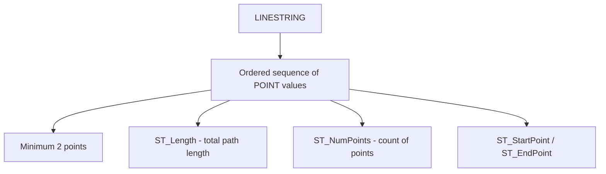

# How to Use LINESTRING Data Type in MySQL

Author: [OneUptime](https://www.github.com/OneUptime)

Tags: MySQL, SQL, Spatial, GIS, Geometry, Database

Description: Learn how to store and query routes and paths using the LINESTRING data type in MySQL, including WKT insertion, length calculation, and spatial queries.

---

## What Is the LINESTRING Data Type

`LINESTRING` is a spatial data type in MySQL that represents an ordered sequence of two or more points connected by straight line segments. It is used to model linear features such as roads, rivers, trails, cables, or any path between locations.

A LINESTRING must contain at least two points. When the first and last points are identical, it forms a closed line, but use `POLYGON` instead for areas.



## Syntax

```sql
-- Column definition
column_name LINESTRING [NOT NULL] [SRID srid_value]

-- Create from WKT
ST_GeomFromText('LINESTRING(x1 y1, x2 y2, x3 y3, ...)', srid)
ST_LineStringFromText('LINESTRING(x1 y1, x2 y2)', srid)

-- Useful functions
ST_Length(linestring)            -- total length in CRS units
ST_NumPoints(linestring)         -- number of points
ST_PointN(linestring, n)         -- nth point (1-based)
ST_StartPoint(linestring)        -- first point
ST_EndPoint(linestring)          -- last point
ST_AsText(linestring)            -- WKT representation
```

## Examples

### Create a Table for Route Data

```sql
CREATE TABLE routes (
    id          INT          PRIMARY KEY AUTO_INCREMENT,
    name        VARCHAR(100) NOT NULL,
    description VARCHAR(255),
    path        LINESTRING   NOT NULL SRID 4326,
    SPATIAL INDEX idx_path (path)
);
```

### Insert LINESTRING Values

```sql
-- A walking trail defined by GPS waypoints (longitude, latitude)
INSERT INTO routes (name, description, path) VALUES
(
    'Central Park Loop',
    'Main loop road around Central Park, New York',
    ST_GeomFromText(
        'LINESTRING(
            -73.9730 40.7648,
            -73.9495 40.7968,
            -73.9735 40.8003,
            -73.9818 40.7648,
            -73.9730 40.7648
        )',
        4326
    )
),
(
    'Brooklyn Bridge Walk',
    'Pedestrian path across the Brooklyn Bridge',
    ST_GeomFromText(
        'LINESTRING(
            -73.9969 40.7061,
            -73.9937 40.7081,
            -73.9900 40.7106
        )',
        4326
    )
),
(
    'High Line Section 1',
    'Elevated park path, section 1',
    ST_GeomFromText(
        'LINESTRING(
            -74.0048 40.7481,
            -74.0040 40.7493,
            -74.0022 40.7510,
            -74.0010 40.7524
        )',
        4326
    )
);
```

### Query LINESTRING Properties

```sql
SELECT
    name,
    ST_NumPoints(path)                  AS num_points,
    ROUND(ST_Length(path), 6)           AS length_degrees,
    ST_AsText(ST_StartPoint(path))      AS start_wkt,
    ST_AsText(ST_EndPoint(path))        AS end_wkt
FROM routes;
```

```text
+----------------------+------------+----------------+-----------------------------+-----------------------------+
| name                 | num_points | length_degrees | start_wkt                   | end_wkt                     |
+----------------------+------------+----------------+-----------------------------+-----------------------------+
| Central Park Loop    | 5          |       0.112000 | POINT(-73.973 40.7648)      | POINT(-73.973 40.7648)      |
| Brooklyn Bridge Walk | 3          |       0.009500 | POINT(-73.9969 40.7061)     | POINT(-73.99 40.7106)       |
| High Line Section 1  | 4          |       0.006900 | POINT(-74.0048 40.7481)     | POINT(-74.001 40.7524)      |
+----------------------+------------+----------------+-----------------------------+-----------------------------+
```

### Extract a Specific Point from a LINESTRING

```sql
SELECT
    name,
    ST_AsText(ST_PointN(path, 1)) AS point_1,
    ST_AsText(ST_PointN(path, 2)) AS point_2,
    ST_AsText(ST_PointN(path, 3)) AS point_3
FROM routes
WHERE name = 'Brooklyn Bridge Walk';
```

```text
+----------------------+-------------------------+-------------------------+------------------------+
| name                 | point_1                 | point_2                 | point_3                |
+----------------------+-------------------------+-------------------------+------------------------+
| Brooklyn Bridge Walk | POINT(-73.9969 40.7061) | POINT(-73.9937 40.7081) | POINT(-73.99 40.7106)  |
+----------------------+-------------------------+-------------------------+------------------------+
```

### Find Routes That Intersect a Polygon Area

```sql
SET @manhattan_south = ST_GeomFromText(
    'POLYGON((-74.02 40.70, -73.97 40.70, -73.97 40.72, -74.02 40.72, -74.02 40.70))',
    4326
);

SELECT name, description
FROM routes
WHERE ST_Intersects(path, @manhattan_south);
```

```text
+----------------------+---------------------------------------------+
| name                 | description                                 |
+----------------------+---------------------------------------------+
| Brooklyn Bridge Walk | Pedestrian path across the Brooklyn Bridge  |
+----------------------+---------------------------------------------+
```

### Check If a LINESTRING Is Closed

```sql
SELECT
    name,
    ST_IsClosed(path)   AS is_closed,
    ST_IsSimple(path)   AS is_simple
FROM routes;
```

```text
+----------------------+-----------+-----------+
| name                 | is_closed | is_simple |
+----------------------+-----------+-----------+
| Central Park Loop    | 1         | 0         |
| Brooklyn Bridge Walk | 0         | 1         |
| High Line Section 1  | 0         | 1         |
+----------------------+-----------+-----------+
```

### Measure Approximate Length in Meters

Use `ST_Length` with SRID 4326 for approximate geodetic length. In MySQL 8.0+, `ST_Length` on SRID 4326 geometry returns meters.

```sql
SELECT
    name,
    ROUND(ST_Length(path)) AS length_meters
FROM routes
ORDER BY length_meters DESC;
```

## MULTILINESTRING Relationship

When you need to store a route made up of disconnected segments (for example, a bus line with gaps), use `MULTILINESTRING`. A single `LINESTRING` must be continuous.

```sql
-- MULTILINESTRING example: disconnected road segments
SELECT ST_AsText(
    ST_GeomFromText(
        'MULTILINESTRING((0 0, 1 1, 2 0), (3 2, 4 3))',
        0
    )
);
```

## Best Practices

- Always specify an SRID. Use SRID 4326 for GPS-based geographic coordinates.
- Store points in (longitude, latitude) order to follow the WKT convention (X before Y).
- Use `ST_Length` in MySQL 8.0 with SRID 4326 to get lengths in meters on the geodetic ellipsoid.
- Add a `SPATIAL INDEX` for queries using `ST_Intersects`, `ST_Within`, or `MBRContains`.
- Use `ST_IsClosed` to validate that a loop route actually closes.

## Summary

`LINESTRING` stores an ordered sequence of connected points representing a path or route. Create values with `ST_GeomFromText('LINESTRING(x1 y1, x2 y2, ...)', srid)`. Use `ST_Length` to measure total length, `ST_NumPoints` to count waypoints, and `ST_PointN` to extract individual points. Use `ST_Intersects` and `MBRContains` with a spatial index to efficiently find routes crossing a given area.
