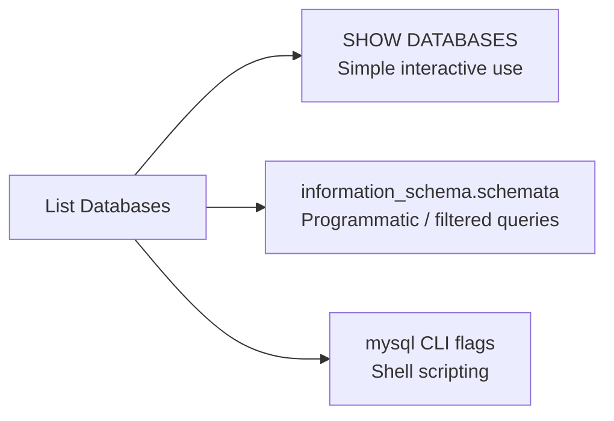

# How to List All Databases in MySQL

Author: [nawazdhandala](https://www.github.com/nawazdhandala)

Tags: MySQL, SQL, DDL, Database, Administration

Description: Learn the different ways to list all databases in MySQL using SHOW DATABASES, information_schema queries, and the mysql CLI, with filtering and privilege examples.

---

## Overview

MySQL provides several ways to list available databases depending on the context: using the `SHOW DATABASES` command, querying `information_schema.schemata`, or using shell-level commands. Each method suits different workflows.



## SHOW DATABASES

The most common and direct way to list all databases the current user can see.

```sql
SHOW DATABASES;
```

```text
+--------------------+
| Database           |
+--------------------+
| information_schema |
| myapp              |
| myapp_test         |
| mysql              |
| performance_schema |
| sys                |
+--------------------+
```

The list includes only databases that the current user has at least one privilege on. Root users see all databases.

## SHOW SCHEMAS (Synonym)

`SHOW SCHEMAS` is an alias for `SHOW DATABASES`:

```sql
SHOW SCHEMAS;
```

Output is identical to `SHOW DATABASES`.

## Filtering with LIKE

```sql
SHOW DATABASES LIKE 'myapp%';
```

```text
+--------------------+
| Database (myapp%)  |
+--------------------+
| myapp              |
| myapp_test         |
+--------------------+
```

## Filtering with WHERE

```sql
SHOW DATABASES WHERE `Database` NOT IN ('information_schema', 'mysql', 'performance_schema', 'sys');
```

```text
+------------+
| Database   |
+------------+
| myapp      |
| myapp_test |
+------------+
```

## Querying information_schema.schemata

For programmatic use, scripts, or when you need additional metadata:

```sql
SELECT schema_name,
       default_character_set_name AS charset,
       default_collation_name      AS collation
FROM information_schema.schemata
ORDER BY schema_name;
```

```text
+--------------------+---------+--------------------+
| schema_name        | charset | collation          |
+--------------------+---------+--------------------+
| information_schema | utf8    | utf8_general_ci    |
| myapp              | utf8mb4 | utf8mb4_unicode_ci |
| myapp_test         | utf8mb4 | utf8mb4_unicode_ci |
| mysql              | utf8mb4 | utf8mb4_0900_ai_ci |
| performance_schema | utf8mb4 | utf8mb4_0900_ai_ci |
| sys                | utf8mb4 | utf8mb4_0900_ai_ci |
+--------------------+---------+--------------------+
```

## Filtering System Databases

```sql
SELECT schema_name
FROM information_schema.schemata
WHERE schema_name NOT IN ('information_schema', 'mysql', 'performance_schema', 'sys')
ORDER BY schema_name;
```

```text
+------------+
| schema_name|
+------------+
| myapp      |
| myapp_test |
+------------+
```

## Listing Databases from the mysql CLI

You can list databases without entering the MySQL prompt using the `-e` flag:

```bash
mysql -u root -p -e "SHOW DATABASES;"
```

Or use the `--execute` option in a shell script:

```bash
mysql -u root -p"${MYSQL_ROOT_PASSWORD}" \
  --execute="SELECT schema_name FROM information_schema.schemata WHERE schema_name NOT IN ('information_schema','mysql','performance_schema','sys');" \
  --silent --skip-column-names
```

## Checking Which Databases a User Can See

Different users see different databases based on their grants:

```sql
-- As root: create a limited user
CREATE USER 'appuser'@'localhost' IDENTIFIED BY 'SecurePass!1';
GRANT ALL PRIVILEGES ON myapp.* TO 'appuser'@'localhost';
FLUSH PRIVILEGES;

-- Connect as appuser and run SHOW DATABASES:
-- Only information_schema and myapp will appear
```

## Listing Databases with Table Count

```sql
SELECT s.schema_name,
       COUNT(t.table_name) AS table_count
FROM information_schema.schemata s
LEFT JOIN information_schema.tables t
    ON t.table_schema = s.schema_name
WHERE s.schema_name NOT IN ('information_schema', 'mysql', 'performance_schema', 'sys')
GROUP BY s.schema_name
ORDER BY s.schema_name;
```

```text
+------------+-------------+
| schema_name| table_count |
+------------+-------------+
| myapp      |          12 |
| myapp_test |           8 |
+------------+-------------+
```

## Listing Database Sizes

```sql
SELECT table_schema AS db_name,
       ROUND(SUM(data_length + index_length) / 1024 / 1024, 2) AS size_mb
FROM information_schema.tables
WHERE table_schema NOT IN ('information_schema', 'mysql', 'performance_schema', 'sys')
GROUP BY table_schema
ORDER BY size_mb DESC;
```

```text
+------------+---------+
| db_name    | size_mb |
+------------+---------+
| myapp      |   45.23 |
| myapp_test |    8.10 |
+------------+---------+
```

## Best Practices

- Use `SHOW DATABASES` for quick interactive inspection and `information_schema.schemata` for scripts and automation.
- Filter out system databases (`information_schema`, `mysql`, `performance_schema`, `sys`) in automation scripts to avoid accidentally operating on them.
- Use limited-privilege users in applications so `SHOW DATABASES` reveals only the databases the application needs.
- Combine database listing with size queries from `information_schema.tables` to monitor growth.

## Summary

`SHOW DATABASES` is the quickest way to list all databases visible to the current user in MySQL. Use `SHOW DATABASES LIKE 'pattern%'` to filter by name prefix, or query `information_schema.schemata` for programmatic access with full metadata including character set and collation. From the shell, use `mysql -e "SHOW DATABASES;"` for scripting. Always filter out the four system databases when writing automation.
