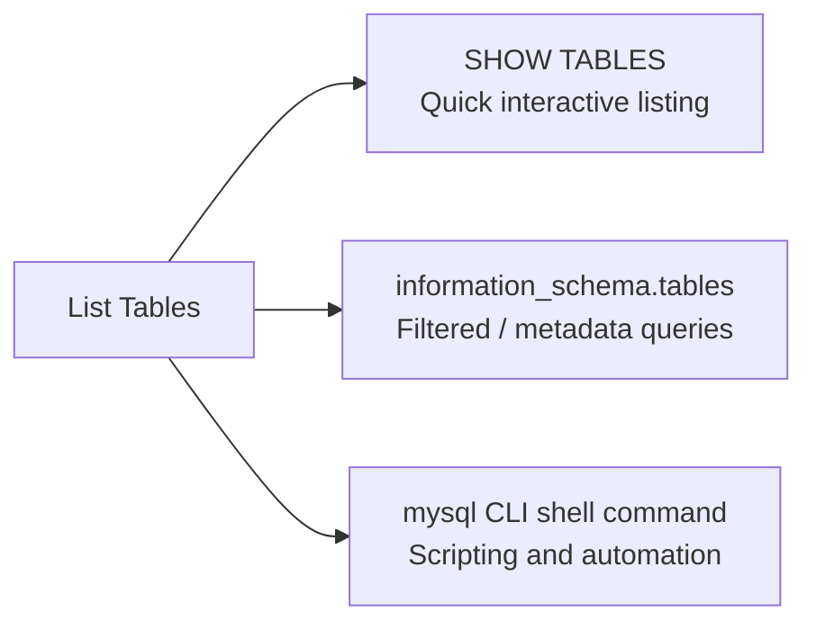

# How to List All Tables in a MySQL Database

Author: [nawazdhandala](https://www.github.com/nawazdhandala)

Tags: MySQL, SQL, DDL, Table, Database

Description: Learn how to list all tables in a MySQL database using SHOW TABLES, information_schema queries, and shell commands, with filtering, size reporting, and metadata examples.

---

## Overview

MySQL provides multiple ways to list tables in a database: the `SHOW TABLES` command for interactive use and `information_schema.tables` for scripting and metadata queries.



## SHOW TABLES

The simplest way to list all tables in the currently selected database:

```sql
USE myapp;
SHOW TABLES;
```

```text
+---------------------------+
| Tables_in_myapp           |
+---------------------------+
| audit_log                 |
| customers                 |
| order_items               |
| orders                    |
| products                  |
| users                     |
+---------------------------+
```

## SHOW TABLES in a Specific Database

You do not need to run `USE` first; specify the database directly:

```sql
SHOW TABLES FROM myapp;
-- or
SHOW TABLES IN myapp;
```

## SHOW FULL TABLES

`SHOW FULL TABLES` adds a second column showing the table type (`BASE TABLE` or `VIEW`):

```sql
SHOW FULL TABLES FROM myapp;
```

```text
+---------------------------+------------+
| Tables_in_myapp           | Table_type |
+---------------------------+------------+
| audit_log                 | BASE TABLE |
| customers                 | BASE TABLE |
| orders                    | BASE TABLE |
| products                  | BASE TABLE |
| active_customers_view     | VIEW       |
| recent_orders_view        | VIEW       |
+---------------------------+------------+
```

## Filtering with LIKE

```sql
SHOW TABLES LIKE 'order%';
```

```text
+---------------------------+
| Tables_in_myapp (order%)  |
+---------------------------+
| order_items               |
| orders                    |
+---------------------------+
```

## Filtering with WHERE

```sql
SHOW FULL TABLES WHERE Table_type = 'BASE TABLE';
SHOW FULL TABLES WHERE Table_type = 'VIEW';
SHOW FULL TABLES WHERE `Tables_in_myapp` LIKE 'user%';
```

## Querying information_schema.tables

For scripting and richer metadata:

```sql
SELECT table_name,
       table_type,
       engine,
       table_rows,
       ROUND((data_length + index_length) / 1024, 2) AS size_kb,
       create_time
FROM information_schema.tables
WHERE table_schema = 'myapp'
ORDER BY table_name;
```

```text
+------------------+------------+--------+------------+---------+---------------------+
| table_name       | table_type | engine | table_rows | size_kb | create_time         |
+------------------+------------+--------+------------+---------+---------------------+
| audit_log        | BASE TABLE | InnoDB |      15023 |  512.00 | 2025-01-01 10:00:00 |
| customers        | BASE TABLE | InnoDB |       3200 |  256.00 | 2025-01-01 10:00:00 |
| orders           | BASE TABLE | InnoDB |      48000 | 2048.00 | 2025-01-01 10:00:00 |
+------------------+------------+--------+------------+---------+---------------------+
```

Note: `table_rows` is an estimate for InnoDB; use `COUNT(*)` for an exact count.

## Listing Tables by Size

```sql
SELECT table_name,
       ROUND((data_length + index_length) / 1024 / 1024, 2) AS total_size_mb,
       ROUND(data_length / 1024 / 1024, 2)                  AS data_mb,
       ROUND(index_length / 1024 / 1024, 2)                 AS index_mb
FROM information_schema.tables
WHERE table_schema = 'myapp'
  AND table_type = 'BASE TABLE'
ORDER BY total_size_mb DESC;
```

## Listing Tables with Row Counts

```sql
-- Fast approximate counts from information_schema
SELECT table_name, table_rows AS approx_rows
FROM information_schema.tables
WHERE table_schema = 'myapp'
  AND table_type = 'BASE TABLE'
ORDER BY table_rows DESC;

-- Exact count for a specific table
SELECT COUNT(*) FROM orders;
```

## Listing Tables Without a Primary Key

```sql
SELECT t.table_name
FROM information_schema.tables t
LEFT JOIN information_schema.table_constraints c
    ON c.table_schema = t.table_schema
    AND c.table_name = t.table_name
    AND c.constraint_type = 'PRIMARY KEY'
WHERE t.table_schema = 'myapp'
  AND t.table_type = 'BASE TABLE'
  AND c.constraint_name IS NULL
ORDER BY t.table_name;
```

## Listing Tables from the Shell

```bash
# List tables for a specific database without entering the prompt
mysql -u root -p myapp -e "SHOW TABLES;"

# List table names only (no headers), suitable for shell scripts
mysql -u root -p"${PASS}" --silent --skip-column-names \
    -e "SELECT table_name FROM information_schema.tables WHERE table_schema='myapp' AND table_type='BASE TABLE';"
```

## Listing Tables with Column Count

```sql
SELECT t.table_name,
       COUNT(c.column_name) AS column_count
FROM information_schema.tables t
JOIN information_schema.columns c
    ON c.table_schema = t.table_schema
    AND c.table_name = t.table_name
WHERE t.table_schema = 'myapp'
  AND t.table_type = 'BASE TABLE'
GROUP BY t.table_name
ORDER BY column_count DESC;
```

## Best Practices

- Use `SHOW TABLES` for interactive inspection and `information_schema.tables` for scripts and monitoring dashboards.
- Use `SHOW FULL TABLES` to distinguish base tables from views in the same database.
- Use `SHOW TABLES LIKE 'pattern%'` to quickly find tables by prefix during development.
- Filter `table_schema = DATABASE()` (instead of hardcoding the name) in scripts to make them portable across environments.
- Monitor table sizes with `information_schema.tables` queries and set up alerts for tables growing unexpectedly large.

## Summary

`SHOW TABLES` is the quickest way to list all tables in the current or a specified MySQL database. `SHOW FULL TABLES` adds the table type (base table or view). For richer information -- row counts, storage sizes, engines, and creation timestamps -- query `information_schema.tables`. Use `LIKE` or `WHERE` clauses to filter results. From the shell, use `mysql -e "SHOW TABLES;"` for scripted automation.
