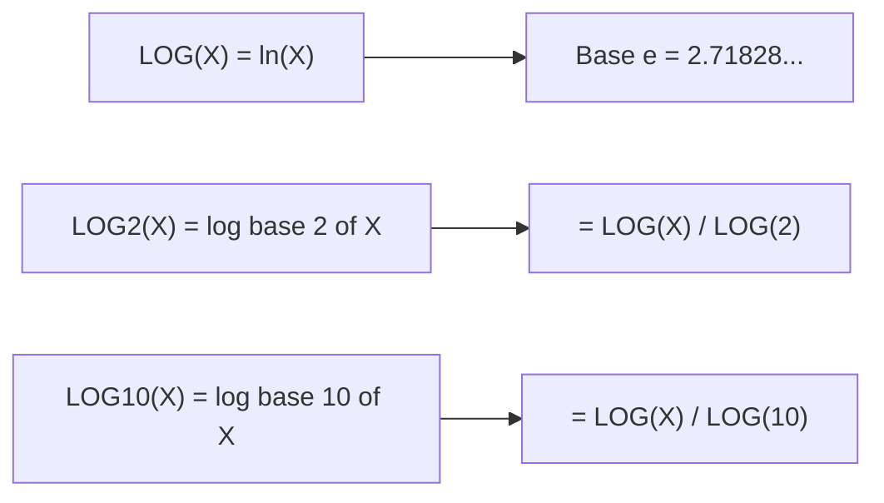

# How to Use LOG(), LOG2(), LOG10() in MySQL

Author: [nawazdhandala](https://www.github.com/nawazdhandala)

Tags: MySQL, SQL, Numeric Function, Mathematical Function, Database

Description: Learn how to use MySQL LOG(), LOG2(), and LOG10() for natural logarithm, base-2, and base-10 logarithm calculations in SQL queries.

---

## Overview

MySQL provides three logarithm functions:

- `LOG(X)` or `LOG(B, X)` - natural logarithm (base e) or logarithm of `X` with arbitrary base `B`.
- `LOG2(X)` - base-2 logarithm.
- `LOG10(X)` - base-10 (common) logarithm.

Logarithms are used in data normalization, information entropy calculations, scaling, and scientific data analysis.

---

## LOG() Function

**Syntax:**

```sql
LOG(X)         -- natural logarithm (base e ≈ 2.71828)
LOG(B, X)      -- logarithm of X with base B
```

- Returns `NULL` if `X <= 0` or if `B <= 1` or `B = NULL`.
- Returns a `DOUBLE`.

### Basic Examples

```sql
SELECT LOG(1);
-- Returns: 0  (ln(1) = 0)

SELECT LOG(EXP(1));
-- Returns: 1  (ln(e) = 1)

SELECT LOG(10);
-- Returns: 2.302585092994046  (ln(10))

SELECT LOG(100);
-- Returns: 4.605170185988092  (ln(100))

-- Arbitrary base
SELECT LOG(2, 8);
-- Returns: 3.0  (log base 2 of 8 = 3)

SELECT LOG(10, 1000);
-- Returns: 3.0  (log base 10 of 1000 = 3)

SELECT LOG(0);
-- Returns: NULL

SELECT LOG(-1);
-- Returns: NULL
```

---

## LOG2() Function

Returns the base-2 logarithm of `X`.

**Syntax:**

```sql
LOG2(X)
```

- Equivalent to `LOG(2, X)` or `LOG(X) / LOG(2)`.
- Returns `NULL` if `X <= 0`.

### Basic Examples

```sql
SELECT LOG2(1);
-- Returns: 0

SELECT LOG2(2);
-- Returns: 1

SELECT LOG2(8);
-- Returns: 3

SELECT LOG2(1024);
-- Returns: 10

SELECT LOG2(0.5);
-- Returns: -1

SELECT LOG2(0);
-- Returns: NULL
```

---

## LOG10() Function

Returns the base-10 (common) logarithm of `X`.

**Syntax:**

```sql
LOG10(X)
```

- Equivalent to `LOG(10, X)` or `LOG(X) / LOG(10)`.
- Returns `NULL` if `X <= 0`.

### Basic Examples

```sql
SELECT LOG10(1);
-- Returns: 0

SELECT LOG10(10);
-- Returns: 1

SELECT LOG10(100);
-- Returns: 2

SELECT LOG10(1000);
-- Returns: 3

SELECT LOG10(0.01);
-- Returns: -2

SELECT LOG10(0);
-- Returns: NULL
```

---

## Relationship Between the Three Functions



Change of base formula: `LOG(B, X) = LOG(X) / LOG(B)`

```sql
-- These are equivalent
SELECT LOG(2, 8);
SELECT LOG(8) / LOG(2);
SELECT LOG2(8);
-- All return: 3.0
```

---

## Logarithmic Scaling

Logarithmic scales are useful for compressing large ranges of values for visualization or comparison:

```sql
CREATE TABLE products (
    id INT AUTO_INCREMENT PRIMARY KEY,
    name VARCHAR(100),
    price DECIMAL(15, 2)
);

INSERT INTO products (name, price) VALUES
('Budget Widget', 1.99),
('Standard Part', 49.99),
('Pro Module', 499.00),
('Enterprise Unit', 4999.00),
('Premium System', 49999.00);

SELECT
    name,
    price,
    ROUND(LOG10(price), 2) AS log10_price,
    ROUND(LOG(price), 2)   AS ln_price
FROM products;
```

Result:

| name            | price    | log10_price | ln_price |
|-----------------|----------|-------------|----------|
| Budget Widget   | 1.99     | 0.30        | 0.69     |
| Standard Part   | 49.99    | 1.70        | 3.91     |
| Pro Module      | 499.00   | 2.70        | 6.21     |
| Enterprise Unit | 4999.00  | 3.70        | 8.52     |
| Premium System  | 49999.00 | 4.70        | 10.82    |

---

## Bits Required to Represent a Number

`LOG2()` tells you how many bits you need to represent a value:

```sql
SELECT
    n,
    CEIL(LOG2(n)) AS bits_required
FROM (
    SELECT 1 AS n
    UNION ALL SELECT 10
    UNION ALL SELECT 100
    UNION ALL SELECT 256
    UNION ALL SELECT 1000
) t;
```

---

## Entropy Calculation (Information Theory)

```sql
-- Shannon entropy: H = -sum(p * log2(p))
-- For a simple two-outcome case
SELECT
    p,
    1 - p AS q,
    ROUND(-p * LOG2(p) - (1 - p) * LOG2(1 - p), 4) AS entropy
FROM (
    SELECT 0.5 AS p
    UNION ALL SELECT 0.8
    UNION ALL SELECT 0.1
) t;
```

---

## Decibel (dB) Calculation

Sound levels in decibels use base-10 logarithms:

```sql
-- dB = 10 * log10(power_ratio)
SELECT
    power_ratio,
    ROUND(10 * LOG10(power_ratio), 1) AS decibels
FROM (
    SELECT 0.001 AS power_ratio
    UNION ALL SELECT 1
    UNION ALL SELECT 10
    UNION ALL SELECT 1000
) t;
```

---

## Using LOG() to Detect Order of Magnitude

```sql
-- Classify values by order of magnitude
SELECT
    value,
    FLOOR(LOG10(value)) AS magnitude
FROM metrics
WHERE value > 0;
```

---

## NULL and Edge Cases

```sql
SELECT LOG(0);       -- NULL
SELECT LOG(-5);      -- NULL
SELECT LOG(1, 10);   -- NULL  (base 1 is invalid)
SELECT LOG(NULL);    -- NULL
SELECT LOG2(NULL);   -- NULL
SELECT LOG10(NULL);  -- NULL
SELECT LOG(1);       -- 0
SELECT LOG2(1);      -- 0
SELECT LOG10(1);     -- 0
```

---

## Summary

`LOG()`, `LOG2()`, and `LOG10()` compute logarithms in base e, base 2, and base 10 respectively. `LOG(B, X)` provides arbitrary-base logarithms via the change-of-base formula. These functions are used for logarithmic data scaling, bit-width calculations, entropy analysis, decibel computation, and order-of-magnitude classification. All three return `NULL` for zero or negative inputs.
