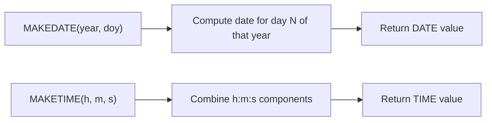

# How to Use MAKEDATE() and MAKETIME() Functions in MySQL

Author: [nawazdhandala](https://www.github.com/nawazdhandala)

Tags: MySQL, SQL, Date Function, Time Function, Database

Description: Learn how to use MySQL MAKEDATE() and MAKETIME() to construct date and time values from individual numeric components like year, day, hour, and minute.

---

## Overview

`MAKEDATE()` and `MAKETIME()` construct `DATE` and `TIME` values respectively from their numeric components. They are the inverse of extraction functions like `YEAR()`, `DAYOFYEAR()`, `HOUR()`, `MINUTE()`, and `SECOND()`.

---

## MAKEDATE() Function

`MAKEDATE()` creates a `DATE` value from a year and a day-of-year number.

**Syntax:**

```sql
MAKEDATE(year, dayofyear)
```

- `year` - a 4-digit year.
- `dayofyear` - the day number within the year (1-366).
- Returns `NULL` if `dayofyear` is 0 or `NULL`.
- If `dayofyear` exceeds the days in the year, it rolls over into subsequent years.

### Basic Examples

```sql
SELECT MAKEDATE(2026, 1);
-- Returns: '2026-01-01'

SELECT MAKEDATE(2026, 90);
-- Returns: '2026-03-31'

SELECT MAKEDATE(2026, 365);
-- Returns: '2026-12-31'

SELECT MAKEDATE(2024, 366);
-- Returns: '2024-12-31'  (2024 is a leap year)

SELECT MAKEDATE(2026, 366);
-- Returns: '2027-01-01'  (2026 has only 365 days, rolls to next year)

SELECT MAKEDATE(2026, 0);
-- Returns: NULL

SELECT MAKEDATE(2026, NULL);
-- Returns: NULL
```

---

## MAKETIME() Function

`MAKETIME()` creates a `TIME` value from hour, minute, and second components.

**Syntax:**

```sql
MAKETIME(hour, minute, second)
```

- `hour` - integer, can exceed 24 for large time intervals.
- `minute` - integer 0-59.
- `second` - integer 0-59, or decimal for microseconds.
- Returns `NULL` if any argument is `NULL`.

### Basic Examples

```sql
SELECT MAKETIME(14, 30, 0);
-- Returns: '14:30:00'

SELECT MAKETIME(9, 0, 0);
-- Returns: '09:00:00'

SELECT MAKETIME(23, 59, 59);
-- Returns: '23:59:59'

SELECT MAKETIME(0, 0, 0);
-- Returns: '00:00:00'

-- Hours can exceed 24 (for TIME intervals)
SELECT MAKETIME(100, 30, 0);
-- Returns: '100:30:00'

-- Fractional seconds
SELECT MAKETIME(12, 30, 45.500);
-- Returns: '12:30:45.500000'

SELECT MAKETIME(9, NULL, 0);
-- Returns: NULL
```

---

## How MAKEDATE() and MAKETIME() Work



---

## Constructing a Full DATETIME

To build a complete `DATETIME`, combine `MAKEDATE()` and `MAKETIME()` with `TIMESTAMP()` or string concatenation:

```sql
-- Combine MAKEDATE and MAKETIME into DATETIME
SELECT TIMESTAMP(MAKEDATE(2026, 90), MAKETIME(14, 30, 0)) AS full_datetime;
-- Returns: '2026-03-31 14:30:00'

-- Alternative using STR_TO_DATE
SELECT CAST(CONCAT(MAKEDATE(2026, 90), ' ', MAKETIME(14, 30, 0)) AS DATETIME) AS full_datetime;
```

---

## Converting Day-of-Year to Full Date

```sql
-- Given a year and day-of-year, find the full date with month and day name
SELECT
    MAKEDATE(2026, 90)              AS full_date,
    DAYNAME(MAKEDATE(2026, 90))     AS weekday,
    MONTHNAME(MAKEDATE(2026, 90))   AS month_name,
    DAYOFMONTH(MAKEDATE(2026, 90))  AS day_of_month;
```

Result:

| full_date  | weekday | month_name | day_of_month |
|------------|---------|------------|--------------|
| 2026-03-31 | Tuesday | March      | 31           |

---

## Rebuilding Dates from Components

Use `MAKEDATE()` to reconstruct dates when you have stored year and day-of-year separately:

```sql
CREATE TABLE annual_events (
    id INT AUTO_INCREMENT PRIMARY KEY,
    event_name VARCHAR(100),
    event_year INT,
    event_doy INT
);

INSERT INTO annual_events (event_name, event_year, event_doy) VALUES
('Spring Equinox', 2026, 80),
('Summer Solstice', 2026, 172),
('Autumn Equinox', 2026, 265);

SELECT
    event_name,
    MAKEDATE(event_year, event_doy) AS event_date,
    MONTHNAME(MAKEDATE(event_year, event_doy)) AS month
FROM annual_events;
```

---

## Rebuilding Times from Components

```sql
CREATE TABLE work_logs (
    id INT AUTO_INCREMENT PRIMARY KEY,
    employee_id INT,
    log_date DATE,
    start_hour INT,
    start_minute INT,
    end_hour INT,
    end_minute INT
);

INSERT INTO work_logs VALUES
(1, 101, '2026-03-31', 9, 0, 17, 30),
(2, 102, '2026-03-31', 8, 30, 16, 0);

SELECT
    employee_id,
    log_date,
    MAKETIME(start_hour, start_minute, 0) AS start_time,
    MAKETIME(end_hour, end_minute, 0)     AS end_time,
    TIMEDIFF(
        MAKETIME(end_hour, end_minute, 0),
        MAKETIME(start_hour, start_minute, 0)
    ) AS hours_worked
FROM work_logs;
```

---

## MAKEDATE() with Overflow (Year Rollover)

```sql
-- Day 400 of 2026 rolls into 2027
SELECT MAKEDATE(2026, 400);
-- Returns: '2027-02-04'

-- Useful for iterating calendar days generically
SELECT MAKEDATE(2026, 1 + seq - 1) AS calendar_day
FROM (SELECT 1 AS seq UNION SELECT 2 UNION SELECT 3 UNION SELECT 4 UNION SELECT 5) t;
```

---

## Inverse Relationship with DAYOFYEAR()

```sql
-- Round-trip: date -> day-of-year -> date
SELECT MAKEDATE(2026, DAYOFYEAR('2026-03-31'));
-- Returns: '2026-03-31'
```

---

## Summary

`MAKEDATE()` constructs a `DATE` from a year and day-of-year number, while `MAKETIME()` constructs a `TIME` from hour, minute, and second. They are useful for rebuilding date/time values from separately stored components, converting day-of-year numbers to calendar dates, and generating iterative date sequences. Combine them with `TIMESTAMP()` or `CONCAT()` to build full `DATETIME` values, and with functions like `DAYNAME()` and `MONTHNAME()` to enrich the constructed dates with readable labels.
