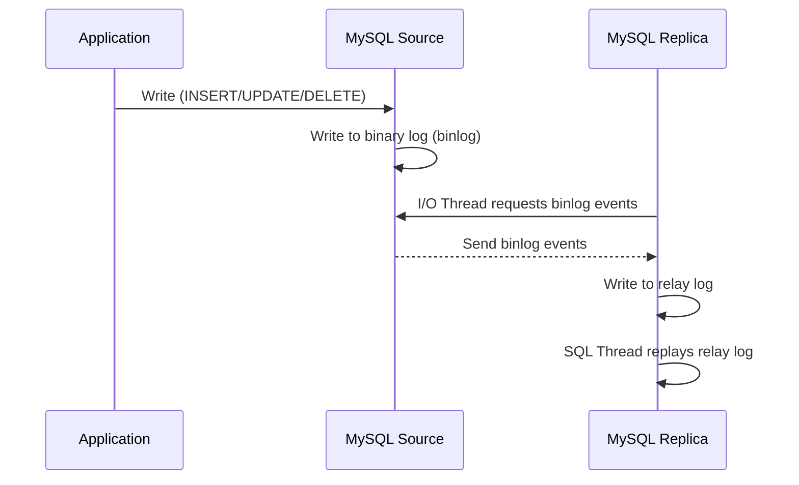

# How to Set Up MySQL Replication (Master-Replica)

Author: [nawazdhandala](https://www.github.com/nawazdhandala)

Tags: MySQL, Replication, High Availability, Database

Description: Learn how to configure MySQL master-replica (source-replica) replication step by step, including binary log setup, replica configuration, and verification.

---

## How MySQL Replication Works

MySQL replication allows data from one server (the source, formerly called master) to be automatically copied to one or more servers (replicas, formerly called slaves). The source records all changes in its binary log. Each replica connects to the source, reads the binary log, and replays the events on its own copy of the data.



Replication uses two threads on the replica:
- **I/O thread** - connects to the source and fetches binary log events into the relay log
- **SQL thread** - reads the relay log and applies the events locally

## Configuration

### Step 1 - Configure the Source Server

Edit `/etc/mysql/mysql.conf.d/mysqld.cnf` (or `/etc/my.cnf`) on the source:

```ini
[mysqld]
server-id         = 1
log_bin           = /var/log/mysql/mysql-bin.log
binlog_do_db      = myapp_db
expire_logs_days  = 7
max_binlog_size   = 100M
```

Restart MySQL:

```bash
sudo systemctl restart mysql
```

### Step 2 - Create a Replication User on the Source

Log in to MySQL on the source and create a dedicated replication user:

```sql
CREATE USER 'replicator'@'%' IDENTIFIED WITH mysql_native_password BY 'StrongPass123!';
GRANT REPLICATION SLAVE ON *.* TO 'replicator'@'%';
FLUSH PRIVILEGES;
```

### Step 3 - Take a Snapshot of the Source

Lock the source tables to get a consistent snapshot, then record the binary log position:

```sql
FLUSH TABLES WITH READ LOCK;
SHOW MASTER STATUS;
```

The output will look like:

```text
+------------------+----------+--------------+------------------+
| File             | Position | Binlog_Do_DB | Binlog_Ignore_DB |
+------------------+----------+--------------+------------------+
| mysql-bin.000003 |      154  | myapp_db     |                  |
+------------------+----------+--------------+------------------+
```

Note the `File` and `Position` values. In a separate shell, dump the database:

```bash
mysqldump -u root -p --all-databases --master-data > /tmp/source_dump.sql
```

Unlock the tables after the dump completes:

```sql
UNLOCK TABLES;
```

### Step 4 - Configure the Replica Server

Edit the replica's MySQL configuration:

```ini
[mysqld]
server-id = 2
relay-log = /var/log/mysql/mysql-relay-bin.log
read_only = ON
```

Restart MySQL on the replica:

```bash
sudo systemctl restart mysql
```

### Step 5 - Import the Snapshot on the Replica

Copy the dump to the replica and import it:

```bash
scp /tmp/source_dump.sql replica-host:/tmp/
mysql -u root -p < /tmp/source_dump.sql
```

### Step 6 - Connect the Replica to the Source

Log in to MySQL on the replica and configure the replication connection:

```sql
CHANGE REPLICATION SOURCE TO
    SOURCE_HOST     = '192.168.1.10',
    SOURCE_USER     = 'replicator',
    SOURCE_PASSWORD = 'StrongPass123!',
    SOURCE_LOG_FILE = 'mysql-bin.000003',
    SOURCE_LOG_POS  = 154;
```

Start the replica:

```sql
START REPLICA;
```

### Step 7 - Verify Replication Status

Check that both threads are running:

```sql
SHOW REPLICA STATUS\G
```

Look for:

```text
Replica_IO_Running: Yes
Replica_SQL_Running: Yes
Seconds_Behind_Source: 0
```

## Monitoring Replication Lag

You can monitor replication lag with:

```sql
SELECT * FROM performance_schema.replication_applier_status_by_worker\G
```

Or check the seconds behind source in a script:

```bash
mysql -u root -p -e "SHOW REPLICA STATUS\G" | grep "Seconds_Behind_Source"
```

## Best Practices

- Use a dedicated replication user with only the `REPLICATION SLAVE` privilege.
- Set `read_only = ON` on replicas to prevent accidental writes.
- Use `expire_logs_days` or `binlog_expire_logs_seconds` to avoid disk exhaustion.
- Monitor `Seconds_Behind_Source`; alert if it exceeds a threshold (e.g., 60 seconds).
- Use semi-synchronous replication for stronger durability guarantees.
- Always use unique `server-id` values across all servers in the topology.
- Consider GTID-based replication for easier failover and management.

## Summary

MySQL master-replica replication copies data from a source server to one or more replicas using binary logs and relay logs. Setting it up involves enabling binary logging on the source, creating a replication user, taking a consistent snapshot, importing it on the replica, and pointing the replica at the source log position. Once running, monitor `SHOW REPLICA STATUS` regularly to ensure the replica stays in sync.
