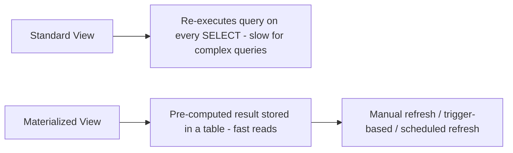
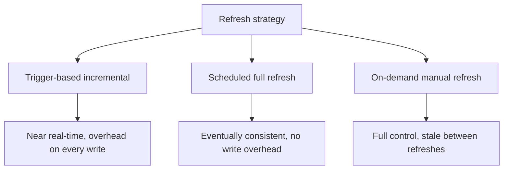

# How to Create a Materialized View Equivalent in MySQL

Author: [nawazdhandala](https://www.github.com/nawazdhandala)

Tags: MySQL, View, Performance, SQL, Database

Description: Learn how to implement materialized view equivalents in MySQL using summary tables, triggers, and scheduled events to cache pre-computed query results for fast reads.

---

## What is a Materialized View?

A materialized view is a database object that stores the result of a query physically on disk. Unlike a standard view (which re-runs the query on every access), a materialized view is pre-computed and refreshed on a schedule or triggered by data changes.



MySQL does not have a native `CREATE MATERIALIZED VIEW` statement. The standard pattern is to combine:

1. A **summary table** to store the pre-computed results.
2. **Triggers** on the source tables to update the summary on writes.
3. A **scheduled event** to perform a full refresh periodically.

## Setup: Source Tables

```sql
CREATE TABLE orders (
    id          INT PRIMARY KEY AUTO_INCREMENT,
    customer_id INT NOT NULL,
    product_id  INT NOT NULL,
    amount      DECIMAL(10,2) NOT NULL,
    status      VARCHAR(20) DEFAULT 'pending',
    created_at  DATE NOT NULL DEFAULT (CURDATE())
);

CREATE TABLE customers (
    id   INT PRIMARY KEY AUTO_INCREMENT,
    name VARCHAR(100) NOT NULL,
    region VARCHAR(50)
);

INSERT INTO customers (name, region) VALUES
    ('Alice', 'East'),
    ('Bob',   'West'),
    ('Carol', 'East');

INSERT INTO orders (customer_id, product_id, amount, status, created_at) VALUES
    (1, 101, 250.00, 'completed', '2024-01-10'),
    (1, 102, 180.00, 'completed', '2024-01-15'),
    (2, 103, 320.00, 'completed', '2024-01-12'),
    (3, 101, 100.00, 'pending',   '2024-01-20'),
    (2, 104, 450.00, 'cancelled', '2024-01-22');
```

## Step 1: Create the Summary Table

```sql
CREATE TABLE mv_customer_order_summary (
    customer_id    INT PRIMARY KEY,
    customer_name  VARCHAR(100),
    region         VARCHAR(50),
    order_count    INT NOT NULL DEFAULT 0,
    total_revenue  DECIMAL(12,2) NOT NULL DEFAULT 0.00,
    avg_order_amt  DECIMAL(10,2) NOT NULL DEFAULT 0.00,
    last_order_date DATE,
    refreshed_at   DATETIME NOT NULL DEFAULT CURRENT_TIMESTAMP
);
```

## Step 2: Initial Population

```sql
INSERT INTO mv_customer_order_summary
    (customer_id, customer_name, region, order_count, total_revenue, avg_order_amt, last_order_date, refreshed_at)
SELECT
    c.id,
    c.name,
    c.region,
    COUNT(o.id),
    COALESCE(SUM(o.amount), 0),
    COALESCE(AVG(o.amount), 0),
    MAX(o.created_at),
    NOW()
FROM customers c
LEFT JOIN orders o ON o.customer_id = c.id AND o.status = 'completed'
GROUP BY c.id, c.name, c.region
ON DUPLICATE KEY UPDATE
    order_count    = VALUES(order_count),
    total_revenue  = VALUES(total_revenue),
    avg_order_amt  = VALUES(avg_order_amt),
    last_order_date = VALUES(last_order_date),
    refreshed_at   = VALUES(refreshed_at);
```

## Step 3: Trigger-Based Incremental Refresh

Keep the summary up to date as orders change.

```sql
DELIMITER $$

-- Refresh summary for one customer
CREATE PROCEDURE RefreshCustomerSummary (
    IN p_customer_id INT
)
BEGIN
    INSERT INTO mv_customer_order_summary
        (customer_id, customer_name, region, order_count, total_revenue, avg_order_amt, last_order_date, refreshed_at)
    SELECT
        c.id,
        c.name,
        c.region,
        COUNT(o.id),
        COALESCE(SUM(o.amount), 0),
        COALESCE(AVG(o.amount), 0),
        MAX(o.created_at),
        NOW()
    FROM customers c
    LEFT JOIN orders o ON o.customer_id = c.id AND o.status = 'completed'
    WHERE c.id = p_customer_id
    GROUP BY c.id, c.name, c.region
    ON DUPLICATE KEY UPDATE
        order_count    = VALUES(order_count),
        total_revenue  = VALUES(total_revenue),
        avg_order_amt  = VALUES(avg_order_amt),
        last_order_date = VALUES(last_order_date),
        refreshed_at   = VALUES(refreshed_at);
END$$

-- After a new order is inserted
CREATE TRIGGER after_order_insert
AFTER INSERT ON orders
FOR EACH ROW
BEGIN
    CALL RefreshCustomerSummary(NEW.customer_id);
END$$

-- After an order is updated (status or amount changes)
CREATE TRIGGER after_order_update
AFTER UPDATE ON orders
FOR EACH ROW
BEGIN
    CALL RefreshCustomerSummary(NEW.customer_id);

    -- If customer changed, refresh the old customer too
    IF OLD.customer_id != NEW.customer_id THEN
        CALL RefreshCustomerSummary(OLD.customer_id);
    END IF;
END$$

-- After an order is deleted
CREATE TRIGGER after_order_delete
AFTER DELETE ON orders
FOR EACH ROW
BEGIN
    CALL RefreshCustomerSummary(OLD.customer_id);
END$$

DELIMITER ;
```

## Step 4: Scheduled Full Refresh with Events

For periodic full refresh (guards against drift caused by bulk loads or direct table edits that bypass triggers):

```sql
-- Enable the event scheduler
SET GLOBAL event_scheduler = ON;

DELIMITER $$

CREATE EVENT evt_refresh_order_summary
ON SCHEDULE EVERY 1 HOUR
STARTS CURRENT_TIMESTAMP
DO
BEGIN
    INSERT INTO mv_customer_order_summary
        (customer_id, customer_name, region, order_count, total_revenue, avg_order_amt, last_order_date, refreshed_at)
    SELECT
        c.id,
        c.name,
        c.region,
        COUNT(o.id),
        COALESCE(SUM(o.amount), 0),
        COALESCE(AVG(o.amount), 0),
        MAX(o.created_at),
        NOW()
    FROM customers c
    LEFT JOIN orders o ON o.customer_id = c.id AND o.status = 'completed'
    GROUP BY c.id, c.name, c.region
    ON DUPLICATE KEY UPDATE
        order_count    = VALUES(order_count),
        total_revenue  = VALUES(total_revenue),
        avg_order_amt  = VALUES(avg_order_amt),
        last_order_date = VALUES(last_order_date),
        refreshed_at   = VALUES(refreshed_at);
END$$

DELIMITER ;
```

## Querying the Materialized View

```sql
SELECT
    customer_name,
    region,
    order_count,
    total_revenue,
    avg_order_amt,
    last_order_date,
    refreshed_at
FROM mv_customer_order_summary
ORDER BY total_revenue DESC;
```

```text
+---------------+--------+-------------+---------------+---------------+-----------------+---------------------+
| customer_name | region | order_count | total_revenue | avg_order_amt | last_order_date | refreshed_at        |
+---------------+--------+-------------+---------------+---------------+-----------------+---------------------+
| Alice         | East   |           2 |        430.00 |        215.00 | 2024-01-15      | 2024-01-22 12:00:00 |
| Bob           | West   |           1 |        320.00 |        320.00 | 2024-01-12      | 2024-01-22 12:00:00 |
| Carol         | East   |           0 |          0.00 |          0.00 | NULL            | 2024-01-22 12:00:00 |
+---------------+--------+-------------+---------------+---------------+-----------------+---------------------+
```

## Strategy Comparison



| Strategy | Freshness | Write Overhead | Complexity |
|---|---|---|---|
| Trigger-based incremental | Near real-time | High (one refresh per DML) | Medium |
| Scheduled full refresh | Hourly/daily lag | Low | Low |
| On-demand (CALL procedure) | Stale until called | None | Low |

## Best Practices

- Add indexes on the summary table for all commonly filtered and sorted columns.
- Track `refreshed_at` so applications can show users how fresh the data is.
- Use `ON DUPLICATE KEY UPDATE` in the refresh logic to handle the upsert atomically.
- For very high write throughput, batch trigger updates with a queue table rather than refreshing synchronously on every INSERT/UPDATE/DELETE.
- Document clearly that the summary table is a derived cache and should not be edited directly.

## Summary

MySQL does not have native materialized views, but the same pattern can be implemented with a summary table, triggers for incremental updates on source table changes, and a scheduled event for periodic full refresh. This approach trades some write overhead and complexity for dramatically faster read performance on pre-aggregated data. Track a `refreshed_at` column to communicate data freshness to your application.
