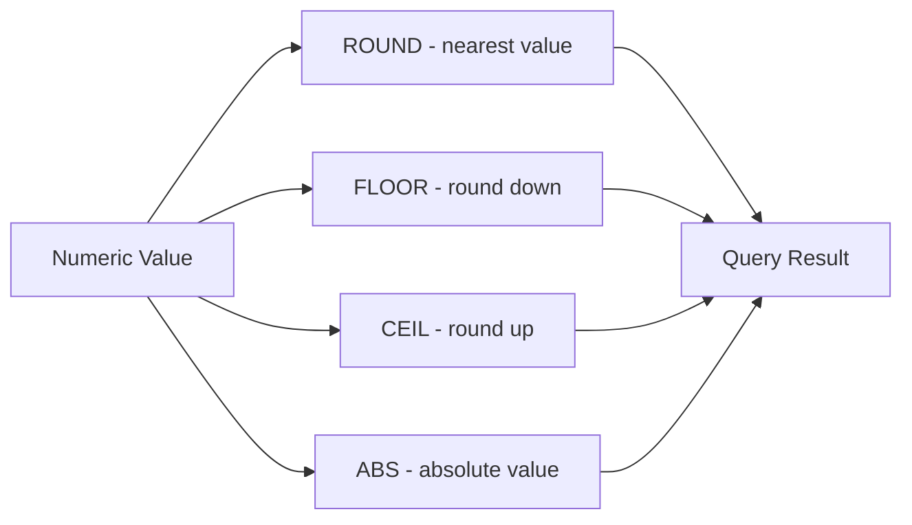

# How to Use MySQL Mathematical Functions (ROUND, FLOOR, CEIL, ABS)

Author: [nawazdhandala](https://www.github.com/nawazdhandala)

Tags: MySQL, SQL, Mathematical Function, Database

Description: Learn how to use MySQL mathematical functions including ROUND, FLOOR, CEIL, and ABS to perform numeric calculations and rounding in SQL queries.

---

## How MySQL Mathematical Functions Work

MySQL ships with a complete set of numeric functions that operate on integer, decimal, and floating-point values. These functions let you round, truncate, and transform numbers directly in queries without any application-layer math.



## Setup: Sample Table

```sql
CREATE TABLE products (
    id           INT AUTO_INCREMENT PRIMARY KEY,
    name         VARCHAR(100),
    price        DECIMAL(10,4),
    discount_pct DECIMAL(5,2),
    stock_qty    INT
);

INSERT INTO products (name, price, discount_pct, stock_qty) VALUES
('Laptop',     1299.9999, 10.5,  50),
('Headphones',   89.4950,  5.0, 200),
('Keyboard',     49.9900, 15.75,  75),
('Mouse',        29.9500,  0.0, 300),
('Monitor',     499.5001, 20.0,  30);
```

## ROUND

`ROUND` rounds a number to a specified number of decimal places. When the digit after the rounding position is exactly 5, MySQL rounds away from zero.

**Syntax:**

```sql
ROUND(number)
ROUND(number, decimal_places)
```

**Example - round prices to two decimal places:**

```sql
SELECT
    name,
    price,
    ROUND(price, 2) AS rounded_price
FROM products;
```

```text
+-----------+-----------+---------------+
| name      | price     | rounded_price |
+-----------+-----------+---------------+
| Laptop    | 1299.9999 | 1300.00       |
| Headphones|   89.4950 |   89.50       |
| Keyboard  |   49.9900 |   49.99       |
| Mouse     |   29.9500 |   30.00       |
| Monitor   |  499.5001 |  499.50       |
+-----------+-----------+---------------+
```

**Example - round to the nearest ten:**

```sql
SELECT name, price, ROUND(price, -1) AS nearest_ten FROM products;
```

## FLOOR

`FLOOR` returns the largest integer value that is not greater than the argument (round toward negative infinity).

**Syntax:**

```sql
FLOOR(number)
```

**Example - calculate discounted price floored to whole dollars:**

```sql
SELECT
    name,
    price,
    discount_pct,
    FLOOR(price * (1 - discount_pct / 100)) AS floor_price
FROM products;
```

```text
+-----------+-----------+--------------+-------------+
| name      | price     | discount_pct | floor_price |
+-----------+-----------+--------------+-------------+
| Laptop    | 1299.9999 | 10.5         | 1163        |
| Headphones|   89.4950 |  5.0         |    84       |
| Keyboard  |   49.9900 | 15.75        |    42       |
| Mouse     |   29.9500 |  0.0         |    29       |
| Monitor   |  499.5001 | 20.0         |   399       |
+-----------+-----------+--------------+-------------+
```

## CEIL / CEILING

`CEIL` (also written `CEILING`) returns the smallest integer value that is not less than the argument (round toward positive infinity).

**Syntax:**

```sql
CEIL(number)
CEILING(number)
```

**Example - ceiling price for display purposes:**

```sql
SELECT
    name,
    price,
    CEIL(price) AS ceiling_price
FROM products;
```

```text
+-----------+-----------+---------------+
| name      | price     | ceiling_price |
+-----------+-----------+---------------+
| Laptop    | 1299.9999 | 1300          |
| Headphones|   89.4950 |    90         |
| Keyboard  |   49.9900 |    50         |
| Mouse     |   29.9500 |    30         |
| Monitor   |  499.5001 |   500         |
+-----------+-----------+---------------+
```

## ABS

`ABS` returns the absolute (non-negative) value of a number. Useful when you need the magnitude of a difference regardless of sign.

**Syntax:**

```sql
ABS(number)
```

**Example - calculate price deviation from average:**

```sql
SELECT
    name,
    price,
    ABS(price - (SELECT AVG(price) FROM products)) AS deviation
FROM products
ORDER BY deviation DESC;
```

## Additional Mathematical Functions

**TRUNCATE** - truncate to a given number of decimal places without rounding:

```sql
SELECT name, TRUNCATE(price, 2) AS truncated_price FROM products;
-- 1299.9999 becomes 1299.99 (not 1300.00)
```

**MOD** - remainder after division:

```sql
SELECT id, name, MOD(stock_qty, 10) AS leftover_units FROM products;
```

**POWER / POW** - raise to a power:

```sql
SELECT POWER(2, 10);
-- Result: 1024
```

**SQRT** - square root:

```sql
SELECT SQRT(144);
-- Result: 12
```

**RAND** - random float between 0 and 1:

```sql
SELECT FLOOR(RAND() * 100) AS random_percent;
```

**LOG, LOG2, LOG10** - logarithms:

```sql
SELECT LOG10(1000);
-- Result: 3
```

## Practical Combined Example

Calculate a final sale price, formatted cleanly:

```sql
SELECT
    name,
    price                                              AS original_price,
    discount_pct,
    ROUND(price * (1 - discount_pct / 100), 2)        AS sale_price,
    ROUND(price - price * (1 - discount_pct / 100), 2) AS savings
FROM products
ORDER BY savings DESC;
```

## Best Practices

- Use `ROUND(value, 2)` rather than relying on `DECIMAL` column definitions for display-safe values.
- Prefer `TRUNCATE` over `FLOOR` when you want to drop decimal digits without affecting the sign of negative numbers differently.
- Avoid `RAND()` in `ORDER BY` clauses on large tables - it forces a full table scan.
- Store monetary values as `DECIMAL(10,2)` or higher precision, and only round at the presentation layer.
- Be careful with floating-point columns (`FLOAT`, `DOUBLE`) - use `DECIMAL` for exact financial calculations.

## Summary

MySQL mathematical functions provide precise numeric operations directly in SQL. `ROUND` rounds values to a given number of decimal places. `FLOOR` always rounds down toward negative infinity, while `CEIL` rounds up toward positive infinity. `ABS` removes the sign from a number. Supporting functions like `TRUNCATE`, `MOD`, `POWER`, and `SQRT` cover a wide range of numeric needs. Using these functions in queries reduces round-trip data processing and keeps numeric logic close to the data.
