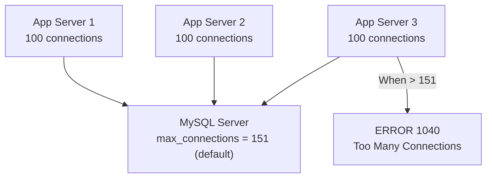

# How to Configure MySQL max_connections

Author: [nawazdhandala](https://www.github.com/nawazdhandala)

Tags: MySQL, Performance, max_connections, Connections, Tuning

Description: Learn how to set MySQL max_connections correctly, calculate the right value for your server's RAM, handle connection errors, and monitor connection utilization.

---

## How MySQL Handles Connections

Every client connection to MySQL creates a dedicated server thread that allocates per-thread memory buffers. The `max_connections` variable sets the upper limit on simultaneous client connections. When this limit is reached, new connection attempts fail with:

```text
ERROR 1040 (HY000): Too many connections
```



MySQL reserves one extra connection beyond `max_connections` for accounts with the `CONNECTION_ADMIN` privilege, allowing administrators to always connect even when the limit is reached.

## Checking Current Settings

```sql
-- View current max_connections setting
SHOW VARIABLES LIKE 'max_connections';

-- View current connection count
SHOW STATUS LIKE 'Threads_connected';

-- View peak connections ever reached
SHOW STATUS LIKE 'Max_used_connections';

-- View failed connection attempts due to too many connections
SHOW STATUS LIKE 'Connection_errors_max_connections';
```

## Calculating the Right Value

Each connection consumes memory from per-thread buffers. Calculate memory per connection:

```sql
SHOW VARIABLES WHERE variable_name IN (
    'join_buffer_size',
    'sort_buffer_size',
    'read_buffer_size',
    'read_rnd_buffer_size',
    'thread_stack',
    'binlog_cache_size'
);
```

Rough per-connection memory estimate:

```text
Per-connection memory ~= join_buffer_size
                       + sort_buffer_size
                       + read_buffer_size
                       + read_rnd_buffer_size
                       + thread_stack
                       + binlog_cache_size
```

Typical default total per connection: about 1-2 MB

Formula for max_connections:

```text
max_connections = (Available RAM for connections) / (Per-connection memory)

Available RAM = Total RAM - innodb_buffer_pool_size - innodb_log_buffer_size
              - key_buffer_size - global overheads (~300 MB)
```

Example for a 32 GB server with 24 GB buffer pool:

```text
Available = 32768 MB - 24576 MB - 300 MB = ~7892 MB
max_connections = 7892 / 2 MB = ~3946
```

Be conservative - set it to 1000-2000 and monitor before pushing higher.

## Setting max_connections

### Dynamic Change (No Restart)

```sql
SET GLOBAL max_connections = 500;
```

This takes effect immediately but is lost on restart.

### Persistent Configuration

Edit `/etc/mysql/mysql.conf.d/mysqld.cnf`:

```ini
[mysqld]
max_connections = 500
```

Restart MySQL:

```bash
sudo systemctl restart mysql
```

## Handling the "Too Many Connections" Error

### Check Who is Connected

```sql
-- Show all connections
SELECT user, host, db, command, time, state, LEFT(info, 80) AS query
FROM   information_schema.PROCESSLIST
ORDER  BY time DESC;

-- Count connections per user
SELECT user, COUNT(*) AS connection_count
FROM   information_schema.PROCESSLIST
GROUP  BY user
ORDER  BY connection_count DESC;
```

### Kill Idle Connections

```sql
-- Find sleeping connections
SELECT id, user, host, time, state
FROM   information_schema.PROCESSLIST
WHERE  command = 'Sleep'
AND    time > 300  -- sleeping for more than 5 minutes
ORDER  BY time DESC;

-- Kill a specific connection
KILL CONNECTION 1234;
```

### Automatically Killing Long-Idle Connections

```ini
[mysqld]
# Close connections that have been idle for more than 10 minutes
wait_timeout         = 600
interactive_timeout  = 600
```

## Per-User Connection Limits

Restrict individual users to a maximum number of connections:

```sql
-- Limit user to 50 simultaneous connections
ALTER USER 'appuser'@'%' WITH MAX_USER_CONNECTIONS 50;

-- Create user with connection limit
CREATE USER 'report_user'@'%' IDENTIFIED BY 'ReportPass123!'
    WITH MAX_USER_CONNECTIONS 10;

-- Remove per-user limit (use global max_connections)
ALTER USER 'appuser'@'%' WITH MAX_USER_CONNECTIONS 0;
```

Per-user limits count toward the global `max_connections` limit.

## Connection Monitoring Dashboard Query

```sql
SELECT
    (SELECT variable_value FROM performance_schema.global_variables WHERE variable_name = 'max_connections')
        AS max_connections,
    (SELECT variable_value FROM performance_schema.global_status WHERE variable_name = 'Threads_connected')
        AS current_connections,
    (SELECT variable_value FROM performance_schema.global_status WHERE variable_name = 'Max_used_connections')
        AS peak_connections,
    ROUND(
        (SELECT variable_value FROM performance_schema.global_status WHERE variable_name = 'Threads_connected') /
        (SELECT variable_value FROM performance_schema.global_variables WHERE variable_name = 'max_connections') * 100,
        1
    ) AS utilization_pct;
```

## When to Use Connection Pooling Instead

If `max_connections` keeps getting exhausted even after increasing it, the real solution is connection pooling at the application or proxy level:

```text
Scenario:       100 app servers x 20 connections each = 2000 connections
Solution:       ProxySQL or PgBouncer-equivalent on each app server
                -> 100 app servers x 20 = 2000 client connections
                -> ProxySQL maintains only 100-200 backend connections to MySQL
```

Connection pooling is almost always the right answer for `max_connections` exhaustion.

## Alerting Thresholds

Set alerts when:
- `Threads_connected / max_connections > 0.80` (80% utilization)
- `Connection_errors_max_connections > 0` (any rejected connections)
- `Max_used_connections` reaches a new high

## Best Practices

- Monitor `Threads_connected` vs `max_connections` - alert at 80% utilization.
- Use `wait_timeout = 300-600` to close idle connections promptly.
- Apply per-user `MAX_USER_CONNECTIONS` limits to prevent a single application from consuming all connections.
- Use connection pooling (ProxySQL or application-side pooling) before raising `max_connections` above 1000.
- Never set `max_connections` higher than the server's memory can safely support.
- Leave the MySQL superuser connection slots intact (do not use the reserved superuser connection for applications).

## Summary

`max_connections` limits the number of simultaneous MySQL client connections. The default (151) is often too low for production. Calculate the appropriate value based on available RAM and per-connection memory, then set it persistently in `my.cnf`. Use `wait_timeout` to close idle connections, per-user limits to prevent any single user from exhausting connections, and ProxySQL connection pooling to serve many application connections with fewer backend connections.
