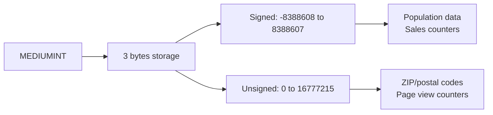
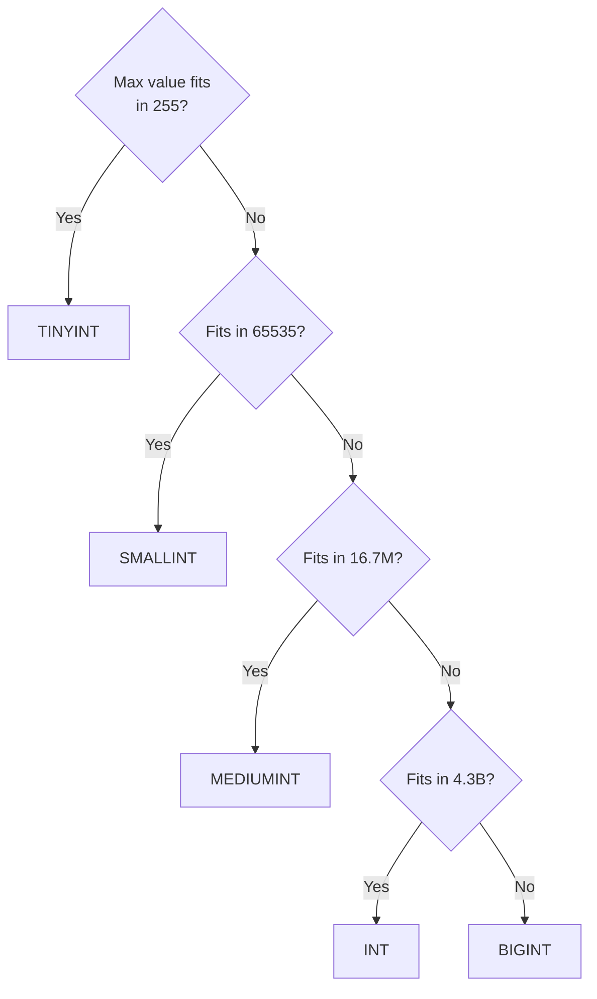

# How to Use MEDIUMINT Data Type in MySQL

Author: [nawazdhandala](https://www.github.com/nawazdhandala)

Tags: MySQL, SQL, Data Type, Integer, Database

Description: Learn how to use the MEDIUMINT data type in MySQL, covering its 3-byte storage, signed and unsigned ranges, and practical use cases for medium-range integer columns.

---

## What Is MEDIUMINT

`MEDIUMINT` is a 3-byte integer type unique to MySQL (it is not part of the SQL standard). It sits between `SMALLINT` (2 bytes) and `INT` (4 bytes), making it useful for columns like page view counters, ZIP codes, and population figures that exceed the `SMALLINT` ceiling but rarely reach billions.



## Storage and Value Range

| Type | Storage | Minimum | Maximum |
|---|---|---|---|
| `MEDIUMINT` (signed) | 3 bytes | -8,388,608 | 8,388,607 |
| `MEDIUMINT UNSIGNED` | 3 bytes | 0 | 16,777,215 |

## Syntax

```sql
column_name MEDIUMINT [(display_width)] [UNSIGNED] [ZEROFILL] [NOT NULL] [DEFAULT value]
```

## Basic Usage

```sql
CREATE TABLE cities (
    id         MEDIUMINT UNSIGNED AUTO_INCREMENT PRIMARY KEY,
    name       VARCHAR(100) NOT NULL,
    country    CHAR(2) NOT NULL,
    population MEDIUMINT UNSIGNED NOT NULL,
    zip_code   MEDIUMINT UNSIGNED
);

INSERT INTO cities (name, country, population, zip_code) VALUES
('Austin',   'US', 961855, 78701),
('Portland', 'US', 641162, 97201),
('Boulder',  'US', 105112, 80301);
```

## Page View Counter

```sql
CREATE TABLE article_stats (
    article_id  INT NOT NULL PRIMARY KEY,
    view_count  MEDIUMINT UNSIGNED NOT NULL DEFAULT 0,
    like_count  MEDIUMINT UNSIGNED NOT NULL DEFAULT 0,
    share_count MEDIUMINT UNSIGNED NOT NULL DEFAULT 0
);

INSERT INTO article_stats (article_id, view_count, like_count, share_count)
VALUES (1, 1500000, 42000, 8750);

-- Increment view counter
UPDATE article_stats
SET view_count = view_count + 1
WHERE article_id = 1;
```

## Population Reporting

```sql
SELECT name, country, population,
       ROUND(population / 1000, 1) AS population_thousands
FROM cities
ORDER BY population DESC;
```

```text
+-----------+---------+------------+----------------------+
| name      | country | population | population_thousands |
+-----------+---------+------------+----------------------+
| Austin    | US      |     961855 |                961.9 |
| Portland  | US      |     641162 |                641.2 |
| Boulder   | US      |     105112 |                105.1 |
+-----------+---------+------------+----------------------+
```

## MEDIUMINT as an AUTO_INCREMENT Primary Key

`MEDIUMINT UNSIGNED AUTO_INCREMENT` supports up to 16,777,215 rows without the overhead of a full 4-byte `INT`. This is suitable for lookup tables, reference tables, or any table guaranteed to stay under ~16 million rows.

```sql
CREATE TABLE product_categories (
    id          MEDIUMINT UNSIGNED AUTO_INCREMENT PRIMARY KEY,
    slug        VARCHAR(80) NOT NULL UNIQUE,
    label       VARCHAR(100) NOT NULL,
    parent_id   MEDIUMINT UNSIGNED,
    FOREIGN KEY (parent_id) REFERENCES product_categories (id)
);

INSERT INTO product_categories (slug, label, parent_id) VALUES
('electronics',   'Electronics',    NULL),
('phones',        'Phones',         1),
('smartphones',   'Smartphones',    2);
```

## Choosing Between Integer Types

```sql
-- Summary of MySQL integer storage
-- TINYINT    1 byte  0 to 255 (unsigned)
-- SMALLINT   2 bytes 0 to 65,535 (unsigned)
-- MEDIUMINT  3 bytes 0 to 16,777,215 (unsigned)
-- INT        4 bytes 0 to 4,294,967,295 (unsigned)
-- BIGINT     8 bytes 0 to 18,446,744,073,709,551,615 (unsigned)
```



## Out of Range Error

```sql
-- MEDIUMINT UNSIGNED max is 16777215
INSERT INTO cities (name, country, population) VALUES ('Megacity', 'US', 20000000);
-- ERROR 1264 (22003): Out of range value for column 'population' at row 1
```

## Inspecting Column Metadata

```sql
SELECT column_name, column_type, is_nullable, column_default
FROM information_schema.columns
WHERE table_schema = DATABASE()
  AND table_name = 'cities';
```

## Best Practices

- Use `MEDIUMINT UNSIGNED` for auto-increment primary keys on tables that will not exceed 16 million rows to save 1 byte per row compared to `INT`.
- Use `MEDIUMINT UNSIGNED` for page view and counter columns that can grow into the millions but are unlikely to exceed 16 million.
- Do not use `MEDIUMINT` for primary keys on tables expected to grow beyond 16 million rows; use `INT` or `BIGINT` instead.
- Avoid `MEDIUMINT` for general-purpose integer columns when you are unsure of the range; `INT` is safer and more portable.

## Summary

`MEDIUMINT` is a 3-byte MySQL-specific integer type with a range of -8,388,608 to 8,388,607 (signed) or 0 to 16,777,215 (unsigned). It is the right choice for population counts, page view counters, ZIP codes, and lookup table primary keys where the value is guaranteed to stay below ~16 million. When in doubt, use `INT` for safety.
